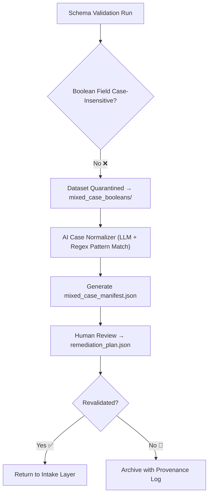

<div align="center">

# 🔡 Kansas Frontier Matrix — **Mixed-Case Booleans**  
`data/work/staging/tabular/tmp/intake/validation/quarantine/incoming/flagged_datasets/schema_errors/invalid_field_types/boolean_inconsistencies/mixed_case_booleans/`

### *“When truth and falsehood differ only by case, clarity is the first casualty.”*

**Purpose:**  
This directory contains datasets exhibiting **mixed-case boolean representations** such as `"TRUE"`, `"False"`, `"True"`, `"false"`, etc.  
These inconsistencies break strict JSON Schema validation and can lead to logic errors in downstream queries, analytics, and AI reasoning.

[](../../../../../../../../../../../../../../../../../../docs/architecture/repo-focus.md)  
[](../../../../../../../../../../../../../../../../../../LICENSE)  
[]()  
[]()  
[]()

</div>

---

## 🧭 Overview

The **Mixed-Case Booleans Subdirectory** contains datasets in which boolean fields fail validation because of inconsistent capitalization across entries.  
Typical examples include:
- `"True"` and `"FALSE"` mixed in the same column  
- Variants like `"True "`, `" false"`, or `"False."` due to whitespace or punctuation  
- Inconsistent use of upper- and lowercase between datasets  

These anomalies are automatically detected by the **AI Boolean Normalizer** and the **Schema Validation Engine**, then placed under quarantine for review and correction.

---

## 🗂️ Directory Layout

```text
data/work/staging/tabular/tmp/intake/validation/quarantine/incoming/flagged_datasets/schema_errors/invalid_field_types/boolean_inconsistencies/mixed_case_booleans/
├── ai_boolean_case_analysis.json          # AI-generated diagnostic report for mixed-case detections
├── mixed_case_manifest.json               # Manifest of datasets containing mixed-case boolean errors
├── examples/                              # CSV or JSON samples illustrating case inconsistencies
│   ├── ks_land_records_1875_example.csv
│   └── ks_census_1890_example.json
├── remediation_plan.json                  # Curator or AI recommendations for value normalization
├── curator_notes.log                      # Human-curated log of remediation actions
└── README.md                              # This document
````

---

## 🔁 Detection & Workflow



---

## 🧩 Mixed-Case Manifest Schema

Each entry in `mixed_case_manifest.json` includes:

| Field                | Description                                | Example                                                              |
| -------------------- | ------------------------------------------ | -------------------------------------------------------------------- |
| `dataset_id`         | Dataset identifier                         | `ks_land_records_1875`                                               |
| `column_name`        | Boolean field containing mixed-case values | `is_homesteaded`                                                     |
| `unique_values`      | Distinct boolean forms detected            | `["TRUE", "True", "false"]`                                          |
| `expected_values`    | Schema-conformant values                   | `["true", "false"]`                                                  |
| `ai_confidence`      | Confidence in AI classification            | `0.987`                                                              |
| `ai_commentary`      | Human-readable explanation                 | `"Mixed-case booleans detected. Normalize all values to lowercase."` |
| `remediation_action` | Suggested correction                       | `"Transform all entries in column 'is_homesteaded' to lowercase."`   |
| `timestamp`          | Detection time (UTC)                       | `2025-10-26T14:47:15Z`                                               |

---

## 🤖 AI Detection & Reasoning

| AI Module                   | Function                                                      | Output                                          |
| --------------------------- | ------------------------------------------------------------- | ----------------------------------------------- |
| **Boolean Case Normalizer** | Detects mixed capitalization patterns in boolean fields       | `ai_boolean_case_analysis.json`                 |
| **AI Explainer Engine**     | Generates plain-language rationale for curator review         | `mixed_case_manifest.json`                      |
| **Pattern Profiler**        | Tracks recurring case inconsistency across datasets           | `reports/fair/mixed_case_booleans_summary.json` |
| **Auto-Remediator**         | Suggests standardization mappings and transformation commands | `remediation_plan.json`                         |

> 🧠 *All AI annotations include confidence scores and rationale, ensuring explainability per MCP-DL governance.*

---

## ⚙️ Curator Workflow

Curators should:

1. Review `ai_boolean_case_analysis.json` for context and frequency distribution.
2. Apply transformations using schema-based correction commands (e.g., lowercase normalization).
3. Record updates in `curator_notes.log`.
4. Re-run validation with:

   ```bash
   make revalidate-flagged
   ```
5. Verify successful correction in `reports/audit/mixed_case_booleans_audit.json`.

---

## 🧾 Compliance Matrix

| Standard                 | Scope                                 | Validator       |
| ------------------------ | ------------------------------------- | --------------- |
| **JSON Schema Draft-07** | Field type and enum enforcement       | `jsonschema`    |
| **FAIR+CARE**            | Transparency and ethical handling     | `fair-audit`    |
| **CIDOC CRM / PROV-O**   | Provenance traceability               | `graph-lint`    |
| **MCP-DL v6.3**          | Documentation-first reproducibility   | `docs-validate` |
| **ISO 19115 / 19157**    | Data lineage and metadata consistency | `geojson-lint`  |

---

## 🪶 Version History

| Version | Date       | Author              | Notes                                                                                           |
| ------- | ---------- | ------------------- | ----------------------------------------------------------------------------------------------- |
| v9.0.0  | 2025-10-26 | `@kfm-architecture` | Initial creation of Mixed-Case Booleans documentation under Diamond⁹ Ω / Crown∞Ω certification. |

---

<div align="center">

### 🜂 Kansas Frontier Matrix — *Logic · Consistency · Governance*

**“Case may differ, but truth must not.”**

[]()
[]()
[]()
[]()
[]()

<br><br> <a href="#-kansas-frontier-matrix--mixed-case-booleans-boolean-inconsistency-subclass--diamond⁹-Ω--crown∞Ω-certified">⬆ Back to Top</a>

</div>
