<div align="center">

# 📄 Kansas Frontier Matrix — **Mixed-Case Boolean Examples**  
`data/work/staging/tabular/tmp/intake/validation/quarantine/incoming/flagged_datasets/schema_errors/invalid_field_types/boolean_inconsistencies/mixed_case_booleans/examples/`

### *“Every inconsistency deserves a witness.”*

**Purpose:**  
This directory provides **empirical examples** of datasets containing mixed-case boolean values (`"TRUE"`, `"False"`, `"True"`, `"false"`, etc.).  
These examples serve as evidence for AI diagnostics, human curation, and FAIR+CARE audits, ensuring transparent traceability and reproducibility in validation.

[](../../../../../../../../../../../../../../../../../../../../docs/architecture/repo-focus.md)  
[](../../../../../../../../../../../../../../../../../../../../LICENSE)  
[]()  
[]()  
[]()

</div>

---

## 🧭 Overview

The **Mixed-Case Boolean Examples Layer** contains a curated set of CSV and JSON fragments extracted from quarantined datasets.  
These examples are used to:
- Demonstrate validation failures for inconsistent boolean casing  
- Train AI models to identify future boolean irregularities  
- Provide transparent evidence for governance and FAIR+CARE audits  
- Benchmark schema correction workflows for curators  

Each file includes a checksum for verification and provenance metadata linking it to the parent dataset’s governance ledger entry.

---

## 🗂️ Directory Layout

```text
data/work/staging/tabular/tmp/intake/validation/quarantine/incoming/flagged_datasets/schema_errors/invalid_field_types/boolean_inconsistencies/mixed_case_booleans/examples/
├── ks_land_records_1875_example.csv     # Sample showing mixed-case booleans in column “is_homesteaded”
├── ks_census_1890_example.json          # JSON record with TRUE/False inconsistencies
├── ks_property_1880_example.csv         # Tabular example with whitespace-affected boolean strings
├── ai_boolean_case_summary.json         # AI analysis of the provided examples
├── evidence_checksums.json              # SHA-256 digest for each sample file
└── README.md                            # This document
````

---

## 🔁 Example Generation Workflow

```mermaid
flowchart TD
    A["Flagged Dataset with Mixed-Case Booleans"] --> B["Extract 5–10 Representative Rows"]
    B --> C["Save Fragments → examples/*.csv or *.json"]
    C --> D["Generate Checksums (SHA-256)"]
    D --> E["Run AI Context Analyzer"]
    E --> F["Summarize Findings → ai_boolean_case_summary.json"]
    F --> G["Register Provenance → Governance Ledger"]
```



---

## 📄 Example Metadata

Each example is logged in `ai_boolean_case_summary.json` and cross-linked to `evidence_checksums.json`:

| Field           | Description                               | Example                                                                                        |
| --------------- | ----------------------------------------- | ---------------------------------------------------------------------------------------------- |
| `dataset_id`    | Origin dataset ID                         | `ks_land_records_1875`                                                                         |
| `file`          | Path to example file                      | `ks_land_records_1875_example.csv`                                                             |
| `column_name`   | Column exhibiting boolean inconsistencies | `is_homesteaded`                                                                               |
| `unique_values` | Boolean variants detected                 | `["TRUE", "True", "False", "false"]`                                                           |
| `ai_comment`    | LLM-generated reasoning                   | `"Column 'is_homesteaded' uses mixed-case values; normalization to lowercase is recommended."` |
| `checksum`      | SHA-256 hash of the sample                | `b8a2ef1c7d52a8f9e91f64e...`                                                                   |
| `timestamp`     | UTC timestamp                             | `2025-10-26T14:48:59Z`                                                                         |

---

## 🤖 AI Integration

| AI Module              | Function                                             | Output                                              |
| ---------------------- | ---------------------------------------------------- | --------------------------------------------------- |
| **Case Profiler**      | Detects inconsistent boolean casing across datasets. | `ai_boolean_case_summary.json`                      |
| **Explainer Model**    | Provides interpretable summaries of boolean issues.  | `ai_boolean_case_summary.json`                      |
| **Checksum Validator** | Verifies integrity of example files.                 | `evidence_checksums.json`                           |
| **Governance Linker**  | Maps examples to corresponding governance entries.   | `tabular_mixed_case_boolean_examples_ledger.jsonld` |

> 🧠 *Each AI-generated annotation includes explanation tokens for full transparency and human interpretability.*

---

## ⚙️ Curator Workflow

Curators should:

1. Review extracted examples for verification of AI findings.
2. Validate checksum integrity using:

   ```bash
   make checksum-verify
   ```
3. Add human commentary or corrective actions to `ai_boolean_case_summary.json`.
4. Confirm FAIR+CARE compliance for shared evidence (no sensitive content).
5. Trigger revalidation cycle post-remediation:

   ```bash
   make revalidate-flagged
   ```

---

## 🧾 Compliance Matrix

| Standard               | Scope                                     | Validator       |
| ---------------------- | ----------------------------------------- | --------------- |
| **FAIR+CARE**          | Ethical and transparent sample handling   | `fair-audit`    |
| **MCP-DL v6.3**        | Documentation-first provenance management | `docs-validate` |
| **CIDOC CRM / PROV-O** | Semantic traceability of examples         | `graph-lint`    |
| **ISO 19115 / 19157**  | Data lineage and integrity tracking       | `geojson-lint`  |
| **STAC / DCAT 3.0**    | Metadata and asset registration           | `stac-validate` |

---

## 🪶 Version History

| Version | Date       | Author              | Notes                                                                                                  |
| ------- | ---------- | ------------------- | ------------------------------------------------------------------------------------------------------ |
| v9.0.0  | 2025-10-26 | `@kfm-architecture` | Initial creation of Mixed-Case Boolean Example documentation under Diamond⁹ Ω / Crown∞Ω certification. |

---

<div align="center">

### 🜂 Kansas Frontier Matrix — *Transparency · Learning · Accountability*

**“Even the smallest inconsistency becomes clarity when documented.”**

[]()
[]()
[]()
[]()
[]()

<br><br> <a href="#-kansas-frontier-matrix--mixed-case-boolean-examples-error-evidence-layer--diamond⁹-Ω--crown∞Ω-certified">⬆ Back to Top</a>

</div>
