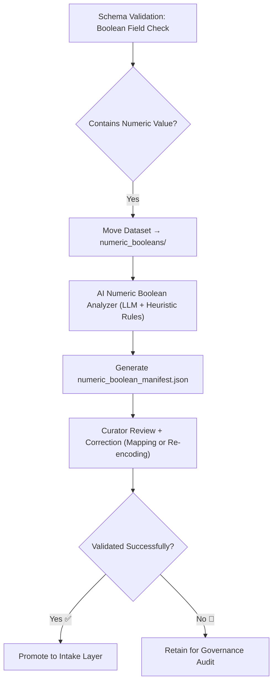

<div align="center">

# 🔢 Kansas Frontier Matrix — **Numeric Booleans**  
`data/work/staging/tabular/tmp/intake/validation/quarantine/incoming/flagged_datasets/schema_errors/invalid_field_types/boolean_inconsistencies/numeric_booleans/`

### *“Numbers pretending to be truth can only fool validation once.”*

**Purpose:**  
This directory stores datasets where boolean (true/false) fields were improperly encoded as numeric values (`1`, `0`, `-1`, etc.).  
Such inconsistencies violate JSON Schema definitions and lead to misinterpretation during AI, analytics, and provenance mapping.

[](../../../../../../../../../../../../../../../docs/architecture/repo-focus.md)  
[](../../../../../../../../../../../../../../../LICENSE)  
[]()  
[]()  
[]()

</div>

---

## 🧭 Overview

The **Numeric Booleans Subdirectory** contains datasets automatically quarantined for using numerical substitutes for boolean values.  
Common invalid representations include:
- `1` and `0` instead of `true` / `false`
- `-1` as an undefined boolean placeholder  
- Fields declared as numeric type instead of boolean  
- Mixtures of numeric and literal boolean values in the same column  

The KFM AI validator and schema engine detect such violations, flag them, and automatically store affected datasets here for review.

---

## 🗂️ Directory Layout

```text
data/work/staging/tabular/tmp/intake/validation/quarantine/incoming/flagged_datasets/schema_errors/invalid_field_types/boolean_inconsistencies/numeric_booleans/
├── numeric_boolean_manifest.json        # Master record of numeric-boolean anomalies
├── ai_numeric_boolean_analysis.json     # AI-generated reasoning & confidence metrics
├── remediation_plan.json                # Suggested conversion mappings
├── examples/                            # CSV/JSON snippets illustrating numeric boolean misuse
│   ├── ks_property_1885_example.csv
│   ├── ks_census_1870_example.json
│   └── ks_agriculture_1890_example.csv
├── curator_notes.log                    # Curator comments and corrections
└── README.md                            # This document
````

---

## 🔁 Detection Workflow



---

## 🧩 Manifest Schema

Each numeric boolean anomaly is registered in `numeric_boolean_manifest.json`:

| Field                    | Description                              | Example                                                                               |
| ------------------------ | ---------------------------------------- | ------------------------------------------------------------------------------------- |
| `dataset_id`             | Dataset identifier                       | `ks_agriculture_1890`                                                                 |
| `column_name`            | Column containing invalid boolean values | `has_irrigation`                                                                      |
| `invalid_values`         | List of invalid boolean encodings        | `[1, 0, -1]`                                                                          |
| `expected_values`        | Schema-compliant boolean literals        | `["true", "false"]`                                                                   |
| `ai_commentary`          | AI summary of the issue                  | `"Boolean field 'has_irrigation' uses numeric encoding instead of boolean literals."` |
| `remediation_suggestion` | Suggested fix                            | `"Convert values 1→true, 0→false"`                                                    |
| `ai_confidence`          | Confidence in classification             | `0.984`                                                                               |
| `timestamp`              | Detection time in UTC                    | `2025-10-26T14:52:18Z`                                                                |

---

## 🤖 AI Reasoning Engine

| AI Module                       | Function                                                        | Output                             |
| ------------------------------- | --------------------------------------------------------------- | ---------------------------------- |
| **AI Numeric Boolean Detector** | Identifies boolean columns containing numeric encodings.        | `numeric_boolean_manifest.json`    |
| **Pattern Profiler**            | Detects usage patterns (1/0, -1/1, 0/99, etc.) across datasets. | `ai_numeric_boolean_analysis.json` |
| **Auto-Remediator**             | Suggests explicit conversion logic and mapping expressions.     | `remediation_plan.json`            |
| **Confidence Engine**           | Assigns confidence levels for automated suggestions.            | `ai_numeric_boolean_analysis.json` |

> 🧠 *All AI-generated insights include confidence values, rationale, and provenance linkage to ensure transparency.*

---

## ⚙️ Curator Actions

Curators should:

1. Review detected numeric boolean anomalies and AI explanations.
2. Apply suggested mappings or manually adjust data type conversions.
3. Record all updates in `curator_notes.log`.
4. Execute:

   ```bash
   make revalidate-flagged
   ```
5. Ensure corrected datasets are promoted to the validated intake directory.

---

## 🧾 Compliance Matrix

| Standard                 | Scope                                   | Validator       |
| ------------------------ | --------------------------------------- | --------------- |
| **JSON Schema Draft-07** | Type and enum validation                | `jsonschema`    |
| **FAIR+CARE**            | Ethical and transparent data handling   | `fair-audit`    |
| **CIDOC CRM / PROV-O**   | Provenance and process tracking         | `graph-lint`    |
| **MCP-DL v6.3**          | Documentation-driven reproducibility    | `docs-validate` |
| **ISO 19115 / 19157**    | Metadata lineage and quality management | `geojson-lint`  |

---

## 🪶 Version History

| Version | Date       | Author              | Notes                                                                                        |
| ------- | ---------- | ------------------- | -------------------------------------------------------------------------------------------- |
| v9.0.0  | 2025-10-26 | `@kfm-architecture` | Initial creation of Numeric Booleans documentation under Diamond⁹ Ω / Crown∞Ω certification. |

---

<div align="center">

### 🜂 Kansas Frontier Matrix — *Logic · Integrity · Transparency*

**“1 and 0 are not truth — only clear documentation makes them real.”**

[]()
[]()
[]()
[]()
[]()

<br><br> <a href="#-kansas-frontier-matrix--numeric-booleans-boolean-inconsistency-subclass--diamond⁹-Ω--crown∞Ω-certified">⬆ Back to Top</a>

</div>
