<div align="center">

# 📊 Kansas Frontier Matrix — **Numeric Boolean Examples**  
`data/work/staging/tabular/tmp/intake/validation/quarantine/incoming/flagged_datasets/schema_errors/invalid_field_types/boolean_inconsistencies/numeric_booleans/examples/`

### *“Truth encoded as a number must still speak clearly.”*

**Purpose:**  
This directory contains **example records and file fragments** illustrating improper numeric boolean usage — values such as `1`, `0`, or `-1` where `true` / `false` were expected.  
These samples provide verifiable evidence for auditors, curators, and AI retraining within the KFM validation ecosystem.

[](../../../../../../../../../../../../../../../../../../../../docs/architecture/repo-focus.md)  
[](../../../../../../../../../../../../../../../../../../../../LICENSE)  
[]()  
[]()  
[]()

</div>

---

## 🧭 Overview

The **Numeric Boolean Examples Subdirectory** holds sample datasets, typically 5–10 rows, that demonstrate how boolean columns were encoded numerically.  
Examples are extracted automatically by the validation pipeline during schema enforcement and AI anomaly detection.  
They are used to:
- Provide evidence of validation rule enforcement  
- Train and evaluate AI pattern-recognition models  
- Document consistent remediation and correction workflows  
- Ensure FAIR+CARE-aligned transparency in data quality governance  

Each example includes cryptographic hash verification and provenance metadata for reproducibility.

---

## 🗂️ Directory Layout

```text
data/work/staging/tabular/tmp/intake/validation/quarantine/incoming/flagged_datasets/schema_errors/invalid_field_types/boolean_inconsistencies/numeric_booleans/examples/
├── ks_agriculture_1890_example.csv      # Sample with 1/0 boolean encoding
├── ks_property_1885_example.csv         # Example using -1/0 boolean placeholders
├── ks_census_1870_example.json          # JSON fragment showing numeric booleans
├── ai_numeric_boolean_summary.json      # AI commentary on extracted examples
├── evidence_checksums.json              # SHA-256 hashes for all sample files
└── README.md                            # This document
````

---

## 🔁 Example Extraction Workflow

```mermaid
flowchart TD
    A["Dataset with Numeric Booleans"] --> B["Detect Boolean Columns with Numeric Values"]
    B --> C["Extract Offending Records (5–10 rows)"]
    C --> D["Hash and Archive Example (SHA-256)"]
    D --> E["Run AI Reasoner for Explanation"]
    E --> F["Store Summary in ai_numeric_boolean_summary.json"]
    F --> G["Register Provenance Entry → Governance Ledger"]
```



---

## 📄 Example Metadata

Each file is referenced in `ai_numeric_boolean_summary.json` with full metadata:

| Field            | Description                      | Example                                                                                      |
| ---------------- | -------------------------------- | -------------------------------------------------------------------------------------------- |
| `dataset_id`     | Dataset name                     | `ks_agriculture_1890`                                                                        |
| `file_path`      | Example file path                | `examples/ks_agriculture_1890_example.csv`                                                   |
| `column_name`    | Affected boolean column          | `is_irrigated`                                                                               |
| `invalid_values` | Detected invalid representations | `[1, 0]`                                                                                     |
| `ai_comment`     | AI-generated explanation         | `"Column 'is_irrigated' encodes boolean logic numerically (1/0). Should be 'true'/'false'."` |
| `checksum`       | SHA-256 digest for evidence file | `ce89b5b2f1e5dbcf91b3...`                                                                    |
| `timestamp`      | UTC time of extraction           | `2025-10-26T14:54:40Z`                                                                       |

---

## 🤖 AI Integration

| AI Module               | Function                                                         | Output                                           |
| ----------------------- | ---------------------------------------------------------------- | ------------------------------------------------ |
| **AI Boolean Analyzer** | Detects and categorizes numeric boolean misuse.                  | `ai_numeric_boolean_summary.json`                |
| **Explainer Engine**    | Generates natural-language context for anomalies.                | `ai_numeric_boolean_summary.json`                |
| **Integrity Checker**   | Verifies evidence file hashes for audit reliability.             | `evidence_checksums.json`                        |
| **Ontology Mapper**     | Links samples to semantic validation terms (CIDOC CRM / PROV-O). | `tabular_numeric_boolean_examples_ledger.jsonld` |

> 🧠 *AI explanations include justification tokens and accuracy confidence for audit transparency.*

---

## ⚙️ Curator Workflow

Curators are expected to:

1. Review `ai_numeric_boolean_summary.json` and verify sample authenticity.
2. Confirm that boolean logic matches schema expectations.
3. Apply corrections (e.g., recasting `1 → true`, `0 → false`).
4. Record changes and rationale in the source dataset’s `curator_notes.log`.
5. Re-run schema validation to confirm compliance:

   ```bash
   make revalidate-flagged
   ```

---

## 🧾 Compliance Matrix

| Standard               | Scope                                    | Validator       |
| ---------------------- | ---------------------------------------- | --------------- |
| **FAIR+CARE**          | Ethical, transparent error documentation | `fair-audit`    |
| **MCP-DL v6.3**        | Documentation-first reproducibility      | `docs-validate` |
| **CIDOC CRM / PROV-O** | Provenance semantics and linkage         | `graph-lint`    |
| **ISO 19115 / 19157**  | Metadata lineage and data quality        | `geojson-lint`  |
| **STAC / DCAT 3.0**    | Structured asset catalog compliance      | `stac-validate` |

---

## 🪶 Version History

| Version | Date       | Author              | Notes                                                                                               |
| ------- | ---------- | ------------------- | --------------------------------------------------------------------------------------------------- |
| v9.0.0  | 2025-10-26 | `@kfm-architecture` | Initial creation of Numeric Boolean Example documentation under Diamond⁹ Ω / Crown∞Ω certification. |

---

<div align="center">

### 🜂 Kansas Frontier Matrix — *Precision · Audit · Accountability*

**“Numbers can lie, but their patterns always tell the truth.”**

[]()
[]()
[]()
[]()
[]()

<br><br> <a href="#-kansas-frontier-matrix--numeric-boolean-examples-error-evidence-layer--diamond⁹-Ω--crown∞Ω-certified">⬆ Back to Top</a>

</div>
