<div align="center">

# 🗣️ Kansas Frontier Matrix — **Textual Booleans**  
`data/work/staging/tabular/tmp/intake/validation/quarantine/incoming/flagged_datasets/schema_errors/invalid_field_types/boolean_inconsistencies/text_booleans/`

### *“When truth becomes a word instead of a value, validation steps in.”*

**Purpose:**  
This directory stores datasets that contain **non-standard textual boolean representations** such as `"Yes"`, `"No"`, `"Y"`, `"N"`, `"on"`, `"off"`, etc.  
Such inconsistencies disrupt schema validation, semantic reasoning, and automated FAIR+CARE audits within the Kansas Frontier Matrix (KFM).

[](../../../../../../../../../../../../../../../docs/architecture/repo-focus.md)  
[](../../../../../../../../../../../../../../../LICENSE)  
[]()  
[]()  
[]()

</div>

---

## 🧭 Overview

The **Textual Booleans Subdirectory** contains datasets automatically quarantined for using text-based boolean terms.  
These terms violate JSON Schema expectations (`true`/`false`) and interfere with deterministic data interpretation.  
Detected examples include:
- `"Yes"`, `"No"`
- `"Y"`, `"N"`
- `"On"`, `"Off"`
- `"Active"`, `"Inactive"`
- Localized variations such as `"Oui"`, `"Non"` or `"Si"`, `"No"`

Such issues are identified by **AI semantic classifiers** and **schema validators**, which analyze column value distributions and logical context.

---

## 🗂️ Directory Layout

```text
data/work/staging/tabular/tmp/intake/validation/quarantine/incoming/flagged_datasets/schema_errors/invalid_field_types/boolean_inconsistencies/text_booleans/
├── text_boolean_manifest.json         # Master manifest of text-based boolean errors
├── ai_text_boolean_analysis.json      # AI reasoning output and classification metadata
├── remediation_plan.json              # Proposed mappings to standard boolean format
├── examples/                          # Example CSV/JSON snippets showing textual booleans
│   ├── ks_property_1875_example.csv
│   ├── ks_census_1890_example.json
│   └── ks_railroads_1885_example.csv
├── curator_notes.log                  # Human review and correction notes
└── README.md                          # This document
````

---

## 🔁 Detection Workflow

```mermaid
flowchart TD
    A["Schema Validator: Boolean Field Check"] --> B{"Text-based values found?"}
    B -- "Yes" --> C["Move Dataset → text_booleans/"]
    C --> D["AI Text Boolean Classifier (LLM + Pattern Analysis)"]
    D --> E["Generate Manifest → text_boolean_manifest.json"]
    E --> F["AI Suggests Remediation Mapping"]
    F --> G["Curator Review + Revalidation"]
    G -- "Validated ✅" --> H["Return to Intake Layer"]
    G -- "Failed 🚫" --> I["Retain in Quarantine for Audit"]
```



---

## 🧩 Manifest Schema

Each text-based boolean anomaly is recorded in `text_boolean_manifest.json`:

| Field                    | Description                    | Example                                                                                          |
| ------------------------ | ------------------------------ | ------------------------------------------------------------------------------------------------ |
| `dataset_id`             | Dataset identifier             | `ks_property_1875`                                                                               |
| `column_name`            | Affected field                 | `is_homesteaded`                                                                                 |
| `invalid_values`         | List of textual boolean values | `["Yes", "No", "Y", "N"]`                                                                        |
| `expected_values`        | Schema-approved values         | `["true", "false"]`                                                                              |
| `ai_explanation`         | AI interpretation of cause     | `"Column 'is_homesteaded' uses text-based booleans ('Yes', 'No') instead of standard literals."` |
| `ai_confidence`          | Confidence score (0–1)         | `0.978`                                                                                          |
| `remediation_suggestion` | Proposed mapping               | `"Map 'Yes' → true, 'No' → false"`                                                               |
| `timestamp`              | Detection time (UTC)           | `2025-10-26T14:56:10Z`                                                                           |

---

## 🤖 AI Detection & Reasoning

| AI Module                      | Function                                                      | Output                                    |
| ------------------------------ | ------------------------------------------------------------- | ----------------------------------------- |
| **AI Text Boolean Classifier** | Identifies text-based boolean patterns and localized variants | `ai_text_boolean_analysis.json`           |
| **LLM Explainer**              | Generates plain-language interpretations of issues            | `text_boolean_manifest.json`              |
| **Auto-Remediator**            | Suggests replacement mappings or transformation regex         | `remediation_plan.json`                   |
| **Ethics Guard**               | Ensures replacement mappings maintain semantic neutrality     | `reports/fair/text_booleans_summary.json` |

> 🧠 *All AI analyses include justification tokens and reproducibility metadata per MCP-DL requirements.*

---

## ⚙️ Curator Workflow

Curators are responsible for:

1. Reviewing all AI reports (`ai_text_boolean_analysis.json`).
2. Verifying replacement mappings are contextually accurate.
3. Documenting approved corrections in `curator_notes.log`.
4. Executing remediation:

   ```bash
   make revalidate-flagged
   ```
5. Verifying FAIR+CARE compliance in the audit log after fixes.

---

## 📘 Example Remediation Mappings

| Invalid Value | Correct Value | Confidence | Notes                        |
| ------------- | ------------- | ---------- | ---------------------------- |
| `"Yes"`       | `true`        | 0.99       | Standard English affirmative |
| `"No"`        | `false`       | 0.99       | Standard English negative    |
| `"Y"`         | `true`        | 0.97       | Abbreviation handling        |
| `"N"`         | `false`       | 0.97       | Abbreviation handling        |
| `"On"`        | `true`        | 0.95       | Binary device state          |
| `"Off"`       | `false`       | 0.95       | Binary device state          |

---

## 🧾 Compliance Matrix

| Standard                 | Scope                               | Validator       |
| ------------------------ | ----------------------------------- | --------------- |
| **JSON Schema Draft-07** | Boolean validation enforcement      | `jsonschema`    |
| **FAIR+CARE**            | Ethical, transparent remediation    | `fair-audit`    |
| **CIDOC CRM / PROV-O**   | Provenance tracking                 | `graph-lint`    |
| **MCP-DL v6.3**          | Documentation-based reproducibility | `docs-validate` |
| **STAC / DCAT 3.0**      | Metadata interoperability           | `stac-validate` |

---

## 🪶 Version History

| Version | Date       | Author              | Notes                                                                                                    |
| ------- | ---------- | ------------------- | -------------------------------------------------------------------------------------------------------- |
| v9.0.0  | 2025-10-26 | `@kfm-architecture` | Initial creation of Textual Boolean schema error documentation under Diamond⁹ Ω / Crown∞Ω certification. |

---

<div align="center">

### 🜂 Kansas Frontier Matrix — *Semantics · Integrity · Validation*

**“The words we use for truth matter — so does their format.”**

[]()
[]()
[]()
[]()
[]()

<br><br> <a href="#-kansas-frontier-matrix--textual-booleans-boolean-inconsistency-subclass--diamond⁹-Ω--crown∞Ω-certified">⬆ Back to Top</a>

</div>
