<div align="center">

# 📚 Kansas Frontier Matrix — **Textual Boolean Examples**  
`data/work/staging/tabular/tmp/intake/validation/quarantine/incoming/flagged_datasets/schema_errors/invalid_field_types/boolean_inconsistencies/text_booleans/examples/`

### *“Truth in words is still truth — but not for a validator.”*

**Purpose:**  
This directory provides **direct sample evidence** of boolean fields expressed with text-based terms such as `"Yes"`, `"No"`, `"Y"`, `"N"`, `"On"`, or `"Off"`.  
These examples demonstrate schema violations in real datasets and are used for AI model retraining, FAIR+CARE auditing, and human curation workflows.

[](../../../../../../../../../../../../../../../../../../../../docs/architecture/repo-focus.md)  
[](../../../../../../../../../../../../../../../../../../../../LICENSE)  
[]()  
[]()  
[]()

</div>

---

## 🧭 Overview

The **Textual Boolean Examples Layer** contains short CSV and JSON file fragments extracted from quarantined datasets that misuse text-based boolean representations.  
They serve as:
- Ground-truth evidence for AI-assisted schema audits  
- Reference material for improving boolean normalization heuristics  
- Documentation of recurring validation failures  
- Training data for FAIR+CARE-compliant error detection models  

Each example is checksum-verified and linked to provenance metadata for reproducibility.

---

## 🗂️ Directory Layout

```text
data/work/staging/tabular/tmp/intake/validation/quarantine/incoming/flagged_datasets/schema_errors/invalid_field_types/boolean_inconsistencies/text_booleans/examples/
├── ks_property_1875_example.csv       # “Yes/No” encoding in property dataset
├── ks_census_1890_example.json        # JSON sample using “Y”/“N” boolean text
├── ks_railroads_1885_example.csv      # “On/Off” device-state booleans
├── ai_text_boolean_summary.json       # AI reasoning and confidence results
├── evidence_checksums.json            # SHA-256 verification for each example
└── README.md                          # This document
````

---

## 🔁 Example Extraction Workflow

```mermaid
flowchart TD
    A["Detected Textual Boolean Field (Yes/No, Y/N, On/Off)"] --> B["Extract 5–10 Representative Records"]
    B --> C["Store Extracts as CSV/JSON in examples/"]
    C --> D["Compute SHA-256 Hash for Each Sample"]
    D --> E["Run AI Context Analyzer (Pattern Recognition + NLP)"]
    E --> F["Save Interpretations → ai_text_boolean_summary.json"]
    F --> G["Link Provenance Entry → Governance Ledger"]
```



---

## 📄 Example Metadata Schema

Each record in `ai_text_boolean_summary.json` documents contextual metadata:

| Field            | Description                       | Example                                                                               |
| ---------------- | --------------------------------- | ------------------------------------------------------------------------------------- |
| `dataset_id`     | Parent dataset identifier         | `ks_property_1875`                                                                    |
| `file_path`      | Path to extracted evidence file   | `examples/ks_property_1875_example.csv`                                               |
| `column_name`    | Affected boolean field            | `is_homesteaded`                                                                      |
| `invalid_values` | List of text-based booleans found | `["Yes", "No", "Y", "N"]`                                                             |
| `ai_explanation` | AI-generated summary              | `"Column 'is_homesteaded' encodes boolean values as text — normalize to true/false."` |
| `checksum`       | SHA-256 of evidence file          | `e8d93bc70fa27ef32f54f...`                                                            |
| `timestamp`      | UTC timestamp of extraction       | `2025-10-26T14:57:44Z`                                                                |

---

## 🤖 AI Reasoning Modules

| Module                    | Function                                                    | Output                                        |
| ------------------------- | ----------------------------------------------------------- | --------------------------------------------- |
| **Text Boolean Detector** | Identifies text-based boolean usage and localized variants. | `ai_text_boolean_summary.json`                |
| **Explainer Engine**      | Produces contextual explanations for each detected pattern. | `ai_text_boolean_summary.json`                |
| **Checksum Verifier**     | Confirms evidence integrity via hash comparison.            | `evidence_checksums.json`                     |
| **Governance Mapper**     | Connects example metadata to JSON-LD provenance.            | `tabular_text_boolean_examples_ledger.jsonld` |

> 🧠 *AI commentary includes confidence scores and suggested remediations, with transparency ensured by MCP-DL compliance.*

---

## ⚙️ Curator Workflow

Curators should:

1. Inspect extracted examples for accuracy and context relevance.
2. Confirm that boolean text patterns align with AI detections.
3. Verify checksums using:

   ```bash
   make checksum-verify
   ```
4. Annotate remediation notes and confirm validation outcomes.
5. Run:

   ```bash
   make revalidate-flagged
   ```

   to ensure schema conformance after corrections.

---

## 🧾 Compliance Matrix

| Standard               | Scope                                | Validator       |
| ---------------------- | ------------------------------------ | --------------- |
| **FAIR+CARE**          | Responsible evidence management      | `fair-audit`    |
| **MCP-DL v6.3**        | Documentation-driven reproducibility | `docs-validate` |
| **CIDOC CRM / PROV-O** | Provenance and semantic linkage      | `graph-lint`    |
| **ISO 19115 / 19157**  | Metadata lineage and data quality    | `geojson-lint`  |
| **STAC / DCAT 3.0**    | Catalog metadata interoperability    | `stac-validate` |

---

## 🪶 Version History

| Version | Date       | Author              | Notes                                                                                               |
| ------- | ---------- | ------------------- | --------------------------------------------------------------------------------------------------- |
| v9.0.0  | 2025-10-26 | `@kfm-architecture` | Initial creation of Textual Boolean Example documentation under Diamond⁹ Ω / Crown∞Ω certification. |

---

<div align="center">

### 🜂 Kansas Frontier Matrix — *Transparency · Context · Correction*

**“Every misuse of truth becomes a lesson when captured in context.”**

[]()
[]()
[]()
[]()
[]()

<br><br> <a href="#-kansas-frontier-matrix--textual-boolean-examples-error-evidence-layer--diamond⁹-Ω--crown∞Ω-certified">⬆ Back to Top</a>

</div>

