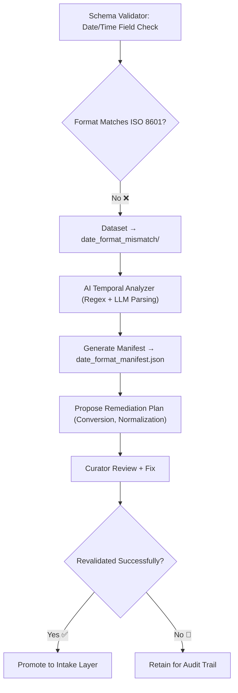

<div align="center">

# 📅 Kansas Frontier Matrix — **Date Format Mismatch**  
`data/work/staging/tabular/tmp/intake/validation/quarantine/incoming/flagged_datasets/schema_errors/invalid_field_types/date_format_mismatch/`

### *“When time is miswritten, history bends — validation restores the timeline.”*

**Purpose:**  
This directory contains datasets that failed validation because **date or time fields were formatted inconsistently** or in a **non-ISO standard**.  
These discrepancies prevent proper temporal reasoning and historical alignment within the Kansas Frontier Matrix (KFM) knowledge graph.

[](../../../../../../../../../../../../../../../docs/architecture/repo-focus.md)  
[](../../../../../../../../../../../../../../../LICENSE)  
[]()  
[]()  
[]()

</div>

---

## 🧭 Overview

The **Date Format Mismatch Subdirectory** captures all tabular datasets in which temporal fields deviate from ISO 8601 or the KFM-approved date/time schema.  
Common issues include:
- Non-ISO formats (`MM/DD/YYYY`, `DD-MM-YY`, etc.)  
- Inconsistent time zones or offsets  
- Partial timestamps (date-only vs. datetime)  
- Mixed delimiters or locale variations (`2025年10月26日`, `26.Oct.2025`)  
- Erroneous string parsing (extra spaces, commas, or invalid characters)

These anomalies disrupt temporal analytics, FAIR+CARE data integration, and CIDOC CRM alignment for events and historical processes.

---

## 🗂️ Directory Layout

```text
data/work/staging/tabular/tmp/intake/validation/quarantine/incoming/flagged_datasets/schema_errors/invalid_field_types/date_format_mismatch/
├── date_format_manifest.json           # Manifest of detected date/time format mismatches
├── ai_date_diagnostics.json            # AI reasoning and pattern interpretation
├── remediation_plan.json               # Suggested format conversion operations
├── examples/                           # CSV/JSON snippets showing formatting errors
│   ├── ks_census_1870_example.csv
│   ├── ks_land_registry_1885_example.json
│   └── ks_agriculture_1890_example.csv
├── curator_notes.log                   # Human notes on remediation decisions
└── README.md                           # This document
````

---

## 🔁 Detection Workflow



---

## 🧩 Manifest Schema

Each format inconsistency is documented in `date_format_manifest.json` as follows:

| Field                    | Description                               | Example                                                                      |
| ------------------------ | ----------------------------------------- | ---------------------------------------------------------------------------- |
| `dataset_id`             | Dataset name                              | `ks_census_1870`                                                             |
| `column_name`            | Field containing invalid date/time        | `recorded_date`                                                              |
| `invalid_formats`        | List of non-conforming date formats found | `["03/14/1870", "1870-3-14", "14-Mar-70"]`                                   |
| `expected_format`        | Correct ISO 8601 pattern                  | `"YYYY-MM-DD"`                                                               |
| `ai_confidence`          | Confidence level of detection             | `0.991`                                                                      |
| `ai_explanation`         | Model summary of the mismatch             | `"Detected mixed date formats and ambiguous delimiters in 'recorded_date'."` |
| `remediation_suggestion` | Proposed correction                       | `"Convert all entries to ISO 8601 via pandas.to_datetime()"`                 |
| `timestamp`              | Detection timestamp                       | `2025-10-26T15:02:08Z`                                                       |

---

## 🤖 AI Temporal Analysis

| AI Module                     | Function                                                            | Output                                                  |
| ----------------------------- | ------------------------------------------------------------------- | ------------------------------------------------------- |
| **Temporal Pattern Detector** | Detects non-standard date/time formats using regex and heuristics.  | `date_format_manifest.json`                             |
| **LLM Temporal Reasoner**     | Infers intended chronology when formats are ambiguous.              | `ai_date_diagnostics.json`                              |
| **Auto-Formatter**            | Suggests code templates for standardization (e.g., Python, R, SQL). | `remediation_plan.json`                                 |
| **Provenance Timekeeper**     | Logs correction lineage for FAIR+CARE auditing.                     | `governance/tabular_date_format_mismatch_ledger.jsonld` |

> 🧠 *AI engines ensure interpretability and reversible transformations, following MCP transparency mandates.*

---

## ⚙️ Curator Workflow

Curators must:

1. Review the `date_format_manifest.json` and `ai_date_diagnostics.json` outputs.
2. Apply date normalization procedures (e.g., standardizing to `YYYY-MM-DD`).
3. Record any manual corrections or exceptions in `curator_notes.log`.
4. Re-run:

   ```bash
   make revalidate-flagged
   ```
5. Confirm successful revalidation and update the governance ledger.

---

## 🧾 Compliance Matrix

| Standard                 | Scope                                       | Validator       |
| ------------------------ | ------------------------------------------- | --------------- |
| **ISO 8601:2019**        | International date/time standard compliance | Internal parser |
| **FAIR+CARE**            | Temporal metadata and ethical transparency  | `fair-audit`    |
| **CIDOC CRM / OWL-Time** | Event and temporal ontology conformance     | `graph-lint`    |
| **MCP-DL v6.3**          | Documentation-first reproducibility         | `docs-validate` |
| **STAC / DCAT 3.0**      | SpatioTemporal metadata cataloging          | `stac-validate` |

---

## 🪶 Version History

| Version | Date       | Author              | Notes                                                                                            |
| ------- | ---------- | ------------------- | ------------------------------------------------------------------------------------------------ |
| v9.0.0  | 2025-10-26 | `@kfm-architecture` | Initial creation of Date Format Mismatch documentation under Diamond⁹ Ω / Crown∞Ω certification. |

---

<div align="center">

### 🜂 Kansas Frontier Matrix — *Time · Structure · Provenance*

**“Temporal precision defines historical truth — and every timestamp must speak clearly.”**

[]()
[]()
[]()
[]()
[]()

<br><br> <a href="#-kansas-frontier-matrix--date-format-mismatch-invalid-field-type-subclass--diamond⁹-Ω--crown∞Ω-certified">⬆ Back to Top</a>

</div>
