<div align="center">

# 🕰️ Kansas Frontier Matrix — **Date Format Mismatch Examples**  
`data/work/staging/tabular/tmp/intake/validation/quarantine/incoming/flagged_datasets/schema_errors/invalid_field_types/date_format_mismatch/examples/`

### *“Even time must speak in the same language.”*

**Purpose:**  
This directory contains **sample data fragments** demonstrating non-standard, inconsistent, or invalid date/time formats detected during schema validation.  
These examples serve as verifiable evidence for human curation, AI model refinement, and FAIR+CARE governance transparency.

[](../../../../../../../../../../../../../../../../../../../../docs/architecture/repo-focus.md)  
[](../../../../../../../../../../../../../../../../../../../../LICENSE)  
[]()  
[]()  
[]()

</div>

---

## 🧭 Overview

The **Date Format Mismatch Examples Layer** showcases extracted CSV and JSON samples from quarantined datasets where date or time fields deviate from ISO 8601 or declared schema standards.  
Commonly observed anomalies include:
- `MM/DD/YYYY` instead of `YYYY-MM-DD`  
- Two-digit years (`12-25-70`)  
- Localized date expressions (`26 Octobre 1890`, `OCT/26/1890`)  
- Ambiguous datetime values (`03/04/1895 12:00`, no timezone)  

These examples enable:
- Auditable evidence of date parsing failures  
- AI-based format recognition improvements  
- Reproducible validation testing and FAIR+CARE compliance assurance  

---

## 🗂️ Directory Layout

```text
data/work/staging/tabular/tmp/intake/validation/quarantine/incoming/flagged_datasets/schema_errors/invalid_field_types/date_format_mismatch/examples/
├── ks_census_1870_example.csv              # Non-ISO date strings (e.g., "3/14/1870")
├── ks_land_registry_1885_example.json      # Irregular formats & locale variations
├── ks_agriculture_1890_example.csv         # Ambiguous short year or missing delimiter
├── ai_date_format_summary.json             # AI interpretation and confidence scores
├── evidence_checksums.json                 # SHA-256 digests for all example files
└── README.md                               # This document
````

---

## 🔁 Example Extraction Workflow

```mermaid
flowchart TD
    A["Detected Non-ISO Date Field"] --> B["Extract 5–10 Records Exhibiting Invalid Formats"]
    B --> C["Store as CSV/JSON Evidence File"]
    C --> D["Compute Checksum (SHA-256)"]
    D --> E["AI Temporal Parser Analysis (LLM + Regex)"]
    E --> F["Generate ai_date_format_summary.json"]
    F --> G["Link Example Provenance → Governance Ledger"]
```



---

## 📄 Example Metadata Schema

Each example is documented in `ai_date_format_summary.json` with contextual metadata:

| Field             | Description                        | Example                                                               |
| ----------------- | ---------------------------------- | --------------------------------------------------------------------- |
| `dataset_id`      | Source dataset name                | `ks_land_registry_1885`                                               |
| `file_path`       | Path to extracted sample           | `examples/ks_land_registry_1885_example.json`                         |
| `column_name`     | Affected field                     | `registration_date`                                                   |
| `invalid_formats` | Non-conforming formats detected    | `["03/14/1885", "1885-3-14", "14-Mar-85"]`                            |
| `expected_format` | Schema-defined ISO pattern         | `"YYYY-MM-DD"`                                                        |
| `ai_explanation`  | AI summary of inconsistency        | `"Detected mixed and ambiguous date formats in 'registration_date'."` |
| `checksum`        | SHA-256 hash of example file       | `e5a9dfba24169f7e52c7...`                                             |
| `timestamp`       | UTC timestamp of sample generation | `2025-10-26T15:04:15Z`                                                |

---

## 🤖 AI Temporal Reasoning Modules

| Module                      | Function                                                            | Output                                                |
| --------------------------- | ------------------------------------------------------------------- | ----------------------------------------------------- |
| **AI Date Format Detector** | Identifies mixed or locale-specific date formats.                   | `ai_date_format_summary.json`                         |
| **Temporal Reasoner**       | Suggests probable intended standardization based on context.        | `ai_date_format_summary.json`                         |
| **Checksum Validator**      | Confirms example integrity with SHA-256 verification.               | `evidence_checksums.json`                             |
| **Ontology Mapper**         | Links date anomalies to OWL-Time and CIDOC CRM temporal properties. | `tabular_date_format_mismatch_examples_ledger.jsonld` |

> 🧠 *AI outputs include confidence intervals and provenance metadata, ensuring reproducibility and explainability under MCP-DL.*

---

## ⚙️ Curator Workflow

Curators are responsible for:

1. Reviewing extracted examples and AI comments in `ai_date_format_summary.json`.
2. Confirming the type of temporal inconsistency (delimiter, locale, timezone).
3. Applying corrections using schema-standard date normalization.
4. Verifying checksum integrity via:

   ```bash
   make checksum-verify
   ```
5. Documenting correction strategy in the main dataset’s `curator_notes.log`.
6. Running revalidation:

   ```bash
   make revalidate-flagged
   ```

---

## 🧾 Compliance Matrix

| Standard                 | Scope                                         | Validator           |
| ------------------------ | --------------------------------------------- | ------------------- |
| **ISO 8601**             | Date/time normalization and formatting        | `temporal-validate` |
| **FAIR+CARE**            | Temporal transparency and ethical stewardship | `fair-audit`        |
| **CIDOC CRM / OWL-Time** | Semantic modeling of time intervals           | `graph-lint`        |
| **MCP-DL v6.3**          | Documentation-driven reproducibility          | `docs-validate`     |
| **STAC / DCAT 3.0**      | SpatioTemporal metadata standardization       | `stac-validate`     |

---

## 🪶 Version History

| Version | Date       | Author              | Notes                                                                                                    |
| ------- | ---------- | ------------------- | -------------------------------------------------------------------------------------------------------- |
| v9.0.0  | 2025-10-26 | `@kfm-architecture` | Initial creation of Date Format Mismatch Example documentation under Diamond⁹ Ω / Crown∞Ω certification. |

---

<div align="center">

### 🜂 Kansas Frontier Matrix — *Time · Precision · Provenance*

**“Every moment miswritten is a lesson in precision — and validation remembers the past correctly.”**

[]()
[]()
[]()
[]()
[]()

<br><br> <a href="#-kansas-frontier-matrix--date-format-mismatch-examples-error-evidence-layer--diamond⁹-Ω--crown∞Ω-certified">⬆ Back to Top</a>

</div>
