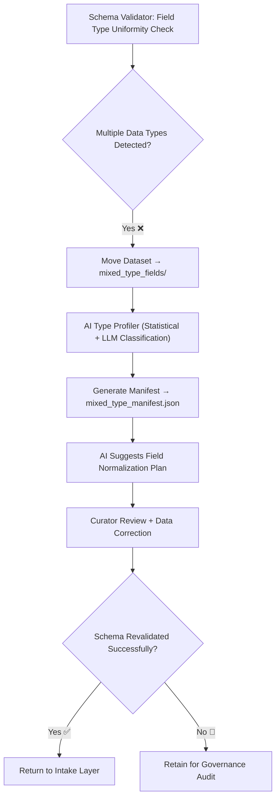

<div align="center">

# 🧩 Kansas Frontier Matrix — **Mixed-Type Fields**  
`data/work/staging/tabular/tmp/intake/validation/quarantine/incoming/flagged_datasets/schema_errors/invalid_field_types/mixed_type_fields/`

### *“When a field tells too many stories, validation brings order to the narrative.”*

**Purpose:**  
This directory contains datasets where **individual columns contain multiple data types** (e.g., a mix of strings, numbers, booleans, or dates).  
Such inconsistencies disrupt schema validation, AI reasoning, and knowledge graph integration within the Kansas Frontier Matrix (KFM).

[](../../../../../../../../../../../../../../../docs/architecture/repo-focus.md)  
[](../../../../../../../../../../../../../../../LICENSE)  
[]()  
[]()  
[]()

</div>

---

## 🧭 Overview

The **Mixed-Type Fields Subdirectory** isolates datasets that violate type uniformity within single columns.  
This problem is particularly common when tabular data originates from OCR, user-entered spreadsheets, or inconsistent ETL transformations.  
Common issues include:
- Numeric and text values in the same field (`"25"`, `"unknown"`, `"NULL"`)  
- Boolean and integer mixing (`true`, `0`, `1`, `"false"`)  
- Temporal and text mixing (`"2025-10-26"`, `"October 26"`)  
- Heterogeneous categorical encodings (`"A"`, `1`, `"missing"`)  

Such inconsistencies lead to schema conflicts, AI model confusion, and loss of data integrity during graph ingestion.

---

## 🗂️ Directory Layout

```text
data/work/staging/tabular/tmp/intake/validation/quarantine/incoming/flagged_datasets/schema_errors/invalid_field_types/mixed_type_fields/
├── mixed_type_manifest.json           # Master manifest of mixed-type field anomalies
├── ai_mixed_type_diagnostics.json     # AI-generated field type distribution & reasoning
├── remediation_plan.json              # Curator & AI suggestions for normalization
├── examples/                          # CSV/JSON snippets illustrating mixed-type issues
│   ├── ks_census_1880_example.csv
│   ├── ks_property_1890_example.json
│   └── ks_taxrolls_1900_example.csv
├── curator_notes.log                  # Manual curator notes and resolution tracking
└── README.md                          # This document
````

---

## 🔁 Detection Workflow



---

## 🧩 Manifest Schema

Each record in `mixed_type_manifest.json` provides contextual metadata for the field-level anomaly:

| Field                    | Description                                | Example                                                                                              |
| ------------------------ | ------------------------------------------ | ---------------------------------------------------------------------------------------------------- |
| `dataset_id`             | Dataset name                               | `ks_census_1880`                                                                                     |
| `column_name`            | Mixed-type field                           | `population_density`                                                                                 |
| `detected_types`         | Data types present in the column           | `["integer", "string", "null"]`                                                                      |
| `dominant_type`          | Most frequent valid data type              | `"integer"`                                                                                          |
| `inconsistent_ratio`     | Percent of records violating dominant type | `0.12`                                                                                               |
| `ai_explanation`         | LLM commentary on anomaly                  | `"Column 'population_density' includes both numeric and textual values such as 'unknown' or 'N/A'."` |
| `remediation_suggestion` | Recommended fix                            | `"Replace non-numeric text with null or convert entire column to string type."`                      |
| `timestamp`              | Detection time (UTC)                       | `2025-10-26T15:06:48Z`                                                                               |

---

## 🤖 AI Type Profiler

| AI Module              | Function                                               | Output                                    |
| ---------------------- | ------------------------------------------------------ | ----------------------------------------- |
| **Type Classifier**    | Detects non-uniform data types within columns          | `mixed_type_manifest.json`                |
| **Value Analyzer**     | Identifies typical outliers and non-conforming entries | `ai_mixed_type_diagnostics.json`          |
| **Normalizer Planner** | Suggests coercion or conversion rules per field        | `remediation_plan.json`                   |
| **Semantic Evaluator** | Links mixed-type issues to schema-level semantics      | `tabular_mixed_type_fields_ledger.jsonld` |

> 🧠 *AI modules are fully explainable under MCP-DL principles, providing reasoning trails and reproducible detection steps.*

---

## ⚙️ Curator Workflow

Curators must:

1. Review each field flagged in `mixed_type_manifest.json`.
2. Assess the AI’s remediation recommendations.
3. Apply conversions (type coercion, replacement, or null standardization).
4. Record remediation details in `curator_notes.log`.
5. Execute revalidation:

   ```bash
   make revalidate-flagged
   ```
6. Confirm schema conformance and governance ledger update.

---

## 📈 Example Anomaly Patterns

| Category              | Invalid Examples               | Corrected Output                 |
| --------------------- | ------------------------------ | -------------------------------- |
| **Numeric + Text**    | `"45"`, `"unknown"`, `"NULL"`  | `45`, `null`, `null`             |
| **Boolean + Integer** | `true`, `0`, `1`, `"false"`    | `true`, `false`, `true`, `false` |
| **Date + Text**       | `"2025-10-26"`, `"October 26"` | `"2025-10-26"`                   |
| **Categorical Mix**   | `"A"`, `1`, `"missing"`        | `"A"`, `"1"`, `"missing"`        |

---

## 🧾 Compliance Matrix

| Standard                 | Scope                               | Validator       |
| ------------------------ | ----------------------------------- | --------------- |
| **JSON Schema Draft-07** | Field type validation and coercion  | `jsonschema`    |
| **FAIR+CARE**            | Ethical and documentation alignment | `fair-audit`    |
| **CIDOC CRM / PROV-O**   | Provenance traceability             | `graph-lint`    |
| **MCP-DL v6.3**          | Documentation-first reproducibility | `docs-validate` |
| **STAC / DCAT 3.0**      | Metadata interoperability           | `stac-validate` |

---

## 🪶 Version History

| Version | Date       | Author              | Notes                                                                                         |
| ------- | ---------- | ------------------- | --------------------------------------------------------------------------------------------- |
| v9.0.0  | 2025-10-26 | `@kfm-architecture` | Initial creation of Mixed-Type Fields documentation under Diamond⁹ Ω / Crown∞Ω certification. |

---

<div align="center">

### 🜂 Kansas Frontier Matrix — *Uniformity · Integrity · Provenance*

**“When columns speak many dialects, schema validation ensures a common tongue.”**

[]()
[]()
[]()
[]()
[]()

<br><br> <a href="#-kansas-frontier-matrix--mixed-type-fields-invalid-field-type-subclass--diamond⁹-Ω--crown∞Ω-certified">⬆ Back to Top</a>

</div>
