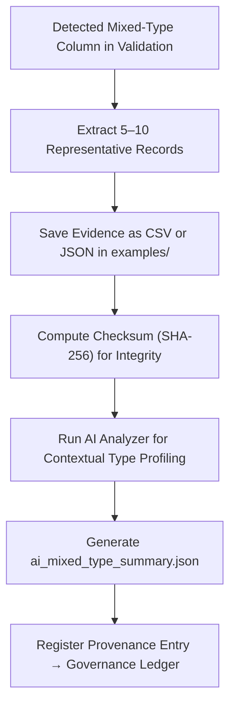

<div align="center">

# 📘 Kansas Frontier Matrix — **Mixed-Type Field Examples**  
`data/work/staging/tabular/tmp/intake/validation/quarantine/incoming/flagged_datasets/schema_errors/invalid_field_types/mixed_type_fields/examples/`

### *“When one field speaks multiple languages, validation becomes the interpreter.”*

**Purpose:**  
This directory houses **data fragments (CSV/JSON)** that exhibit mixed-type inconsistencies within single columns — e.g., text mixed with numeric or boolean values.  
These examples are retained as reproducible evidence for validation transparency, AI learning, and FAIR+CARE documentation.

[](../../../../../../../../../../../../../../../../../../../../docs/architecture/repo-focus.md)  
[](../../../../../../../../../../../../../../../../../../../../LICENSE)  
[]()  
[]()  
[]()

</div>

---

## 🧭 Overview

The **Mixed-Type Field Examples Layer** contains extracted evidence from quarantined datasets illustrating field-level type heterogeneity.  
These samples allow:
- Human-readable verification of validation failures  
- AI model retraining for anomaly classification  
- Documentation of schema correction practices  
- FAIR+CARE-compliant transparency across validation pipelines  

Common examples:
- `"45"`, `"unknown"`, `"NULL"` in numeric fields  
- `true`, `"false"`, `"1"` in boolean columns  
- `"1870-10-26"`, `"Oct 26"` in temporal columns  

---

## 🗂️ Directory Layout

```text
data/work/staging/tabular/tmp/intake/validation/quarantine/incoming/flagged_datasets/schema_errors/invalid_field_types/mixed_type_fields/examples/
├── ks_census_1880_example.csv            # Field mixing numeric + text
├── ks_property_1890_example.json          # Mixed date + string entries
├── ks_taxrolls_1900_example.csv           # Boolean and numeric mixing
├── ai_mixed_type_summary.json             # AI reasoning for detected examples
├── evidence_checksums.json                # SHA-256 hashes verifying integrity
└── README.md                              # This document
````

---

## 🔁 Example Extraction Workflow



---

## 📄 Example Metadata Schema

Each example is referenced in `ai_mixed_type_summary.json` with detailed metadata:

| Field            | Description                        | Example                                                                        |
| ---------------- | ---------------------------------- | ------------------------------------------------------------------------------ |
| `dataset_id`     | Originating dataset ID             | `ks_census_1880`                                                               |
| `file_path`      | Path to example file               | `examples/ks_census_1880_example.csv`                                          |
| `column_name`    | Mixed-type column name             | `population_density`                                                           |
| `detected_types` | Data types identified in the field | `["integer", "string", "null"]`                                                |
| `ai_comment`     | AI-generated summary of issue      | `"Column mixes numbers and text ('unknown', 'NULL'); normalization required."` |
| `checksum`       | SHA-256 digest of example file     | `8c45b7c9da41a51b33b7c18...`                                                   |
| `timestamp`      | Extraction time                    | `2025-10-26T15:08:15Z`                                                         |

---

## 🤖 AI Field Profiling

| AI Module             | Function                                               | Output                                            |
| --------------------- | ------------------------------------------------------ | ------------------------------------------------- |
| **Type Classifier**   | Detects non-uniform type usage within a column         | `ai_mixed_type_summary.json`                      |
| **Semantic Analyzer** | Assesses potential meaning and context of mixed values | `ai_mixed_type_summary.json`                      |
| **Checksum Verifier** | Validates example file integrity                       | `evidence_checksums.json`                         |
| **Governance Mapper** | Links each example to provenance logs                  | `tabular_mixed_type_field_examples_ledger.jsonld` |

> 🧠 *All AI outputs include transparency fields such as `confidence`, `explanation`, and `origin` per MCP-DL compliance.*

---

## ⚙️ Curator Workflow

Curators are responsible for:

1. Reviewing the AI-generated summary for each example.
2. Verifying extracted rows represent the actual type conflict.
3. Annotating corrections or decisions in `curator_notes.log` of the parent directory.
4. Revalidating the corrected dataset using:

   ```bash
   make revalidate-flagged
   ```
5. Confirming checksum integrity post-correction.

---

## 🧾 Compliance Matrix

| Standard                 | Scope                                  | Validator       |
| ------------------------ | -------------------------------------- | --------------- |
| **JSON Schema Draft-07** | Field type and constraint verification | `jsonschema`    |
| **FAIR+CARE**            | Transparent handling of error evidence | `fair-audit`    |
| **CIDOC CRM / PROV-O**   | Provenance and semantic documentation  | `graph-lint`    |
| **ISO 19115 / 19157**    | Data quality and metadata lineage      | `geojson-lint`  |
| **MCP-DL v6.3**          | Documentation-first reproducibility    | `docs-validate` |

---

## 🪶 Version History

| Version | Date       | Author              | Notes                                                                                                |
| ------- | ---------- | ------------------- | ---------------------------------------------------------------------------------------------------- |
| v9.0.0  | 2025-10-26 | `@kfm-architecture` | Initial creation of Mixed-Type Field Example documentation under Diamond⁹ Ω / Crown∞Ω certification. |

---

<div align="center">

### 🜂 Kansas Frontier Matrix — *Clarity · Precision · Provenance*

**“Heterogeneity breeds confusion — documentation restores meaning.”**

[]()
[]()
[]()
[]()
[]()

<br><br> <a href="#-kansas-frontier-matrix--mixed-type-field-examples-error-evidence-layer--diamond⁹-Ω--crown∞Ω-certified">⬆ Back to Top</a>

</div>
