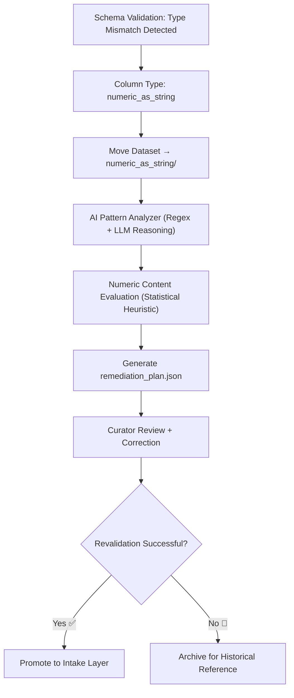

<div align="center">

# 🔢 Kansas Frontier Matrix — **Numeric-as-String Errors**  
`data/work/staging/tabular/tmp/intake/validation/quarantine/incoming/flagged_datasets/schema_errors/invalid_field_types/numeric_as_string/`

### *“When numbers forget to be numbers, validation reminds them who they are.”*

**Purpose:**  
This directory contains datasets where **numeric fields are incorrectly stored as strings**, causing schema mismatches or analytical inconsistencies.  
These files are automatically quarantined by KFM’s schema validation and AI diagnostic engines for correction and provenance logging.

[](../../../../../../../../../../../../../../../../docs/architecture/repo-focus.md)  
[](../../../../../../../../../../../../../../../../LICENSE)  
[]()  
[]()  
[]()

</div>

---

## 🧭 Overview

The **Numeric-as-String Subdirectory** captures datasets containing columns that should hold numeric values (e.g., `integer`, `float`) but instead contain text-formatted numbers such as `"12"`, `"001"`, or `"9.5 "`.  
These errors disrupt sorting, aggregation, and machine reasoning tasks in downstream processes.  
Detection is performed through:
- Schema comparison (expected type vs. actual type)
- AI pattern detection (character-level inspection for non-numeric symbols)
- Statistical validation (distribution anomalies for numeric columns)

---

## 🗂️ Directory Layout

```text
data/work/staging/tabular/tmp/intake/validation/quarantine/incoming/flagged_datasets/schema_errors/invalid_field_types/numeric_as_string/
├── samples/                           # Example rows exhibiting numeric-as-string issues
├── manifests/                         # Per-file manifest of numeric anomalies
├── ai_numeric_diagnostics.json        # AI-generated diagnostic summaries
├── remediation_plan.json              # Suggested data type conversions
├── curator_notes.log                  # Human audit trail for corrections
└── README.md                          # This document
````

---

## 🔁 Detection Workflow



---

## 🧩 Manifest Schema

Each anomaly detected is logged in `manifests/numeric_as_string_manifest.json`:

| Field                    | Description                 | Example                                                               |
| ------------------------ | --------------------------- | --------------------------------------------------------------------- |
| `dataset_id`             | Dataset identifier          | `ks_agriculture_1870`                                                 |
| `column_name`            | Field name with issue       | `acreage_total`                                                       |
| `expected_type`          | Expected type in schema     | `integer`                                                             |
| `detected_type`          | Observed type               | `string`                                                              |
| `error_sample`           | Example invalid value       | `"4500"`                                                              |
| `ai_explanation`         | AI-generated reasoning      | `"Field 'acreage_total' contains numeric values encoded as strings."` |
| `remediation_suggestion` | AI or curator-suggested fix | `convert column 'acreage_total' to integer`                           |
| `timestamp`              | UTC timestamp               | `2025-10-26T14:33:15Z`                                                |

---

## 🤖 AI Diagnostics Modules

| Module                  | Function                                                                   | Output                                      |
| ----------------------- | -------------------------------------------------------------------------- | ------------------------------------------- |
| **Regex Inspector**     | Detects numbers stored as quoted strings                                   | `ai_numeric_diagnostics.json`               |
| **LLM Schema Analyzer** | Evaluates semantic context to confirm intended type                        | `ai_numeric_diagnostics.json`               |
| **Auto-Converter**      | Generates recommended casting or cleaning operations                       | `remediation_plan.json`                     |
| **Anomaly Profiler**    | Detects patterns in data format errors (e.g., thousands separators, units) | `manifests/numeric_as_string_manifest.json` |

> 🧠 *All AI modules comply with MCP-DL explainability standards — each decision includes a justification and confidence score.*

---

## ⚙️ Curator Workflow

Curators addressing numeric-as-string issues should:

1. Inspect the anomaly manifest and AI diagnostic summary.
2. Confirm the intended field type via schema reference.
3. Apply necessary conversion (e.g., casting to integer or float).
4. Record the fix in `curator_notes.log`.
5. Run revalidation with:

   ```bash
   make revalidate-flagged
   ```
6. Verify checksum and schema compliance upon re-entry.

---

## 🧾 Compliance Matrix

| Standard                 | Scope                                 | Validator       |
| ------------------------ | ------------------------------------- | --------------- |
| **JSON Schema Draft-07** | Field type enforcement                | `jsonschema`    |
| **STAC 1.0 / DCAT 3.0**  | Metadata harmonization                | `stac-validate` |
| **CIDOC CRM / PROV-O**   | Provenance and lineage representation | `graph-lint`    |
| **FAIR+CARE**            | Transparency and ethical governance   | `fair-audit`    |
| **MCP-DL v6.3**          | Documentation-driven reproducibility  | `docs-validate` |

---

## 🪶 Version History

| Version | Date       | Author              | Notes                                                                                                      |
| ------- | ---------- | ------------------- | ---------------------------------------------------------------------------------------------------------- |
| v9.0.0  | 2025-10-26 | `@kfm-architecture` | Initial creation of Numeric-as-String schema error documentation under Diamond⁹ Ω / Crown∞Ω certification. |

---

<div align="center">

### 🜂 Kansas Frontier Matrix — *Precision · Audit · Correction*

**“A number in quotes is still a number — until validation makes it real.”**

[]()
[]()
[]()
[]()
[]()

<br><br> <a href="#-kansas-frontier-matrix--numeric-as-string-errors-invalid-field-type-subclass--diamond⁹-Ω--crown∞Ω-certified">⬆ Back to Top</a>

</div>
