<div align="center">

# 🗃️ Kansas Frontier Matrix — **Numeric-as-String Manifests**  
`data/work/staging/tabular/tmp/intake/validation/quarantine/incoming/flagged_datasets/schema_errors/invalid_field_types/numeric_as_string/manifests/`

### *“Every anomaly deserves a paper trail.”*

**Purpose:**  
This directory contains the **JSON manifest files** documenting numeric-as-string schema violations.  
Each manifest provides machine- and human-readable metadata describing the datasets, fields, errors, and AI diagnostics related to numeric field misclassification.

[](../../../../../../../../../../../../../../../../../docs/architecture/repo-focus.md)  
[](../../../../../../../../../../../../../../../../../LICENSE)  
[]()  
[]()  
[]()

</div>

---

## 🧭 Overview

The **Numeric-as-String Manifest Layer** functions as the authoritative record for all detected numeric type errors.  
Each manifest entry is automatically generated during the **schema validation → quarantine intake** sequence and includes:

- Dataset and field identifiers  
- Description of numeric-as-string conditions  
- AI interpretation and remediation suggestions  
- Provenance metadata (source, timestamp, checksum)  
- Linkage to FAIR+CARE and MCP governance ledgers  

Manifests serve both as **evidence logs** and as **training data** for refining schema validation models.

---

## 🗂️ Directory Layout

```text
data/work/staging/tabular/tmp/intake/validation/quarantine/incoming/flagged_datasets/schema_errors/invalid_field_types/numeric_as_string/manifests/
├── numeric_as_string_manifest.json      # Master record of all numeric-as-string anomalies
├── dataset_level_manifests/             # Individual JSON manifests per dataset
│   ├── ks_population_1880_manifest.json
│   ├── ks_agriculture_1870_manifest.json
│   └── ks_demographics_1900_manifest.json
├── ai_manifest_analysis.json            # AI commentary and confidence metadata
├── remediation_actions.json             # Machine-readable fix proposals
└── README.md                            # This document
````

---

## 🔁 Manifest Generation Workflow

```mermaid
flowchart TD
    A["Validation Engine detects numeric-as-string mismatch"] --> B["Create Dataset Manifest"]
    B --> C["Compute Checksums + Record Provenance Metadata"]
    C --> D["AI Analyzer adds Interpretation & Remediation Advice"]
    D --> E["Append Entry → numeric_as_string_manifest.json"]
    E --> F["Sync Provenance to Governance Ledger"]
```



---

## 🧩 Manifest Schema Fields

| Field                | Description                                | Example                                                                           |
| -------------------- | ------------------------------------------ | --------------------------------------------------------------------------------- |
| `dataset_id`         | Unique dataset identifier                  | `ks_census_1870`                                                                  |
| `column_name`        | Column containing numeric-as-string values | `population_total`                                                                |
| `expected_type`      | Expected schema type                       | `integer`                                                                         |
| `detected_type`      | Actual detected type                       | `string`                                                                          |
| `anomaly_ratio`      | Percentage of affected records             | `0.42`                                                                            |
| `ai_explanation`     | LLM-generated explanation                  | `"Field 'population_total' stores numeric data as strings with trailing spaces."` |
| `remediation_action` | Suggested fix                              | `"Convert 'population_total' column to integer after trimming whitespace."`       |
| `checksum`           | SHA-256 hash of dataset                    | `cd48d7a81be41c982e7...`                                                          |
| `timestamp`          | Validation time in UTC                     | `2025-10-26T14:38:02Z`                                                            |

---

## 🤖 AI Integration & Reporting

| AI Module                 | Function                                                                          | Output                                                        |
| ------------------------- | --------------------------------------------------------------------------------- | ------------------------------------------------------------- |
| **AI Manifest Annotator** | Enhances manifests with human-readable explanations and classification summaries. | `ai_manifest_analysis.json`                                   |
| **Confidence Engine**     | Assigns accuracy/confidence levels to AI recommendations.                         | `ai_manifest_analysis.json`                                   |
| **Remediation Planner**   | Suggests automated schema corrections.                                            | `remediation_actions.json`                                    |
| **Governance Sync Agent** | Links manifest updates to the provenance ledger.                                  | `governance/tabular_numeric_as_string_manifest_ledger.jsonld` |

> 🧠 *All AI operations are logged with justification metadata under MCP transparency principles.*

---

## ⚙️ Curator Workflow

Curators must:

1. Review AI commentary in `ai_manifest_analysis.json`.
2. Verify field-level mismatches and remediation accuracy.
3. Update `remediation_actions.json` if manual intervention is required.
4. Confirm all corrected datasets via `make revalidate-flagged`.
5. Ensure updated manifests are hashed and version-locked.

---

## 🧾 Compliance Matrix

| Standard                 | Scope                                        | Validator       |
| ------------------------ | -------------------------------------------- | --------------- |
| **JSON Schema Draft-07** | Schema enforcement for manifest format       | `jsonschema`    |
| **FAIR+CARE**            | Transparency & ethics in validation metadata | `fair-audit`    |
| **MCP-DL v6.3**          | Documentation and provenance logging         | `docs-validate` |
| **CIDOC CRM / PROV-O**   | Semantic linkage to provenance records       | `graph-lint`    |
| **ISO 19115 / 19157**    | Metadata integrity and lineage tracking      | `geojson-lint`  |

---

## 🪶 Version History

| Version | Date       | Author              | Notes                                                                                                  |
| ------- | ---------- | ------------------- | ------------------------------------------------------------------------------------------------------ |
| v9.0.0  | 2025-10-26 | `@kfm-architecture` | Initial creation of Numeric-as-String manifest documentation under Diamond⁹ Ω / Crown∞Ω certification. |

---

<div align="center">

### 🜂 Kansas Frontier Matrix — *Documentation · Transparency · Governance*

**“Every dataset error deserves a trace — every trace deserves to be understood.”**

[]()
[]()
[]()
[]()
[]()

<br><br> <a href="#-kansas-frontier-matrix--numeric-as-string-manifests-error-metadata--diamond⁹-Ω--crown∞Ω-certified">⬆ Back to Top</a>

</div>
