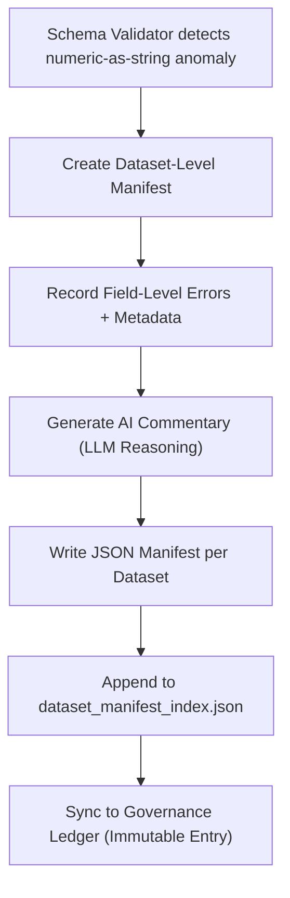

<div align="center">

# 📑 Kansas Frontier Matrix — **Dataset-Level Numeric-as-String Manifests**  
`data/work/staging/tabular/tmp/intake/validation/quarantine/incoming/flagged_datasets/schema_errors/invalid_field_types/numeric_as_string/manifests/dataset_level_manifests/`

### *“Every dataset has its own fingerprint — and every fingerprint deserves a record.”*

**Purpose:**  
This directory contains **dataset-specific manifest files** summarizing numeric-as-string validation errors at the dataset level.  
Each file records localized issues (column, type mismatch, AI commentary, provenance) for individual tabular datasets under review.

[](../../../../../../../../../../../../../../../../../../../docs/architecture/repo-focus.md)  
[](../../../../../../../../../../../../../../../../../../../LICENSE)  
[]()  
[]()  
[]()

</div>

---

## 🧭 Overview

The **Dataset-Level Manifest Layer** extends the numeric-as-string reporting hierarchy, providing granular, per-dataset insight into schema type mismatches.  
Each manifest here is an isolated log for a single dataset, created automatically when the **schema validation engine** or **AI anomaly detector** flags one or more numeric-as-string violations.

These manifests form the **lowest tier of provenance tracking**, enabling traceable repair, versioning, and revalidation per dataset.

---

## 🗂️ Directory Layout

```text
data/work/staging/tabular/tmp/intake/validation/quarantine/incoming/flagged_datasets/schema_errors/invalid_field_types/numeric_as_string/manifests/dataset_level_manifests/
├── ks_population_1880_manifest.json       # Dataset-specific manifest
├── ks_agriculture_1870_manifest.json      # Dataset-specific manifest
├── ks_demographics_1900_manifest.json     # Dataset-specific manifest
├── dataset_manifest_index.json            # Index of all dataset-level manifests
└── README.md                              # This document
````

---

## 🔁 Manifest Generation Workflow



---

## 🧩 Dataset-Level Manifest Schema

Each manifest (e.g., `ks_population_1880_manifest.json`) includes:

| Field                | Description                       | Example                                                               |
| -------------------- | --------------------------------- | --------------------------------------------------------------------- |
| `dataset_id`         | Dataset identifier                | `ks_population_1880`                                                  |
| `schema_version`     | Schema used during validation     | `v13`                                                                 |
| `flagged_fields`     | Fields with detected errors       | `["population_total", "growth_rate"]`                                 |
| `error_summary`      | Description of detected issues    | `"Field 'population_total' contains numeric data stored as strings."` |
| `ai_confidence`      | AI model certainty score (0–1)    | `0.975`                                                               |
| `error_samples`      | List of example invalid entries   | `["'35000'", "'12.5 '"]`                                              |
| `remediation_action` | Suggested fix                     | `"Convert 'population_total' and 'growth_rate' to numeric types."`    |
| `checksum`           | SHA-256 hash for dataset snapshot | `a8d4f26cb8a6b...`                                                    |
| `timestamp`          | UTC time of detection             | `2025-10-26T14:42:10Z`                                                |

---

## 🤖 AI Diagnostic Augmentation

| AI Module                 | Function                                                                     | Output                        |
| ------------------------- | ---------------------------------------------------------------------------- | ----------------------------- |
| **Dataset Insight Agent** | Generates natural-language summaries of detected numeric issues per dataset. | `*_manifest.json`             |
| **Confidence Engine**     | Scores accuracy of AI recommendations based on prior model history.          | `ai_confidence` field         |
| **Remediation Planner**   | Proposes corrective actions and SQL-compatible conversion expressions.       | `remediation_action`          |
| **Trend Analyzer**        | Tracks recurring field-type issues across datasets.                          | `dataset_manifest_index.json` |

> 🧠 *AI commentary is subject to human validation before re-ingestion — auto-corrections are not performed without curator approval.*

---

## ⚙️ Curator Workflow

Curators should:

1. Review dataset-specific manifests for type error details.
2. Verify AI explanations against schema definitions.
3. Update the dataset if corrections are applied.
4. Mark resolution progress in `dataset_manifest_index.json`.
5. Execute revalidation:

   ```bash
   make revalidate-flagged
   ```
6. Confirm successful reintegration by checking `reports/audit/numeric_as_string_dataset_audit.json`.

---

## 🧾 Compliance Matrix

| Standard                 | Scope                                        | Validator       |
| ------------------------ | -------------------------------------------- | --------------- |
| **JSON Schema Draft-07** | Manifest structural compliance               | `jsonschema`    |
| **FAIR+CARE**            | Responsible governance alignment             | `fair-audit`    |
| **CIDOC CRM / PROV-O**   | Provenance traceability and semantic linking | `graph-lint`    |
| **MCP-DL v6.3**          | Documentation-first reproducibility          | `docs-validate` |
| **STAC / DCAT 3.0**      | Dataset catalog metadata linkage             | `stac-validate` |

---

## 🪶 Version History

| Version | Date       | Author              | Notes                                                                                                                |
| ------- | ---------- | ------------------- | -------------------------------------------------------------------------------------------------------------------- |
| v9.0.0  | 2025-10-26 | `@kfm-architecture` | Initial creation of Dataset-Level Numeric-as-String manifest documentation under Diamond⁹ Ω / Crown∞Ω certification. |

---

<div align="center">

### 🜂 Kansas Frontier Matrix — *Granularity · Transparency · Validation*

**“Each dataset tells a story — manifests make sure it’s written down.”**

[]()
[]()
[]()
[]()
[]()

<br><br> <a href="#-kansas-frontier-matrix--dataset-level-numeric-as-string-manifests-diamond⁹-Ω--crown∞Ω-certified">⬆ Back to Top</a>

</div>
