<div align="center">

# 🧪 Kansas Frontier Matrix — **Numeric-as-String Sample Evidence**  
`data/work/staging/tabular/tmp/intake/validation/quarantine/incoming/flagged_datasets/schema_errors/invalid_field_types/numeric_as_string/samples/`

### *“Evidence matters — every anomaly tells a story.”*

**Purpose:**  
This directory archives **sample excerpts** from datasets where numeric values were improperly encoded as strings.  
These samples serve as direct evidence for AI, curator, and audit review within the Kansas Frontier Matrix validation ecosystem.

[](../../../../../../../../../../../../../../../../../docs/architecture/repo-focus.md)  
[](../../../../../../../../../../../../../../../../../LICENSE)  
[]()  
[]()  
[]()

</div>

---

## 🧭 Overview

The **Numeric-as-String Samples Repository** captures the **exact offending rows or field segments** from datasets exhibiting this validation error.  
Samples are extracted automatically by the AI diagnostics engine during quarantine classification and used to:
- Demonstrate precise schema non-conformance  
- Provide training data for anomaly model refinement  
- Support human-readable audit trails for governance reviews  
- Verify the effectiveness of remediation actions during revalidation  

Each sample is cryptographically hashed, version-controlled, and linked to its originating dataset and manifest entry.

---

## 🗂️ Directory Layout

```text
data/work/staging/tabular/tmp/intake/validation/quarantine/incoming/flagged_datasets/schema_errors/invalid_field_types/numeric_as_string/samples/
├── examples/                        # Snippets of offending data extracted from CSV/JSON files
│   ├── ks_population_1880_example.csv
│   ├── ks_agriculture_1870_example.json
│   └── ks_demographics_1900_example.csv
├── ai_sample_analysis.json           # AI-generated summaries describing detected patterns
├── sample_manifest.json              # Manifest linking each sample to its parent dataset
├── provenance_map.json               # Provenance linkage between samples and source files
└── README.md                         # This document
````

---

## 🔁 Sample Extraction Workflow

```mermaid
flowchart TD
    A["Detected Numeric-as-String Column"] --> B["Extract 5–10 Representative Rows"]
    B --> C["Hash Sample (SHA-256)"]
    C --> D["Generate Provenance Map (Dataset → Sample)"]
    D --> E["Write Evidence → examples/*.csv | *.json"]
    E --> F["Register in sample_manifest.json"]
    F --> G["Governance Ledger Link (JSON-LD Entry)"]
```



---

## 📄 Sample Manifest Schema

| Field           | Description                               | Example                                                                   |
| --------------- | ----------------------------------------- | ------------------------------------------------------------------------- |
| `dataset_id`    | Source dataset ID                         | `ks_census_1870`                                                          |
| `file_path`     | Sample file path                          | `examples/ks_census_1870_example.csv`                                     |
| `column_name`   | Column exhibiting numeric-as-string issue | `population_total`                                                        |
| `error_count`   | Count of erroneous records extracted      | `6`                                                                       |
| `ai_commentary` | LLM interpretation of cause               | `"All numeric entries stored as quoted strings with whitespace padding."` |
| `checksum`      | SHA-256 hash of the sample file           | `cf09b8faae51ac3c78a95...`                                                |
| `timestamp`     | Time extracted                            | `2025-10-26T14:34:55Z`                                                    |

---

## 🤖 AI Review Integration

| AI Component          | Role                                                            | Output                                                |
| --------------------- | --------------------------------------------------------------- | ----------------------------------------------------- |
| **Sample Summarizer** | Generates short descriptions for each numeric-as-string sample. | `ai_sample_analysis.json`                             |
| **Pattern Detector**  | Identifies recurring error patterns across datasets.            | `ai_sample_analysis.json`                             |
| **Provenance Linker** | Connects extracted samples to their original dataset records.   | `provenance_map.json`                                 |
| **Ethics Monitor**    | Ensures sampled data does not expose PII or sensitive content.  | `reports/fair/numeric_as_string_samples_summary.json` |

> 🧠 *AI modules work in tandem with FAIR+CARE auditors to ensure sample data handling remains ethically compliant.*

---

## ⚙️ Curator Workflow

Curators should:

1. Verify each extracted sample for schema alignment.
2. Document findings or corrections in the source dataset log.
3. Review AI commentary and confirm or dispute its explanation.
4. Update `sample_manifest.json` with resolution status.
5. Execute:

   ```bash
   make revalidate-flagged
   ```

   once remediation is complete.

---

## 🧾 Compliance Matrix

| Standard               | Scope                                        | Validator       |
| ---------------------- | -------------------------------------------- | --------------- |
| **FAIR+CARE**          | Ethical data reuse and handling              | `fair-audit`    |
| **MCP-DL v6.3**        | Documentation-based provenance               | `docs-validate` |
| **CIDOC CRM / PROV-O** | Provenance mapping and semantic traceability | `graph-lint`    |
| **ISO 19115 / 19157**  | Metadata lineage tracking                    | `geojson-lint`  |
| **STAC / DCAT 3.0**    | Open metadata cataloging                     | `stac-validate` |

---

## 🪶 Version History

| Version | Date       | Author              | Notes                                                                                                         |
| ------- | ---------- | ------------------- | ------------------------------------------------------------------------------------------------------------- |
| v9.0.0  | 2025-10-26 | `@kfm-architecture` | Initial creation of Numeric-as-String sample evidence documentation under Diamond⁹ Ω / Crown∞Ω certification. |

---

<div align="center">

### 🜂 Kansas Frontier Matrix — *Evidence · Precision · Transparency*

**“Every anomaly leaves a trace — this is where we study its signature.”**

[]()
[]()
[]()
[]()
[]()

<br><br> <a href="#-kansas-frontier-matrix--numeric-as-string-sample-evidence-diamond⁹-Ω--crown∞Ω-certified">⬆ Back to Top</a>

</div>
