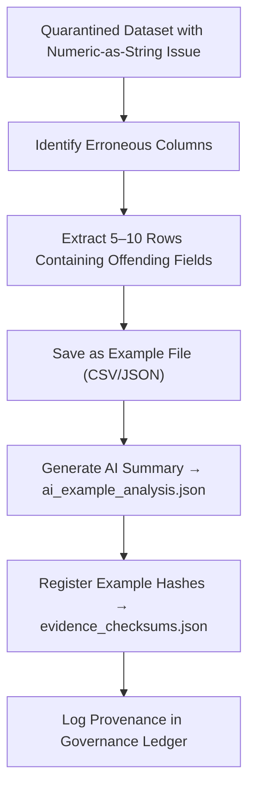

<div align="center">

# 📂 Kansas Frontier Matrix — **Numeric-as-String Error Examples**  
`data/work/staging/tabular/tmp/intake/validation/quarantine/incoming/flagged_datasets/schema_errors/invalid_field_types/numeric_as_string/samples/examples/`

### *“Errors are data too — studied, they become precision.”*

**Purpose:**  
This directory preserves **raw sample fragments** from quarantined datasets where numeric fields were encoded as strings.  
These examples provide empirical evidence for AI learning, schema validation improvement, and FAIR+CARE governance audits.

[](../../../../../../../../../../../../../../../../../../docs/architecture/repo-focus.md)  
[](../../../../../../../../../../../../../../../../../../LICENSE)  
[]()  
[]()  
[]()

</div>

---

## 🧭 Overview

The **Numeric-as-String Examples Layer** stores file fragments (usually CSV or JSON snippets) that demonstrate concrete instances of **numeric fields represented as strings**.  
They provide both **quantitative evidence** for validation reports and **qualitative insight** for AI anomaly training and schema evolution.

All examples are:
- Extracted from quarantined datasets automatically by the AI diagnostics engine  
- Hash-verified and registered in the **Sample Manifest** (`../sample_manifest.json`)  
- Safe for public review (no sensitive or personal information)  
- Structured for reproducibility and long-term semantic linking  

---

## 🗂️ Directory Layout

```text
data/work/staging/tabular/tmp/intake/validation/quarantine/incoming/flagged_datasets/schema_errors/invalid_field_types/numeric_as_string/samples/examples/
├── ks_population_1880_example.csv          # Example: string-formatted numbers in population totals
├── ks_agriculture_1870_example.json        # Example: numeric values quoted in JSON
├── ks_demographics_1900_example.csv        # Example: leading zeros and space-padded numbers
├── ai_example_analysis.json                # AI comments and metrics for extracted examples
├── evidence_checksums.json                 # SHA-256 digests for reproducibility
└── README.md                               # This document
````

---

## 🔁 Example Extraction Workflow



---

## 📄 Example Metadata Template

Each example file is referenced in `ai_example_analysis.json` and linked to provenance metadata:

| Field            | Description                    | Example                                                                |
| ---------------- | ------------------------------ | ---------------------------------------------------------------------- |
| `dataset_id`     | Source dataset                 | `ks_population_1880`                                                   |
| `example_file`   | Path to evidence file          | `ks_population_1880_example.csv`                                       |
| `column_name`    | Problematic field              | `population_total`                                                     |
| `issue_detected` | Type of anomaly                | `numeric_as_string`                                                    |
| `error_sample`   | Representative value           | `"14500"`                                                              |
| `ai_comment`     | Model-generated interpretation | `"Column 'population_total' stores numeric values as quoted strings."` |
| `checksum`       | File integrity hash            | `d04ab74b4faeabc3c7...`                                                |

---

## 🧠 AI Evidence Annotation

| Module                    | Function                                                      | Output                                                        |
| ------------------------- | ------------------------------------------------------------- | ------------------------------------------------------------- |
| **AI Evidence Annotator** | Summarizes and categorizes extracted examples                 | `ai_example_analysis.json`                                    |
| **Integrity Auditor**     | Confirms checksum alignment and file authenticity             | `evidence_checksums.json`                                     |
| **Pattern Recognizer**    | Groups similar formatting issues across datasets              | `ai_example_analysis.json`                                    |
| **Ontology Linker**       | Associates examples with schema concepts (CIDOC CRM / PROV-O) | `governance/tabular_numeric_as_string_examples_ledger.jsonld` |

> 🧩 *These annotated examples are key for AI retraining and validation explainability.*

---

## ⚙️ Curator Guidelines

Curators should:

1. Verify that extracted examples accurately reflect the reported issue.
2. Ensure that no personal or sensitive data is exposed.
3. Validate hashes using:

   ```bash
   make checksum-verify
   ```
4. Document corrections or training feedback in `ai_example_analysis.json`.
5. Trigger a revalidation cycle with:

   ```bash
   make revalidate-flagged
   ```

---

## 🧾 Compliance Matrix

| Standard               | Scope                                    | Validator       |
| ---------------------- | ---------------------------------------- | --------------- |
| **FAIR+CARE**          | Responsible sharing & audit transparency | `fair-audit`    |
| **MCP-DL v6.3**        | Documentation-first reproducibility      | `docs-validate` |
| **CIDOC CRM / PROV-O** | Provenance and semantic linkage          | `graph-lint`    |
| **ISO 19115 / 19157**  | Data lineage integrity                   | `geojson-lint`  |
| **STAC / DCAT 3.0**    | Dataset asset registration               | `stac-validate` |

---

## 🪶 Version History

| Version | Date       | Author              | Notes                                                                                                          |
| ------- | ---------- | ------------------- | -------------------------------------------------------------------------------------------------------------- |
| v9.0.0  | 2025-10-26 | `@kfm-architecture` | Initial creation of Numeric-as-String example evidence documentation under Diamond⁹ Ω / Crown∞Ω certification. |

---

<div align="center">

### 🜂 Kansas Frontier Matrix — *Evidence · Learning · Provenance*

**“Every anomaly teaches precision when recorded truthfully.”**

[]()
[]()
[]()
[]()
[]()

<br><br> <a href="#-kansas-frontier-matrix--numeric-as-string-error-examples-sample-evidence-layer--diamond⁹-Ω--crown∞Ω-certified">⬆ Back to Top</a>

</div>
