<div align="center">

# 🚧 Kansas Frontier Matrix — **Missing Required Fields**  
`data/work/staging/tabular/tmp/intake/validation/quarantine/incoming/flagged_datasets/schema_errors/missing_required_fields/`

### *“Completeness is not optional — validation ensures every field finds its place.”*

**Purpose:**  
This directory contains tabular datasets that failed validation due to **absent or null required fields** defined in the Kansas Frontier Matrix schema (e.g., missing `dataset_id`, `year`, `source`, `checksum`).  
These records represent data incompleteness issues detected during automated or AI-assisted schema enforcement.

[](../../../../../../../../../../../../../docs/architecture/repo-focus.md)  
[](../../../../../../../../../../../../../LICENSE)  
[]()  
[]()  
[]()

</div>

---

## 🧭 Overview

The **Missing Required Fields Subdirectory** stores datasets where one or more mandatory schema-defined fields were absent, improperly labeled, or null.  
These errors compromise reproducibility, data provenance, and FAIR+CARE completeness requirements.  
Examples of missing fields include:
- Required identifiers: `dataset_id`, `source_id`  
- Temporal metadata: `year`, `timestamp`  
- Provenance and governance fields: `license`, `checksum`  
- Semantic labels required by ontology alignment (CIDOC CRM / DCAT / STAC)

Each quarantined dataset is versioned, logged, and traceable in the **Tabular Quarantine Ledger** for governance review.

---

## 🗂️ Directory Layout

```text
data/work/staging/tabular/tmp/intake/validation/quarantine/incoming/flagged_datasets/schema_errors/missing_required_fields/
├── missing_fields_manifest.json         # Registry of missing field violations
├── ai_missing_field_analysis.json        # AI-detected gaps and semantic mapping
├── remediation_plan.json                 # Suggested recovery and reconstruction actions
├── examples/                             # CSV/JSON samples of datasets missing fields
│   ├── ks_treaty_1854_example.csv
│   ├── ks_agriculture_1880_example.json
│   └── ks_land_claims_1895_example.csv
├── curator_notes.log                     # Human review and recovery decisions
└── README.md                             # This document
````

---

## 🔁 Validation Workflow

```mermaid
flowchart TD
    A["Schema Validator: Required Fields Check"] --> B{"Field Missing or Null?"}
    B -- "Yes ❌" --> C["Move Dataset → missing_required_fields/"]
    C --> D["AI Field Completeness Analyzer (LLM + Schema Context)"]
    D --> E["Log Violations → missing_fields_manifest.json"]
    E --> F["AI Generates Remediation Plan"]
    F --> G["Curator Review + Field Restoration"]
    G --> H{"Revalidated Successfully?"}
    H -- "Yes ✅" --> I["Promote to Intake Layer"]
    H -- "No 🚫" --> J["Retain for Governance Audit"]
```



---

## 🧩 Manifest Schema

Each validation issue is recorded in `missing_fields_manifest.json` with detailed context:

| Field                    | Description                                   | Example                                                                           |
| ------------------------ | --------------------------------------------- | --------------------------------------------------------------------------------- |
| `dataset_id`             | Dataset name                                  | `ks_agriculture_1880`                                                             |
| `missing_fields`         | List of absent required fields                | `["source_id", "checksum"]`                                                       |
| `schema_version`         | Schema version used for validation            | `v13`                                                                             |
| `ai_explanation`         | AI-generated summary of issue                 | `"Dataset missing 'checksum' and 'source_id'; likely omitted during ETL export."` |
| `remediation_suggestion` | Recommended fix                               | `"Recalculate checksum; fetch missing source_id from metadata table."`            |
| `severity`               | Error level (`critical`, `moderate`, `minor`) | `critical`                                                                        |
| `timestamp`              | Time of detection                             | `2025-10-26T15:10:02Z`                                                            |

---

## 🤖 AI Detection Modules

| Module                       | Function                                                  | Output                                          |
| ---------------------------- | --------------------------------------------------------- | ----------------------------------------------- |
| **AI Completeness Detector** | Identifies missing fields vs. required schema blueprint   | `missing_fields_manifest.json`                  |
| **LLM Schema Mapper**        | Suggests probable column matches or metadata replacements | `ai_missing_field_analysis.json`                |
| **Auto-Filler (Optional)**   | Proposes inferred values based on dataset lineage         | `remediation_plan.json`                         |
| **Governance Notifier**      | Updates the ledger with missing field metadata            | `tabular_missing_required_fields_ledger.jsonld` |

> 🧠 *All automated recovery suggestions require explicit curator approval to preserve provenance integrity.*

---

## ⚙️ Curator Workflow

Curators must:

1. Review `missing_fields_manifest.json` and `ai_missing_field_analysis.json` for contextual clues.
2. Identify whether missing fields can be restored from trusted metadata or lineage records.
3. Document findings and recovery actions in `curator_notes.log`.
4. Execute revalidation via:

   ```bash
   make revalidate-flagged
   ```
5. Verify successful field restoration and integrity of updated metadata.

---

## 📈 FAIR+CARE Impact

| FAIR Principle                   | Description                                     | Impact of Missing Fields |
| -------------------------------- | ----------------------------------------------- | ------------------------ |
| **F2 – Rich Metadata**           | Missing required fields reduce discoverability. | ↓                        |
| **I1 – Schema Interoperability** | Schema misalignment breaks machine readability. | ↓                        |
| **R1.3 – Provenance Included**   | Missing `checksum` or `license` erodes trust.   | ↓                        |
| **CARE – Responsibility**        | Documented omissions preserve ethical handling. | ↑                        |

---

## 🧾 Compliance Matrix

| Standard                 | Scope                                               | Validator       |
| ------------------------ | --------------------------------------------------- | --------------- |
| **JSON Schema Draft-07** | Structural integrity and required field enforcement | `jsonschema`    |
| **FAIR+CARE**            | Transparency and completeness audit                 | `fair-audit`    |
| **CIDOC CRM / PROV-O**   | Provenance & semantic tracking                      | `graph-lint`    |
| **MCP-DL v6.3**          | Documentation-first reproducibility                 | `docs-validate` |
| **ISO 19115 / 19157**    | Metadata completeness                               | `geojson-lint`  |

---

## 🪶 Version History

| Version | Date       | Author              | Notes                                                                                               |
| ------- | ---------- | ------------------- | --------------------------------------------------------------------------------------------------- |
| v9.0.0  | 2025-10-26 | `@kfm-architecture` | Initial creation of Missing Required Fields documentation under Diamond⁹ Ω / Crown∞Ω certification. |

---

<div align="center">

### 🜂 Kansas Frontier Matrix — *Completeness · Reproducibility · Governance*

**“Every missing field hides a story — validation ensures it’s found and told.”**

[]()
[]()
[]()
[]()
[]()

<br><br> <a href="#-kansas-frontier-matrix--missing-required-fields-schema-validation-class--diamond⁹-Ω--crown∞Ω-certified">⬆ Back to Top</a>

</div>
