<div align="center">

# 📋 Kansas Frontier Matrix — **Missing Required Field Examples**  
`data/work/staging/tabular/tmp/intake/validation/quarantine/incoming/flagged_datasets/schema_errors/missing_required_fields/examples/`

### *“When context is missing, documentation fills the gap.”*

**Purpose:**  
This directory preserves **sample excerpts** of tabular datasets missing one or more required fields according to KFM schema definitions.  
These examples serve as FAIR+CARE-aligned evidence for curation, AI retraining, and schema validation refinement.

[](../../../../../../../../../../../../../../../../../../../../docs/architecture/repo-focus.md)  
[](../../../../../../../../../../../../../../../../../../../../LICENSE)  
[]()  
[]()  
[]()

</div>

---

## 🧭 Overview

The **Missing Required Field Examples Layer** provides curated snippets of validation failures where essential schema fields were absent or improperly populated.  
Each example:
- Highlights a real-world omission (missing column or empty metadata field).  
- Includes cryptographic integrity metadata for reproducibility.  
- Supports explainable AI validation workflows under MCP-DL.  
- Enables FAIR+CARE-compliant open audit of data completeness.  

Commonly missing fields include:
- `dataset_id`, `source_id`  
- `year`, `timestamp`  
- `checksum`, `license`, or `provenance_link`  

---

## 🗂️ Directory Layout

```text
data/work/staging/tabular/tmp/intake/validation/quarantine/incoming/flagged_datasets/schema_errors/missing_required_fields/examples/
├── ks_treaty_1854_example.csv             # Missing dataset_id and license fields
├── ks_agriculture_1880_example.json       # Incomplete metadata (missing year, source)
├── ks_land_claims_1895_example.csv        # Absent checksum and provenance
├── ai_missing_field_summary.json          # AI-generated diagnostic overview
├── evidence_checksums.json                # SHA-256 hashes verifying evidence integrity
└── README.md                              # This document
````

---

## 🔁 Example Extraction Workflow

```mermaid
flowchart TD
    A["Validation detects missing required fields"] --> B["Extract 5–10 affected records"]
    B --> C["Save as CSV/JSON in examples/"]
    C --> D["Generate SHA-256 checksum for each sample"]
    D --> E["AI Completeness Analyzer summarizes missing fields"]
    E --> F["Output → ai_missing_field_summary.json"]
    F --> G["Link provenance to governance ledger (JSON-LD entry)"]
```



---

## 📄 Example Metadata Schema

Each example is documented in `ai_missing_field_summary.json`:

| Field            | Description                     | Example                                                                                           |
| ---------------- | ------------------------------- | ------------------------------------------------------------------------------------------------- |
| `dataset_id`     | Parent dataset name             | `ks_agriculture_1880`                                                                             |
| `file_path`      | Example file location           | `examples/ks_agriculture_1880_example.json`                                                       |
| `missing_fields` | List of absent required fields  | `["year", "source_id"]`                                                                           |
| `schema_version` | Applied schema version          | `v13`                                                                                             |
| `ai_commentary`  | AI-generated explanation        | `"Dataset missing required metadata fields 'year' and 'source_id'; schema alignment incomplete."` |
| `checksum`       | SHA-256 digest for verification | `fa3c27b18e7d2b45a9d7...`                                                                         |
| `timestamp`      | Extraction time                 | `2025-10-26T15:12:47Z`                                                                            |

---

## 🤖 AI Completeness Modules

| Module                       | Function                                                      | Output                                                  |
| ---------------------------- | ------------------------------------------------------------- | ------------------------------------------------------- |
| **AI Completeness Detector** | Identifies omitted fields in relation to schema requirements. | `ai_missing_field_summary.json`                         |
| **Schema Context Engine**    | Determines whether omissions are critical or optional.        | `ai_missing_field_summary.json`                         |
| **Checksum Verifier**        | Validates hash signatures of evidence files.                  | `evidence_checksums.json`                               |
| **Governance Mapper**        | Links missing field examples to provenance entries.           | `tabular_missing_required_field_examples_ledger.jsonld` |

> 🧠 *All AI interpretations are explainable and embedded with provenance tokens per MCP-DL standard.*

---

## ⚙️ Curator Workflow

Curators should:

1. Review `ai_missing_field_summary.json` for missing schema metadata.
2. Inspect corresponding examples for omitted fields.
3. Validate evidence integrity with:

   ```bash
   make checksum-verify
   ```
4. Document manual recovery or inferred restoration in `curator_notes.log`.
5. Re-run validation using:

   ```bash
   make revalidate-flagged
   ```

---

## 🧾 Compliance Matrix

| Standard                 | Scope                                       | Validator       |
| ------------------------ | ------------------------------------------- | --------------- |
| **JSON Schema Draft-07** | Required field enforcement                  | `jsonschema`    |
| **FAIR+CARE**            | Transparent documentation of omissions      | `fair-audit`    |
| **CIDOC CRM / PROV-O**   | Provenance and lineage mapping              | `graph-lint`    |
| **ISO 19115 / 19157**    | Metadata completeness validation            | `geojson-lint`  |
| **MCP-DL v6.3**          | Documentation-first provenance verification | `docs-validate` |

---

## 🪶 Version History

| Version | Date       | Author              | Notes                                                                                                       |
| ------- | ---------- | ------------------- | ----------------------------------------------------------------------------------------------------------- |
| v9.0.0  | 2025-10-26 | `@kfm-architecture` | Initial creation of Missing Required Field Examples documentation under Diamond⁹ Ω / Crown∞Ω certification. |

---

<div align="center">

### 🜂 Kansas Frontier Matrix — *Completeness · Integrity · Provenance*

**“What’s missing today is tomorrow’s fix — provided it’s documented.”**

[]()
[]()
[]()
[]()
[]()

<br><br> <a href="#-kansas-frontier-matrix--missing-required-field-examples-error-evidence-layer--diamond⁹-Ω--crown∞Ω-certified">⬆ Back to Top</a>

</div>

