<div align="center">

# 🔍 Kansas Frontier Matrix — **Pattern Violations**  
`data/work/staging/tabular/tmp/intake/validation/quarantine/incoming/flagged_datasets/schema_errors/pattern_violations/`

### *“Structure is meaning — and every pattern broken must be found.”*

**Purpose:**  
This directory houses datasets that failed **regex or string pattern validation** under the Kansas Frontier Matrix (KFM) tabular schema.  
Each violation indicates a mismatch between actual data and required regular expressions for field formatting, encoding, or structure.

[](../../../../../../../../../../../../../docs/architecture/repo-focus.md)  
[](../../../../../../../../../../../../../LICENSE)  
[]()  
[]()  
[]()

</div>

---

## 🧭 Overview

The **Pattern Violations Subdirectory** isolates datasets containing **field-level pattern mismatches** that violate the rules defined in KFM’s JSON Schema and metadata specifications.  
Regex validations are critical for enforcing:
- **Identifier syntax** (e.g., `dataset_id`, `source_id`)  
- **Checksum and hash formatting** (`^[a-fA-F0-9]{64}$`)  
- **Email, URL, or coordinate patterns**  
- **Year and temporal formats** (`^\d{4}$`)  
- **CIDOC/DCAT field consistency**  

Violations are detected automatically by schema validators and AI-assisted regex analyzers to ensure precision, consistency, and audit transparency.

---

## 🗂️ Directory Layout

```text
data/work/staging/tabular/tmp/intake/validation/quarantine/incoming/flagged_datasets/schema_errors/pattern_violations/
├── pattern_violations_manifest.json      # Registry of all detected pattern errors
├── ai_pattern_diagnostics.json           # AI-enhanced regex interpretation & summaries
├── remediation_plan.json                 # Suggested correction or normalization logic
├── examples/                             # Example CSV/JSON samples with pattern issues
│   ├── ks_property_1885_example.csv
│   ├── ks_census_1890_example.json
│   └── ks_land_registry_1870_example.csv
├── curator_notes.log                     # Human-curated observations and corrections
└── README.md                             # This document
````

---

## 🔁 Detection Workflow

```mermaid
flowchart TD
    A["Schema Validator: Regex Enforcement"] --> B{"Pattern Match Failed?"}
    B -- "Yes ❌" --> C["Move Dataset → pattern_violations/"]
    C --> D["AI Regex Auditor (LLM + Pattern Analysis)"]
    D --> E["Generate Manifest → pattern_violations_manifest.json"]
    E --> F["Propose Fix → remediation_plan.json"]
    F --> G["Curator Review + Revalidation"]
    G -- "Success ✅" --> H["Return Dataset to Intake Layer"]
    G -- "Failure 🚫" --> I["Archive for Governance Audit"]
```



---

## 🧩 Manifest Schema

Each entry in `pattern_violations_manifest.json` contains:

| Field                    | Description                                    | Example                                                     |
| ------------------------ | ---------------------------------------------- | ----------------------------------------------------------- |
| `dataset_id`             | Dataset name                                   | `ks_land_registry_1870`                                     |
| `column_name`            | Field with pattern violation                   | `checksum`                                                  |
| `invalid_value`          | Value failing regex validation                 | `"a49ff_123xyz!"`                                           |
| `expected_pattern`       | Regex rule enforced by schema                  | `"^[a-fA-F0-9]{64}$"`                                       |
| `ai_explanation`         | AI-generated context                           | `"Checksum contains invalid characters or is too short."`   |
| `severity`               | Impact level (`critical`, `moderate`, `minor`) | `critical`                                                  |
| `remediation_suggestion` | AI or curator proposed fix                     | `"Recalculate SHA-256 checksum and replace invalid entry."` |
| `timestamp`              | UTC time of detection                          | `2025-10-26T15:14:03Z`                                      |

---

## 🤖 AI Pattern Auditor

| AI Module              | Function                                             | Output                                     |
| ---------------------- | ---------------------------------------------------- | ------------------------------------------ |
| **Regex Validator**    | Performs schema-level regex validation               | `pattern_violations_manifest.json`         |
| **AI Regex Explainer** | Translates complex patterns into human-readable form | `ai_pattern_diagnostics.json`              |
| **Pattern Normalizer** | Suggests possible corrections or canonical formats   | `remediation_plan.json`                    |
| **Governance Linker**  | Logs anomalies in provenance ledger for audit trails | `tabular_pattern_violations_ledger.jsonld` |

> 🧠 *AI modules explain pattern mismatches with contextual reasoning and probability estimates of correction accuracy.*

---

## ⚙️ Curator Workflow

Curators are required to:

1. Examine each pattern violation listed in `pattern_violations_manifest.json`.
2. Review AI interpretations and regex definitions.
3. Apply manual or automated corrections per `remediation_plan.json`.
4. Document actions in `curator_notes.log`.
5. Run revalidation:

   ```bash
   make revalidate-flagged
   ```
6. Verify that fixes conform to schema regex rules.

---

## 📈 Common Pattern Issues

| Pattern Rule        | Description                           | Violation Example   | Expected Correction   |
| ------------------- | ------------------------------------- | ------------------- | --------------------- |
| `^[a-z0-9_-]+$`     | Dataset ID naming rule                | `KS Dataset 1880`   | `ks_dataset_1880`     |
| `^\d{4}$`           | Year field must be 4 digits           | `188`               | `1880`                |
| `^https?://`        | URL fields must start with HTTP/HTTPS | `ftp://data.ks.gov` | `https://data.ks.gov` |
| `^[a-fA-F0-9]{64}$` | SHA-256 checksum rule                 | `a49ff_123xyz!`     | `9f5a7a43e8d33c...`   |
| `^[YyNn]$`          | Boolean text field (Y/N)              | `Yes`               | `Y`                   |

---

## 🧾 Compliance Matrix

| Standard                 | Scope                                 | Validator       |
| ------------------------ | ------------------------------------- | --------------- |
| **JSON Schema Draft-07** | Regex-based pattern enforcement       | `jsonschema`    |
| **FAIR+CARE**            | Metadata consistency and transparency | `fair-audit`    |
| **CIDOC CRM / PROV-O**   | Provenance and metadata coherence     | `graph-lint`    |
| **MCP-DL v6.3**          | Documentation-first reproducibility   | `docs-validate` |
| **ISO 19115 / 19157**    | Metadata formatting standards         | `geojson-lint`  |

---

## 🪶 Version History

| Version | Date       | Author              | Notes                                                                                          |
| ------- | ---------- | ------------------- | ---------------------------------------------------------------------------------------------- |
| v9.0.0  | 2025-10-26 | `@kfm-architecture` | Initial creation of Pattern Violations documentation under Diamond⁹ Ω / Crown∞Ω certification. |

---

<div align="center">

### 🜂 Kansas Frontier Matrix — *Precision · Consistency · Integrity*

**“Patterns define structure — and structure preserves truth.”**

[]()
[]()
[]()
[]()
[]()

<br><br> <a href="#-kansas-frontier-matrix--pattern-violations-schema-validation-class--diamond⁹-Ω--crown∞Ω-certified">⬆ Back to Top</a>

</div>
