<div align="center">

# 🧾 Kansas Frontier Matrix — **Pattern Violation Examples**  
`data/work/staging/tabular/tmp/intake/validation/quarantine/incoming/flagged_datasets/schema_errors/pattern_violations/examples/`

### *“Every broken pattern is an opportunity to restore precision.”*

**Purpose:**  
This directory archives **verifiable sample records** extracted from datasets exhibiting regex or string pattern mismatches during validation.  
These examples provide transparent, FAIR+CARE-compliant evidence for auditors, AI retraining, and documentation integrity under MCP-DL v6.3.

[](../../../../../../../../../../../../../../../../../../../../docs/architecture/repo-focus.md)  
[](../../../../../../../../../../../../../../../../../../../../LICENSE)  
[]()  
[]()  
[]()

</div>

---

## 🧭 Overview

The **Pattern Violation Examples Layer** provides concrete examples of invalid data entries that failed schema pattern enforcement.  
By capturing 5–10 representative records per anomaly, this layer allows developers, curators, and auditors to understand real-world validation failures and evaluate AI model performance.

Examples often include:
- Invalid identifiers (`"KS Dataset 1880"` instead of `ks_dataset_1880`)  
- Malformed checksums (`a49ff_123xyz!`)  
- Improper URLs (`ftp://data.ks.gov` instead of `https://`)  
- Incorrect year or date patterns (`188` instead of `1880`)  

---

## 🗂️ Directory Layout

```text
data/work/staging/tabular/tmp/intake/validation/quarantine/incoming/flagged_datasets/schema_errors/pattern_violations/examples/
├── ks_property_1885_example.csv          # Dataset with invalid identifier pattern
├── ks_census_1890_example.json           # Example with malformed field names or checksums
├── ks_land_registry_1870_example.csv     # Dataset containing pattern-breaking date fields
├── ai_pattern_example_summary.json       # AI-generated explanations of regex failures
├── evidence_checksums.json               # SHA-256 verification hashes for all examples
└── README.md                             # This document
````

---

## 🔁 Example Extraction Workflow

```mermaid
flowchart TD
    A["Validation detects regex/pattern failure"] --> B["Extract 5–10 representative records"]
    B --> C["Store as CSV/JSON in examples/"]
    C --> D["Generate file checksums (SHA-256)"]
    D --> E["AI Regex Auditor analyzes invalid tokens"]
    E --> F["Produce ai_pattern_example_summary.json"]
    F --> G["Register provenance in governance ledger (JSON-LD entry)"]
```



---

## 📄 Example Metadata Schema

Each example file is referenced in `ai_pattern_example_summary.json` with metadata context:

| Field              | Description                   | Example                                                    |
| ------------------ | ----------------------------- | ---------------------------------------------------------- |
| `dataset_id`       | Dataset name                  | `ks_land_registry_1870`                                    |
| `file_path`        | Example file path             | `examples/ks_land_registry_1870_example.csv`               |
| `column_name`      | Affected field                | `checksum`                                                 |
| `invalid_value`    | Pattern-breaking value        | `"a49ff_123xyz!"`                                          |
| `expected_pattern` | Regex pattern per schema      | `"^[a-fA-F0-9]{64}$"`                                      |
| `ai_commentary`    | AI explanation of issue       | `"Checksum too short; contains invalid characters ('_')."` |
| `checksum`         | SHA-256 hash of evidence file | `1bfae51c95d8ffb66a3c9b...`                                |
| `timestamp`        | Time of extraction            | `2025-10-26T15:16:27Z`                                     |

---

## 🤖 AI Regex Interpretation Modules

| Module                | Function                                                       | Output                                             |
| --------------------- | -------------------------------------------------------------- | -------------------------------------------------- |
| **AI Regex Auditor**  | Identifies and explains regex mismatches in schema enforcement | `ai_pattern_example_summary.json`                  |
| **Pattern Explainer** | Translates regex failures into readable feedback for curators  | `ai_pattern_example_summary.json`                  |
| **Checksum Verifier** | Validates SHA-256 integrity of evidence samples                | `evidence_checksums.json`                          |
| **Governance Mapper** | Appends provenance data to the FAIR+CARE ledger                | `tabular_pattern_violation_examples_ledger.jsonld` |

> 🧠 *All AI interpretations are accompanied by confidence levels, human-readable rationale, and pattern rule summaries.*

---

## ⚙️ Curator Workflow

Curators must:

1. Review AI explanations in `ai_pattern_example_summary.json`.
2. Inspect sample files to confirm regex mismatches.
3. Apply pattern correction or normalization (e.g., fixing field formatting).
4. Log remediation details in `curator_notes.log` (at parent directory).
5. Re-run validation:

   ```bash
   make revalidate-flagged
   ```
6. Ensure successful pattern conformity and ledger update.

---

## 📈 Common Regex Patterns & Violations

| Field Type              | Regex Rule          | Invalid Example     | Corrected Example     |
| ----------------------- | ------------------- | ------------------- | --------------------- |
| **Dataset ID**          | `^[a-z0-9_-]+$`     | `KS Dataset 1890`   | `ks_dataset_1890`     |
| **Year**                | `^\d{4}$`           | `189`               | `1890`                |
| **Checksum**            | `^[a-fA-F0-9]{64}$` | `a49ff_123xyz!`     | `9f3ae14d3...`        |
| **URL**                 | `^https?://`        | `ftp://data.ks.gov` | `https://data.ks.gov` |
| **Boolean Field (Y/N)** | `^[YyNn]$`          | `Yes`               | `Y`                   |

---

## 🧾 Compliance Matrix

| Standard                 | Scope                                             | Validator       |
| ------------------------ | ------------------------------------------------- | --------------- |
| **JSON Schema Draft-07** | Regex pattern enforcement                         | `jsonschema`    |
| **FAIR+CARE**            | Transparent reporting of data validation failures | `fair-audit`    |
| **CIDOC CRM / PROV-O**   | Provenance alignment for metadata correction      | `graph-lint`    |
| **ISO 19115 / 19157**    | Data quality and formatting standards             | `geojson-lint`  |
| **MCP-DL v6.3**          | Documentation-first transparency                  | `docs-validate` |

---

## 🪶 Version History

| Version | Date       | Author              | Notes                                                                                                  |
| ------- | ---------- | ------------------- | ------------------------------------------------------------------------------------------------------ |
| v9.0.0  | 2025-10-26 | `@kfm-architecture` | Initial creation of Pattern Violation Examples documentation under Diamond⁹ Ω / Crown∞Ω certification. |

---

<div align="center">

### 🜂 Kansas Frontier Matrix — *Precision · Patterns · Proof*

**“Regex defines structure — examples reveal the truth.”**

[]()
[]()
[]()
[]()
[]()

<br><br> <a href="#-kansas-frontier-matrix--pattern-violation-examples-error-evidence-layer--diamond⁹-Ω--crown∞Ω-certified">⬆ Back to Top</a>

</div>

