<div align="center">

# 🩺 Kansas Frontier Matrix — **Remediation Logs**  
`data/work/staging/tabular/tmp/intake/validation/quarantine/remediation_logs/`

### *“Accountability means documenting every fix — not just finding the flaws.”*

**Purpose:**  
This directory maintains **the official remediation and correction logs** for all quarantined datasets in the Kansas Frontier Matrix (KFM) pipeline.  
Every fix, validation repair, or metadata correction performed by curators or AI systems is recorded here for **transparency, reproducibility, and ethical governance**.

[](../../../../../../../../../../../docs/architecture/repo-focus.md)  
[](../../../../../../../../../../../LICENSE)  
[]()  
[]()  
[]()

</div>

---

## 🧭 Overview

The **Remediation Logs Layer** serves as the **governance backbone** of the KFM Quarantine Zone.  
It provides a full audit trail for all corrective actions — whether applied automatically by AI systems or manually by human curators.  
Every fix to schema failures, checksum mismatches, FAIR+CARE omissions, or AI anomalies must be accompanied by an entry here.

All records include:
- Dataset identifiers and issue classifications  
- Original error summaries and applied fixes  
- Tools, scripts, or workflows used in the repair  
- Curator or AI attribution  
- Verification timestamps and ledger entries  

These logs ensure **complete provenance and traceable accountability** for every remediation performed within KFM’s data ecosystem.

---

## 🗂️ Directory Layout

```text
data/work/staging/tabular/tmp/intake/validation/quarantine/remediation_logs/
├── remediation_manifest.json             # Primary record of all fixes applied to quarantined datasets
├── ai_remediation_summaries.json         # AI-generated fix suggestions and their implementation outcomes
├── curator_actions.log                   # Human-readable narrative of curator interventions
├── remediation_diff_records.json         # Pre- vs. post-fix checksums and content deltas
├── verification_results.json             # Validation reports confirming successful fixes
├── examples/                             # Sample remediation and verification cases
│   ├── checksum_repair_case_001.json
│   ├── schema_fix_case_002.json
│   └── faircare_completion_case_003.json
└── README.md                             # This document
````

---

## 🔁 Remediation Workflow

```mermaid
flowchart TD
    A["Dataset Flagged for Error"] --> B["Curator / AI Applies Remediation"]
    B --> C["Document Fix in remediation_manifest.json"]
    C --> D["Compute New Checksums → remediation_diff_records.json"]
    D --> E["Run Post-Fix Validation → verification_results.json"]
    E --> F["Link Remediation Entry to Governance Ledger"]
```



---

## 🧩 Remediation Manifest Schema

| Field                  | Description                        | Example                                                      |
| ---------------------- | ---------------------------------- | ------------------------------------------------------------ |
| `dataset_id`           | Dataset identifier                 | `ks_census_1890`                                             |
| `issue_type`           | Category of problem fixed          | `Schema Failure`                                             |
| `error_summary`        | Description of original issue      | `"Missing required field 'checksum' in metadata block."`     |
| `fix_action`           | Description of applied remediation | `"Added checksum field with verified SHA-256 value."`        |
| `applied_by`           | Person or AI system responsible    | `"AI Schema Auto-Remediator v3.1"`                           |
| `fix_timestamp`        | UTC timestamp when fix was applied | `2025-10-26T15:52:51Z`                                       |
| `validation_status`    | Outcome of revalidation            | `Passed`                                                     |
| `governance_reference` | Link to JSON-LD ledger entry       | `governance/tabular_remediation_logs_ledger.jsonld#entry-22` |

---

## 🤖 AI & Human Remediation Modules

| Module                    | Function                                      | Output                                   |
| ------------------------- | --------------------------------------------- | ---------------------------------------- |
| **AI Auto-Remediator**    | Suggests and applies schema or metadata fixes | `ai_remediation_summaries.json`          |
| **Checksum Rebuilder**    | Regenerates integrity hashes post-repair      | `remediation_diff_records.json`          |
| **FAIR+CARE Completer**   | Adds missing ethical metadata fields          | `ai_remediation_summaries.json`          |
| **Schema Validator**      | Revalidates dataset post-remediation          | `verification_results.json`              |
| **Governance Integrator** | Updates ledger with provenance and timestamp  | `tabular_remediation_logs_ledger.jsonld` |

> 🧠 *AI systems perform deterministic, logged, and reversible repairs under the MCP-DL governance contract.*

---

## ⚙️ Curator Workflow

Curators must:

1. Verify AI-proposed fixes in `ai_remediation_summaries.json`.
2. Add manual corrections or narrative context to `curator_actions.log`.
3. Compute new checksums and document diffs:

   ```bash
   make remediation-diff
   ```
4. Run validation tests to confirm the issue has been resolved:

   ```bash
   make revalidate-flagged
   ```
5. Approve the dataset for reintegration only after all checks pass.
6. Log closure details in the governance ledger for transparency.

---

## 📈 Example Fix Categories

| Issue Type               | Typical Remediation                          | Validation Tool          |
| ------------------------ | -------------------------------------------- | ------------------------ |
| **Checksum Mismatch**    | Recompute and update manifest hash           | `make checksums-update`  |
| **Schema Failure**       | Add missing field or correct datatype        | `make revalidate-schema` |
| **FAIR+CARE Incomplete** | Populate missing ethical metadata            | `make faircare-validate` |
| **AI Anomaly**           | Adjust detection thresholds or retrain model | `make ai-retrain`        |
| **Pattern Violation**    | Normalize values to schema regex             | `make pattern-fix`       |

---

## 🧾 Compliance Matrix

| Standard               | Scope                                         | Validator       |
| ---------------------- | --------------------------------------------- | --------------- |
| **FAIR+CARE**          | Ethical repair and transparency documentation | `fair-audit`    |
| **MCP-DL v6.3**        | Documentation-first governance                | `docs-validate` |
| **CIDOC CRM / PROV-O** | Provenance and change lineage                 | `graph-lint`    |
| **ISO 19115 / 19157**  | Data quality and metadata correction tracking | `geojson-lint`  |
| **STAC / DCAT 3.0**    | Metadata interoperability validation          | `stac-validate` |

---

## 🪶 Version History

| Version | Date       | Author              | Notes                                                                                        |
| ------- | ---------- | ------------------- | -------------------------------------------------------------------------------------------- |
| v9.0.0  | 2025-10-26 | `@kfm-architecture` | Initial creation of Remediation Logs documentation under Diamond⁹ Ω / Crown∞Ω certification. |

---

<div align="center">

### 🜂 Kansas Frontier Matrix — *Repair · Traceability · Trust*

**“Every fix documented is integrity regained.”**

[]()
[]()
[]()
[]()

<br><br> <a href="#-kansas-frontier-matrix--remediation-logs-governance-oversight-layer--diamond⁹-Ω--crown∞Ω-certified">⬆ Back to Top</a>

</div>
