<div align="center">

# 🧾 Kansas Frontier Matrix — **Remediation Log Examples**  
`data/work/staging/tabular/tmp/intake/validation/quarantine/remediation_logs/examples/`

### *“Every correction tells a story — these are its receipts.”*

**Purpose:**  
This directory provides **auditable examples of remediation actions** performed on quarantined datasets within the Kansas Frontier Matrix (KFM) validation system.  
Each case demonstrates how schema, checksum, FAIR+CARE, or AI-detected issues were resolved and verified, ensuring traceable and reproducible governance.

[](../../../../../../../../../../../../../../../../docs/architecture/repo-focus.md)  
[](../../../../../../../../../../../../../../../../LICENSE)  
[]()  
[]()  
[]()

</div>

---

## 🧭 Overview

The **Remediation Log Examples Layer** contains concrete, reproducible cases showing **how data issues were detected, fixed, verified, and revalidated** in accordance with KFM’s MCP-DL v6.3 governance protocols.  
Each example records:
- Original issue context (e.g., schema failure, checksum mismatch)  
- AI and human corrective actions  
- Validation outcomes post-remediation  
- Associated ledger and checksum entries  

These examples serve as **training materials, audit references, and reproducibility proofs** for governance and compliance review.

---

## 🗂️ Directory Layout

```text
data/work/staging/tabular/tmp/intake/validation/quarantine/remediation_logs/examples/
├── checksum_repair_case_001.json          # Example of checksum mismatch correction
├── schema_fix_case_002.json               # Schema field restoration and revalidation
├── faircare_completion_case_003.json      # FAIR+CARE metadata completion case
├── ai_remediation_case_004.json           # AI-assisted remediation summary
├── evidence_checksums.json                # SHA-256 hashes verifying example integrity
└── README.md                              # This document
````

---

## 🔁 Remediation Documentation Workflow

```mermaid
flowchart TD
    A["Dataset Error Logged in Quarantine"] --> B["Curator / AI Applies Fix"]
    B --> C["Generate Case File in examples/"]
    C --> D["Compute File Integrity Hashes → evidence_checksums.json"]
    D --> E["Revalidate Dataset Post-Remediation"]
    E --> F["Record Fix Outcome → remediation_manifest.json"]
    F --> G["Link Case to Governance Ledger Entry (JSON-LD)"]
```



---

## 📄 Example Metadata Schema

Each case file (e.g., `schema_fix_case_002.json`) is recorded in structured form:

| Field                | Description                        | Example                                                                                |
| -------------------- | ---------------------------------- | -------------------------------------------------------------------------------------- |
| `case_id`            | Unique remediation case identifier | `schema_fix_case_002`                                                                  |
| `dataset_id`         | Dataset involved                   | `ks_census_1890`                                                                       |
| `issue_type`         | Nature of the issue fixed          | `Schema Failure`                                                                       |
| `original_error`     | Summary of detected issue          | `"Missing required field 'checksum' in metadata block."`                               |
| `remediation_action` | Steps taken to fix issue           | `"Added checksum field; recalculated SHA-256 hash; updated schema version reference."` |
| `applied_by`         | Responsible agent (human or AI)    | `AI Schema Auto-Remediator v3.1`                                                       |
| `validation_result`  | Outcome after revalidation         | `"Passed"`                                                                             |
| `checksum`           | Hash verifying case file integrity | `f1a9e3b80e95c72f...`                                                                  |
| `timestamp`          | Completion time (UTC)              | `2025-10-26T15:55:06Z`                                                                 |

---

## 🤖 AI & Human Collaboration Modules

| Module                    | Function                                                 | Output                                           |
| ------------------------- | -------------------------------------------------------- | ------------------------------------------------ |
| **AI Auto-Remediator**    | Suggests and applies schema/metadata fixes automatically | `ai_remediation_case_004.json`                   |
| **Checksum Verifier**     | Validates integrity of corrected files                   | `checksum_repair_case_001.json`                  |
| **FAIR+CARE Completer**   | Adds or corrects ethical metadata                        | `faircare_completion_case_003.json`              |
| **Schema Validator**      | Revalidates dataset after corrections                    | `schema_fix_case_002.json`                       |
| **Governance Integrator** | Logs remediation lineage to FAIR+CARE ledger             | `tabular_remediation_log_examples_ledger.jsonld` |

> 🧠 *AI-generated remediations are recorded with human oversight and transparent reasoning tokens for full interpretability.*

---

## ⚙️ Curator Workflow

Curators and reviewers must:

1. Review each remediation case file (JSON format) for context and completeness.
2. Confirm checksum verification via:

   ```bash
   make checksum-verify
   ```
3. Validate that all remediation actions have been confirmed successful.
4. Document governance approval or re-audit requirements in `curator_notes.log`.
5. Sync updated case metadata with the FAIR+CARE governance ledger:

   ```bash
   make governance-update
   ```

---

## 📈 Example Remediation Scenarios

| Case    | Issue Type           | Description                           | Resolution                                                |
| ------- | -------------------- | ------------------------------------- | --------------------------------------------------------- |
| **001** | Checksum Mismatch    | File hash mismatch post-transfer      | Recomputed SHA-256 hash; updated manifest                 |
| **002** | Schema Failure       | Missing required metadata fields      | Added fields and revalidated JSON Schema                  |
| **003** | FAIR+CARE Incomplete | Missing ethical governance metadata   | Added license, provenance, and community authority fields |
| **004** | AI Anomaly           | False positive from anomaly detection | Adjusted model confidence threshold                       |

---

## 🧾 Compliance Matrix

| Standard               | Scope                                           | Validator       |
| ---------------------- | ----------------------------------------------- | --------------- |
| **FAIR+CARE**          | Ethical documentation and correction validation | `fair-audit`    |
| **MCP-DL v6.3**        | Transparent AI-human repair logging             | `docs-validate` |
| **CIDOC CRM / PROV-O** | Provenance alignment of corrective actions      | `graph-lint`    |
| **ISO 19115 / 19157**  | Metadata lineage and quality assurance          | `geojson-lint`  |
| **STAC / DCAT 3.0**    | Metadata interoperability post-fix              | `stac-validate` |

---

## 🪶 Version History

| Version | Date       | Author              | Notes                                                                                                |
| ------- | ---------- | ------------------- | ---------------------------------------------------------------------------------------------------- |
| v9.0.0  | 2025-10-26 | `@kfm-architecture` | Initial creation of Remediation Log Examples documentation under Diamond⁹ Ω / Crown∞Ω certification. |

---

<div align="center">

### 🜂 Kansas Frontier Matrix — *Correction · Documentation · Accountability*

**“Integrity isn’t restored by silence — it’s proven by evidence.”**

[]()
[]()
[]()
[]()
[]()

<br><br> <a href="#-kansas-frontier-matrix--remediation-log-examples-governance-evidence-layer--diamond⁹-Ω--crown∞Ω-certified">⬆ Back to Top</a>

</div>
