<div align="center">

# 🧱 Kansas Frontier Matrix — **Schema Failures**  
`data/work/staging/tabular/tmp/intake/validation/quarantine/schema_failures/`

### *“Structure defines meaning — when it breaks, governance restores it.”*

**Purpose:**  
This directory houses datasets that **failed schema validation** during the KFM tabular intake process.  
These failures indicate serious violations of structural integrity, metadata compliance, or field definitions within JSON Schema, STAC, DCAT, or CIDOC CRM alignment.

[](../../../../../../../../../../../docs/architecture/repo-focus.md)  
[](../../../../../../../../../../../LICENSE)  
[]()  
[]()  
[]()

</div>

---

## 🧭 Overview

The **Schema Failures Layer** isolates datasets that failed schema conformance checks and could not progress through automated normalization.  
These failures often originate from:
- Missing or incorrectly typed fields  
- Violations of enumerated value sets  
- Structural misalignment with CIDOC CRM / OWL-Time relationships  
- Broken or circular JSON schema references  
- Incorrect or missing `$schema` URIs  

Schema failures are treated as **critical** within KFM’s governance workflow, halting dataset progression until remediation and revalidation are complete.

---

## 🗂️ Directory Layout

```text
data/work/staging/tabular/tmp/intake/validation/quarantine/schema_failures/
├── schema_failure_manifest.json          # Registry of all schema validation errors
├── ai_schema_diagnostics.json            # AI interpretability and cause analysis
├── remediation_plan.json                 # Structured recommendations for fixing schema issues
├── examples/                             # Dataset fragments demonstrating schema failure
│   ├── ks_census_1890_example.json
│   ├── ks_treaty_1854_example.csv
│   └── ks_agriculture_1880_example.json
├── curator_notes.log                     # Manual curation logs and governance decisions
└── README.md                             # This document
````

---

## 🔁 Validation & Quarantine Workflow

```mermaid
flowchart TD
    A["Dataset Validation"] --> B["Schema Validator (JSON Schema + CIDOC CRM)"]
    B --> C{"Validation Passed?"}
    C -- "No ❌" --> D["Move Dataset → schema_failures/"]
    D --> E["AI Schema Diagnostics (Reasoning + Severity Ranking)"]
    E --> F["Generate schema_failure_manifest.json"]
    F --> G["Curator Review + Remediation"]
    G --> H{"Schema Fixed?"}
    H -- "Yes ✅" --> I["Revalidate and Promote"]
    H -- "No 🚫" --> J["Archive and Flag for Governance Audit"]
```



---

## 🧩 Manifest Schema

Each failure entry in `schema_failure_manifest.json` contains detailed structural diagnostics:

| Field                    | Description                           | Example                                                                     |
| ------------------------ | ------------------------------------- | --------------------------------------------------------------------------- |
| `dataset_id`             | Dataset identifier                    | `ks_agriculture_1880`                                                       |
| `error_type`             | Nature of schema failure              | `Missing Required Field`                                                    |
| `schema_path`            | JSON schema pointer to offending node | `$.properties.checksum`                                                     |
| `error_message`          | Validator output message              | `"Required property 'checksum' is missing."`                                |
| `severity`               | Impact level                          | `critical`                                                                  |
| `ai_explanation`         | AI interpretation of cause            | `"Dataset likely generated before checksum field was added to schema v13."` |
| `remediation_suggestion` | Fix proposal                          | `"Add checksum field to schema metadata block."`                            |
| `timestamp`              | UTC detection time                    | `2025-10-26T15:40:45Z`                                                      |

---

## 🤖 AI Schema Diagnostic Engine

| Module                 | Function                                                                                   | Output                                  |
| ---------------------- | ------------------------------------------------------------------------------------------ | --------------------------------------- |
| **AI Schema Analyzer** | Uses LLM reasoning to translate technical validation errors into human-readable summaries. | `ai_schema_diagnostics.json`            |
| **Auto-Remediator**    | Suggests field additions, datatype corrections, or schema version migration.               | `remediation_plan.json`                 |
| **CIDOC Validator**    | Checks semantic and ontology alignment.                                                    | `schema_failure_manifest.json`          |
| **Governance Linker**  | Logs results in FAIR+CARE provenance ledger.                                               | `tabular_schema_failures_ledger.jsonld` |

> 🧠 *AI reasoning enhances interpretability for curators, providing remediation paths rather than raw error stacks.*

---

## ⚙️ Curator Workflow

Curators must:

1. Review the `schema_failure_manifest.json` and `ai_schema_diagnostics.json` for failure summaries.
2. Identify missing fields or invalid datatypes.
3. Apply schema corrections using recommendations from `remediation_plan.json`.
4. Record corrective actions in `curator_notes.log`.
5. Revalidate datasets via:

   ```bash
   make revalidate-schema
   ```
6. Confirm revalidation success and governance ledger update.

---

## 📈 Common Schema Failure Patterns

| Error Type                 | Description                 | Example                                    | Resolution                       |
| -------------------------- | --------------------------- | ------------------------------------------ | -------------------------------- |
| **Missing Required Field** | Absent schema-defined field | No `checksum` field                        | Add `checksum` field to metadata |
| **Invalid Type**           | Field value type mismatch   | `"year": "1880A"`                          | Convert to integer type          |
| **Enum Violation**         | Value not in accepted list  | `"license": "CC-0.5"`                      | Replace with valid SPDX license  |
| **Bad Reference**          | Schema `$ref` unresolved    | `$ref: ./metadata.schema.json` not found   | Correct reference path           |
| **CIDOC Alignment Error**  | Invalid ontology mapping    | `E7 Activity` missing `P14 carried out by` | Add missing relationship         |

---

## 🧾 Compliance Matrix

| Standard                 | Scope                                       | Validator       |
| ------------------------ | ------------------------------------------- | --------------- |
| **JSON Schema Draft-07** | Structural validation                       | `jsonschema`    |
| **STAC 1.0 / DCAT 3.0**  | Metadata interoperability                   | `stac-validate` |
| **CIDOC CRM / OWL-Time** | Semantic ontology conformance               | `graph-lint`    |
| **FAIR+CARE**            | Documentation and ethical completeness      | `fair-audit`    |
| **MCP-DL v6.3**          | Documentation-driven schema reproducibility | `docs-validate` |

---

## 🪶 Version History

| Version | Date       | Author              | Notes                                                                                       |
| ------- | ---------- | ------------------- | ------------------------------------------------------------------------------------------- |
| v9.0.0  | 2025-10-26 | `@kfm-architecture` | Initial creation of Schema Failures documentation under Diamond⁹ Ω / Crown∞Ω certification. |

---

<div align="center">

### 🜂 Kansas Frontier Matrix — *Structure · Semantics · Accountability*

**“Schemas are not constraints — they are commitments to clarity.”**

[]()
[]()
[]()
[]()
[]()

<br><br> <a href="#-kansas-frontier-matrix--schema-failures-critical-validation-class--diamond⁹-Ω--crown∞Ω-certified">⬆ Back to Top</a>

</div>
