<div align="center">

# 📘 Kansas Frontier Matrix — **Schema Failure Examples**  
`data/work/staging/tabular/tmp/intake/validation/quarantine/schema_failures/examples/`

### *“Every failed schema is a lesson written in validation logs.”*

**Purpose:**  
This directory contains **example dataset fragments** that failed schema validation within the Kansas Frontier Matrix (KFM) intake pipeline.  
These samples are extracted to provide evidence for auditors, schema architects, and AI-assisted diagnostics, ensuring transparency and reproducibility of every structural anomaly.

[](../../../../../../../../../../../../../../../../docs/architecture/repo-focus.md)  
[](../../../../../../../../../../../../../../../../LICENSE)  
[]()  
[]()  
[]()

</div>

---

## 🧭 Overview

The **Schema Failure Examples Layer** provides concrete examples of schema violations discovered during automated and AI-assisted validation.  
These cases are curated to demonstrate:
- Structural or datatype inconsistencies  
- Missing required fields or bad references  
- Enum or value range violations  
- CIDOC CRM or OWL-Time alignment errors  
- Outdated or deprecated schema usage  

Each example is checksum-verified and governance-registered, ensuring full traceability from failure detection to remediation.

---

## 🗂️ Directory Layout

```text
data/work/staging/tabular/tmp/intake/validation/quarantine/schema_failures/examples/
├── ks_census_1890_example.json            # Missing required field 'checksum'
├── ks_treaty_1854_example.csv             # Enum and datatype validation failures
├── ks_agriculture_1880_example.json       # CIDOC mapping and schema version conflict
├── ai_schema_failure_summary.json         # AI-generated interpretability report
├── evidence_checksums.json                # SHA-256 verification hashes
└── README.md                              # This document
````

---

## 🔁 Extraction Workflow

```mermaid
flowchart TD
    A["Schema Validation Error Detected"] --> B["Extract 5–10 Representative Records"]
    B --> C["Save Snippets as CSV/JSON Files"]
    C --> D["Compute File Checksums (SHA-256)"]
    D --> E["Run AI Schema Diagnostic Engine"]
    E --> F["Generate ai_schema_failure_summary.json"]
    F --> G["Register Provenance in Governance Ledger"]
```



---

## 📄 Example Metadata Schema

Each sample is described in `ai_schema_failure_summary.json`:

| Field                    | Description                           | Example                                                     |
| ------------------------ | ------------------------------------- | ----------------------------------------------------------- |
| `dataset_id`             | Dataset name                          | `ks_census_1890`                                            |
| `file_path`              | Path to extracted evidence file       | `examples/ks_census_1890_example.json`                      |
| `schema_path`            | JSON Schema pointer to failed element | `$.properties.checksum`                                     |
| `error_message`          | Validator output                      | `"Required property 'checksum' is missing."`                |
| `ai_explanation`         | LLM-generated interpretation          | `"Dataset predates checksum field addition in schema v13."` |
| `remediation_suggestion` | Recommended fix                       | `"Add checksum metadata and revalidate under schema v13."`  |
| `checksum`               | SHA-256 verification hash             | `a2e5f91e0a6c9d9b75ff...`                                   |
| `timestamp`              | Extraction time                       | `2025-10-26T15:42:31Z`                                      |

---

## 🤖 AI Schema Diagnostics Modules

| Module                        | Function                                                             | Output                                          |
| ----------------------------- | -------------------------------------------------------------------- | ----------------------------------------------- |
| **AI Schema Explainer**       | Translates JSON Schema error messages into contextual human language | `ai_schema_failure_summary.json`                |
| **CIDOC Alignment Validator** | Checks semantic consistency with CIDOC CRM & OWL-Time                | `ai_schema_failure_summary.json`                |
| **Pattern Analyzer**          | Detects recurring schema error patterns across datasets              | `ai_schema_failure_summary.json`                |
| **Checksum Verifier**         | Validates evidence file integrity                                    | `evidence_checksums.json`                       |
| **Governance Mapper**         | Links schema failure examples to provenance records                  | `tabular_schema_failure_examples_ledger.jsonld` |

> 🧠 *AI-driven schema diagnostics provide actionable insight for rapid remediation while maintaining FAIR+CARE accountability.*

---

## ⚙️ Curator Workflow

Curators should:

1. Review `ai_schema_failure_summary.json` to understand validation issues.
2. Compare error locations (`schema_path`) with active schema definitions.
3. Apply fixes following `remediation_suggestion` entries.
4. Verify evidence integrity using:

   ```bash
   make checksum-verify
   ```
5. Re-run schema validation:

   ```bash
   make revalidate-schema
   ```
6. Document corrective actions in `curator_notes.log`.

---

## 📈 Common Schema Failure Cases

| Failure Type               | Description                               | Example                             | Resolution                     |
| -------------------------- | ----------------------------------------- | ----------------------------------- | ------------------------------ |
| **Missing Required Field** | Omitted field defined in schema           | Missing `license` property          | Add required field to metadata |
| **Invalid Type**           | Type mismatch between expected and actual | `"year": "1880A"`                   | Correct to integer             |
| **Enum Violation**         | Value not in schema enum                  | `"license": "CC-1.0"`               | Replace with `CC-BY 4.0`       |
| **Bad Reference**          | `$ref` path invalid or deprecated         | Missing `metadata.schema.json`      | Update schema URI              |
| **CIDOC Error**            | Inconsistent ontology mapping             | `E21 Person` missing `P98` relation | Correct CIDOC mapping          |

---

## 🧾 Compliance Matrix

| Standard                 | Scope                                | Validator       |
| ------------------------ | ------------------------------------ | --------------- |
| **JSON Schema Draft-07** | Structural validation rules          | `jsonschema`    |
| **STAC 1.0 / DCAT 3.0**  | Dataset metadata interoperability    | `stac-validate` |
| **CIDOC CRM / OWL-Time** | Semantic ontology enforcement        | `graph-lint`    |
| **FAIR+CARE**            | Documentation and ethical validation | `fair-audit`    |
| **MCP-DL v6.3**          | Documentation-driven reproducibility | `docs-validate` |

---

## 🪶 Version History

| Version | Date       | Author              | Notes                                                                                               |
| ------- | ---------- | ------------------- | --------------------------------------------------------------------------------------------------- |
| v9.0.0  | 2025-10-26 | `@kfm-architecture` | Initial creation of Schema Failure Examples documentation under Diamond⁹ Ω / Crown∞Ω certification. |

---

<div align="center">

### 🜂 Kansas Frontier Matrix — *Structure · Clarity · Remediation*

**“Schema failures are not errors — they’re milestones toward better data.”**

[]()
[]()
[]()
[]()
[]()

<br><br> <a href="#-kansas-frontier-matrix--schema-failure-examples-critical-validation-evidence--diamond⁹-Ω--crown∞Ω-certified">⬆ Back to Top</a>

</div>
