<div align="center">

# 📜 Kansas Frontier Matrix — **Validation Reports Directory**  
`data/work/staging/tabular/tmp/intake/validation/reports/`

### *“Where every dataset earns its proof of integrity and ethical compliance.”*

**Purpose:**  
The **Validation Reports Directory** stores the official output reports generated during the **Validation TMP Layer** process.  
Each report provides human- and machine-readable summaries of validation results — schema conformance, checksum confirmation, FAIR+CARE scoring, and provenance verification.  
These reports are the authoritative evidence of a dataset’s integrity within the Kansas Frontier Matrix pipeline.

[](../../../../../../../../../docs/architecture/repo-focus.md)
[](../../../../../../../../../LICENSE)
[]()
[]()
[]()

</div>

---

## 🧭 Overview

The **Validation Reports** provide the final summary of automated and manual checks applied to tabular datasets before normalization.  
Each report consolidates information from logs and AI outputs to form a structured **validation dossier**, stored in JSON format for reproducibility.

Reports within this directory are generated automatically at the end of every validation run and are **referenced in the Governance Ledger** for permanent archival.

---

## 🗂️ Directory Layout

```plaintext
data/work/staging/tabular/tmp/intake/validation/reports/
├── validation_ks_hydro_1874.json          # Consolidated schema + checksum + FAIR+CARE summary
├── validation_ks_population_1890.json     # Example validation report
├── ontology_ks_hydro_1874.json            # CIDOC CRM / STAC / DCAT ontology results
├── faircare_ks_hydro_1874.json            # FAIR+CARE evaluation summary
├── batch_validation_2025-10-26.json       # Daily batch summary for multiple datasets
└── README.md                              # This document
````

---

## 🧾 Report Schema (validation_report_v3)

```json
{
  "dataset": "ks_hydro_1874",
  "schema_validation": "passed",
  "ontology_alignment": "passed",
  "checksum_verified": true,
  "faircare_score": 1.0,
  "issues": [],
  "ai_confidence": 0.97,
  "validated_by": "auto-etl",
  "timestamp": "2025-10-26T14:23:47Z",
  "provenance_ref": "governance/tabular_intake_ledger.jsonld#ks_hydro_1874"
}
```

---

## 📋 Report Types

| File Prefix         | Report Type                    | Description                                                 | Source                  |
| ------------------- | ------------------------------ | ----------------------------------------------------------- | ----------------------- |
| `validation_`       | Consolidated validation report | Combines all checks (schema, checksum, FAIR+CARE, ontology) | `make validate-tabular` |
| `ontology_`         | Ontology compliance results    | CIDOC CRM, STAC, DCAT mappings and temporal consistency     | `graph-lint`            |
| `faircare_`         | FAIR+CARE compliance summary   | Ethical and openness audit results                          | `fair-audit.yml`        |
| `batch_validation_` | Daily combined run summary     | Aggregates results for multiple datasets                    | Pipeline scheduler      |

---

## 🧠 Example Validation Report (Full)

**File:** `validation_ks_hydro_1874.json`

```json
{
  "dataset": "ks_hydro_1874",
  "schema_validation": "passed",
  "ontology_alignment": "passed",
  "checksum_verified": true,
  "faircare_score": 1.0,
  "issues": [],
  "ai_confidence": 0.97,
  "validator_stack": [
    "stac-validate",
    "graph-lint",
    "checksum-verifier",
    "fair-audit"
  ],
  "validated_by": "auto-etl",
  "curator": "@kfm-curation",
  "status": "passed",
  "timestamp": "2025-10-26T14:23:47Z",
  "provenance_ref": "governance/tabular_intake_ledger.jsonld#ks_hydro_1874"
}
```

---

## 🧩 FAIR+CARE Summary (Example)

**File:** `faircare_ks_hydro_1874.json`

```json
{
  "dataset": "ks_hydro_1874",
  "FAIR": {
    "Findable": 1.0,
    "Accessible": 1.0,
    "Interoperable": 0.98,
    "Reusable": 1.0
  },
  "CARE": {
    "CollectiveBenefit": 0.95,
    "AuthorityToControl": 1.0,
    "Responsibility": 1.0,
    "Ethics": 1.0
  },
  "overall_score": 0.992,
  "status": "passed",
  "timestamp": "2025-10-26T14:23:47Z"
}
```

---

## 🧩 Ontology Report (CIDOC CRM / OWL-Time)

**File:** `ontology_ks_hydro_1874.json`

```json
{
  "dataset": "ks_hydro_1874",
  "ontology_frameworks": ["CIDOC CRM", "OWL-Time", "DCAT"],
  "entity_mappings": {
    "Place": "Ellis County, KS",
    "Event": "Hydrology Survey 1874",
    "TimeSpan": "1874-08-01/1874-08-31"
  },
  "semantic_alignment_score": 0.98,
  "temporal_consistency": true,
  "status": "passed"
}
```

---

## ⚙️ Report Generation Workflow

```mermaid
flowchart TD
    A["📦 Validation Incoming"] --> B["🧪 Schema & Ontology Checks"]
    B --> C["🌍 FAIR+CARE & Ethics Audit"]
    C --> D["🧾 Report Generation (.json)"]
    D --> E["🏛 Governance Ledger Append"]
```



---

## 🧮 Commands

```bash
# Generate validation reports for all datasets
make validate-tabular

# Create FAIR+CARE reports only
make fair-report

# Generate daily batch summary
make batch-validation-report

# Verify report schema validity
make validate-reports
```

---

## 🧯 Troubleshooting

| Issue                            | Likely Cause                        | Resolution                                 |
| -------------------------------- | ----------------------------------- | ------------------------------------------ |
| **Missing report**               | Validation step incomplete          | Re-run `make validate-tabular`             |
| **FAIR+CARE score < 0.9**        | Missing license or metadata         | Update metadata and rerun `fair-audit.yml` |
| **Ontology mismatch**            | CIDOC CRM/OWL-Time alignment failed | Review `ontology_*.json` and adjust schema |
| **Checksum verification failed** | File changed post-intake            | Regenerate checksum and revalidate         |

---

## 🧾 Governance Ledger Integration

Every report is linked in the **Provenance Ledger** for traceability:

```json
{
  "dataset": "ks_hydro_1874",
  "report_files": [
    "reports/validation_ks_hydro_1874.json",
    "reports/ontology_ks_hydro_1874.json",
    "reports/faircare_ks_hydro_1874.json"
  ],
  "status": "validated",
  "timestamp": "2025-10-26T14:24:00Z",
  "checksum": "b7a9f22c47dbb1a5f8e7e8b67d7a5a8b9c4c7e2f3b4a6e0a...",
  "linked_logs": [
    "logs/validation/validate-ks_hydro_1874.jsonl",
    "logs/faircare/faircare-audit-ks_hydro_1874.jsonl"
  ]
}
```

---

## ☑️ Validation Report Checklist

* [x] STAC/DCAT schema validation complete
* [x] Ontology alignment confirmed
* [x] FAIR+CARE score ≥ 0.9
* [x] Checksum verified
* [x] AI confidence ≥ 0.9
* [x] Governance ledger updated
* [x] Telemetry ping successful

---

## 🪶 Version History

| Version    | Date       | Author              | Notes                                                                               |
| ---------- | ---------- | ------------------- | ----------------------------------------------------------------------------------- |
| **v9.0.1** | 2025-10-26 | `@kfm-architecture` | Initial release — defines report schema, FAIR+CARE and ontology report integration. |

---

<div align="center">

### 🜂 Kansas Frontier Matrix — *Validation · Ethics · Permanence*

**“Reports are the written memory of data integrity.”**

[]()
[]()
[]()
[]()

[⬆ Back to Top](#-kansas-frontier-matrix--validation-reports-directory)

</div>
```

