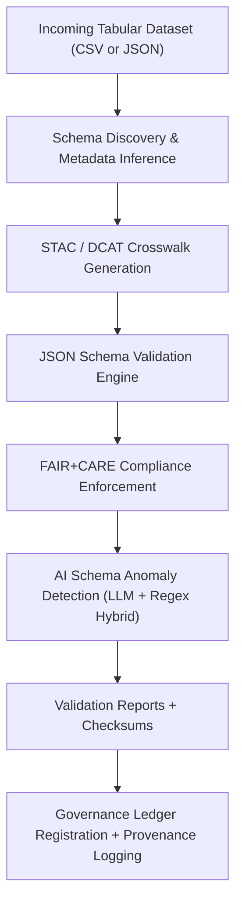

<div align="center">

# 📘 Kansas Frontier Matrix — **Tabular Validation Schemas**  
`data/work/staging/tabular/tmp/intake/validation/schemas/`

### *“Every rule that defines structure defines reproducibility.”*  

**Purpose:** This directory contains the **active and historical schema definitions** used for tabular validation within the Kansas Frontier Matrix (KFM).  
Schemas ensure consistent enforcement of field types, metadata alignment, AI validation, and FAIR+CARE compliance across all datasets entering the staging environment.

[](../../../../../../../../../../docs/architecture/repo-focus.md)  
[](../../../../../../../../../../LICENSE)  
[]()  
[]()  
[]()

</div>

---

## 🧭 Overview

The **Validation Schemas Layer** provides the blueprint for validating all tabular datasets processed by the KFM ETL pipelines.  
Each schema is written in **JSON Schema Draft-07** and extended with **MCP-DL annotations** for metadata tracking and reproducibility.

Validation schemas here govern:
- **Data structure:** fields, types, and constraints  
- **Semantic mapping:** STAC/DCAT and CIDOC CRM alignment  
- **AI model configuration:** anomaly detection fields, summary metadata  
- **FAIR+CARE compliance:** ethical and accessibility metadata requirements  

---

## 🗂️ Directory Layout

```text
data/work/staging/tabular/tmp/intake/validation/schemas/
├── tabular-intake-v13.json             # Core schema for intake validation
├── tabular-schema-validation-v13.json  # Structural and logical validation rules
├── tabular-ai-anomaly-v2.json          # Schema for AI anomaly report format
├── tabular-faircare-v1.json            # Schema for FAIR+CARE compliance reporting
├── tabular-profile-v1.json             # Schema for data profiling summaries
└── README.md                           # This document
````

---

## 🧩 Schema Validation Workflow



---

## ⚙️ Schema Composition

Each schema includes four principal sections:

| Section       | Description                       | Example                                                                     |
| ------------- | --------------------------------- | --------------------------------------------------------------------------- |
| `$id`         | Unique URI identifying the schema | `"https://kfm.schema.dev/tabular-intake-v13.json"`                          |
| `title`       | Human-readable schema name        | `"KFM Tabular Intake Validation Schema"`                                    |
| `description` | Purpose and scope                 | `"Defines the structure and validation rules for tabular intake datasets."` |
| `properties`  | Field definitions and types       | `"record_id": { "type": "string" }, "year": { "type": "integer" }`          |

---

## 🧮 Example Schema Snippet

```json
{
  "$schema": "http://json-schema.org/draft-07/schema#",
  "$id": "https://kfm.schema.dev/tabular-intake-v13.json",
  "title": "KFM Tabular Intake Validation Schema",
  "description": "Ensures all tabular intake datasets conform to standard structure and metadata conventions.",
  "type": "object",
  "required": ["dataset_id", "source", "year", "checksum"],
  "properties": {
    "dataset_id": {
      "type": "string",
      "pattern": "^[a-z0-9_\\-]+$"
    },
    "source": {
      "type": "string",
      "description": "Original dataset source or URL."
    },
    "year": {
      "type": "integer",
      "minimum": 1800,
      "maximum": 2100
    },
    "checksum": {
      "type": "string",
      "pattern": "^[a-fA-F0-9]{64}$"
    }
  }
}
```

---

## 🔍 Schema Crosswalks

All schemas integrate crosswalk mappings for interoperability:

| Standard      | Field Mapping                                  | Notes                             |
| ------------- | ---------------------------------------------- | --------------------------------- |
| **STAC 1.0**  | `properties → assets → href`                   | Dataset asset linkage             |
| **DCAT 3.0**  | `distribution.accessURL`                       | Catalog-level access URL          |
| **CIDOC CRM** | `E7 Activity → P14 carried out by → E39 Actor` | Provenance relations              |
| **OWL-Time**  | `temporal.extent`                              | Time interval of dataset coverage |
| **PROV-O**    | `wasGeneratedBy`, `used`                       | Source derivation chains          |

---

## 🤖 AI Schema Management

| AI Function                 | Description                                     | Schema Reference             | Output                            |
| --------------------------- | ----------------------------------------------- | ---------------------------- | --------------------------------- |
| **Schema Anomaly Detector** | Detects schema drift or unregistered fields     | `tabular-ai-anomaly-v2.json` | `ai_anomalies.tabular.json`       |
| **Schema Summarizer**       | Produces compact summaries of schema evolution  | `tabular-profile-v1.json`    | `ai_schema_summary.json`          |
| **FAIR+CARE Checker**       | Evaluates ethical completeness of schema fields | `tabular-faircare-v1.json`   | `faircare_validation_report.json` |

---

## 🧾 Compliance Matrix

| Standard                 | Scope                                | Validator       |
| ------------------------ | ------------------------------------ | --------------- |
| **JSON Schema Draft-07** | Core structural validation           | `jsonschema`    |
| **STAC 1.0 / DCAT 3.0**  | Metadata and cataloging alignment    | `stac-validate` |
| **CIDOC CRM / OWL-Time** | Semantic ontology adherence          | `graph-lint`    |
| **FAIR+CARE Principles** | Ethical and accessibility validation | `fair-audit`    |
| **MCP-DL v6.3**          | Documentation-first reproducibility  | `docs-validate` |

---

## ⚙️ Common Commands

```bash
# Validate dataset using intake schema
make validate-tabular-schema

# Run FAIR+CARE schema checks
make faircare-schema-validate

# Generate schema summary manifest
make export-schema-meta
```

Each validation run references the schema version ID stored in the dataset’s provenance ledger.

---

## 🪶 Version History

| Version | Date       | Author              | Notes                                                                                          |
| ------- | ---------- | ------------------- | ---------------------------------------------------------------------------------------------- |
| v9.0.0  | 2025-10-26 | `@kfm-architecture` | Initial creation of Tabular Validation Schemas documentation (Diamond⁹ Ω / Crown∞Ω Certified). |

---

<div align="center">

### 🜂 Kansas Frontier Matrix — *Structure · Logic · Semantics*

**“Schemas are the architecture of truth — validation enforces its symmetry.”**

[]()
[]()
[]()
[]()
[]()

<br><br> <a href="#-kansas-frontier-matrix--tabular-validation-schemas-diamond⁹-Ω--crown∞Ω-certified">⬆ Back to Top</a>

</div>
```

