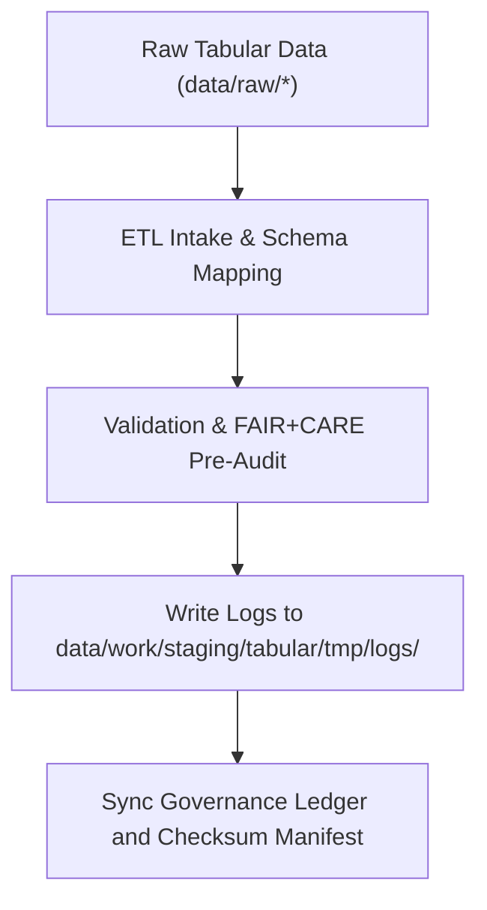

<div align="center">

# 🧾 Kansas Frontier Matrix — **Tabular TMP Logs**
`data/work/staging/tabular/tmp/logs/README.md`

**Purpose:** Centralized log directory for all tabular ingestion, normalization, and FAIR+CARE pre-validation events in the Kansas Frontier Matrix (KFM) ETL pipeline.  
These logs ensure traceability, transparency, and reproducibility across all temporary tabular processing tasks performed during staging.

[](../../../../../../docs/standards/faircare-validation.md)
[](../../../../../../LICENSE)
[](../../../../../../docs/architecture/repo-focus.md)

</div>

---

## 📚 Overview

The `data/work/staging/tabular/tmp/logs/` directory captures **runtime activity logs, validation results, and governance synchronization traces** for temporary tabular ETL operations.  
It documents ingestion, schema alignment, pre-validation, and FAIR+CARE ethical review activities prior to dataset normalization.

### Primary Functions:
- Record ETL execution metadata for each TMP operation.  
- Capture schema validation and field normalization diagnostics.  
- Log FAIR+CARE ethical checks and audit communications.  
- Maintain provenance synchronization logs for checksum verification.  

All logs comply with FAIR+CARE governance standards and are retained for audit reproducibility.

---

## 🗂️ Directory Layout

```plaintext
data/work/staging/tabular/tmp/logs/
├── README.md                           # This file — overview of tabular TMP logs
│
├── etl_tmp_run.log                     # Execution trace for tabular TMP ETL pipeline
├── data_contract_check.log             # Field-level schema conformance verification
├── faircare_pre_audit.log              # Ethical audit and FAIR+CARE validation trace
├── governance_sync.log                 # Governance ledger synchronization log
└── metadata.json                       # Log-level provenance and checksum records
```

---

## ⚙️ TMP Logging Workflow



### Workflow Description:
1. **ETL Intake:** Logs created during ingestion and schema normalization.  
2. **Validation:** Field-level QA, encoding, and data type checks recorded.  
3. **Ethics Review:** FAIR+CARE pre-audit results appended to log metadata.  
4. **Governance:** Checksum and provenance entries written to audit ledger.  
5. **Synchronization:** Log hashes added to `releases/v9.3.2/manifest.zip`.

---

## 🧩 Example Log Metadata Record

```json
{
  "id": "tabular_tmp_log_climate_indices_v9.3.2",
  "component": "etl_tmp_pipeline",
  "created": "2025-10-28T15:40:00Z",
  "records_processed": 54012,
  "schema_errors": 0,
  "validation_warnings": 2,
  "faircare_status": "compliant",
  "checksum": "sha256:9c10c2fa09cb8bb4d9e0432f1faef733fb93ad12...",
  "governance_ledger_ref": "data/reports/audit/data_provenance_ledger.json"
}
```

---

## 🧠 FAIR+CARE Compliance in TMP Logging

| Principle | Implementation |
|------------|----------------|
| **Findable** | Each TMP log indexed by dataset, ETL pipeline, and checksum ID. |
| **Accessible** | Logs stored in open text or JSON formats for governance access. |
| **Interoperable** | Schema aligned with FAIR+CARE and MCP-DL logging standards. |
| **Reusable** | Logs include provenance and checksum references for reproducibility. |
| **Collective Benefit** | Promotes ethical transparency in staging pipelines. |
| **Authority to Control** | FAIR+CARE Council monitors pre-validation audit results. |
| **Responsibility** | Validators and engineers must document all TMP transformations. |
| **Ethics** | Logs redact sensitive or personal identifiers before archival. |

FAIR+CARE compliance results synchronized to:  
`data/reports/fair/data_care_assessment.json` and `data/reports/audit/data_provenance_ledger.json`.

---

## ⚙️ Log Categories

| Log File | Description | Format |
|-----------|--------------|--------|
| `etl_tmp_run.log` | Execution trace of tabular ETL TMP pipelines. | Text |
| `data_contract_check.log` | Field-level and schema compliance trace. | Text |
| `faircare_pre_audit.log` | FAIR+CARE ethical pre-validation results. | Text |
| `governance_sync.log` | Governance ledger and manifest synchronization record. | Text |
| `metadata.json` | Contextual metadata and checksum validation. | JSON |

---

## ⚖️ Governance & Provenance Integration

| Record | Description |
|---------|-------------|
| `metadata.json` | Captures TMP run identifiers, provenance linkage, and checksums. |
| `data/reports/audit/data_provenance_ledger.json` | Logs TMP lineage, ETL run status, and audit trace. |
| `data/reports/validation/schema_validation_summary.json` | Contains validation conformance outcomes. |
| `releases/v9.3.2/manifest.zip` | Tracks log integrity through SHA-256 checksum records. |

Governance synchronization automated by `tabular_tmp_log_sync.yml`.

---

## 🧾 Retention Policy

| Log Type | Retention Duration | Policy |
|-----------|--------------------|--------|
| ETL TMP Logs | 30 days | Purged after dataset normalization approval. |
| Schema Validation Logs | 14 days | Retained for review, then archived to system logs. |
| FAIR+CARE Pre-Audit Logs | 90 days | Maintained for ethics re-audit verification. |
| Governance Sync Logs | 365 days | Archived for governance continuity. |

Automated cleanup handled by `tabular_tmp_cleanup.yml`.

---

## 🧾 Internal Use Citation

```text
Kansas Frontier Matrix (2025). Tabular TMP Logs (v9.3.2).
Centralized log repository for ETL, schema validation, and FAIR+CARE pre-validation in temporary tabular staging workflows.
Restricted to internal reproducibility, QA, and governance audit operations.
```

---

## 🧾 Version Notes

| Version | Date | Notes |
|----------|------|--------|
| v9.3.2 | 2025-10-28 | Added FAIR+CARE pre-audit log support and checksum governance linkage. |
| v9.2.0 | 2024-07-15 | Introduced schema conformance trace and validation reporting. |
| v9.0.0 | 2023-01-10 | Established TMP logging structure for tabular ETL pipelines. |

---

<div align="center">

**Kansas Frontier Matrix** · *Data Provenance × FAIR+CARE Accountability × Reproducible Tabular Governance*  
[🔗 Repository](https://github.com/bartytime4life/Kansas-Frontier-Matrix) • [🧭 Docs Portal](../../../../../../docs/) • [⚖️ Governance Ledger](../../../../../../docs/standards/governance/)

</div>
