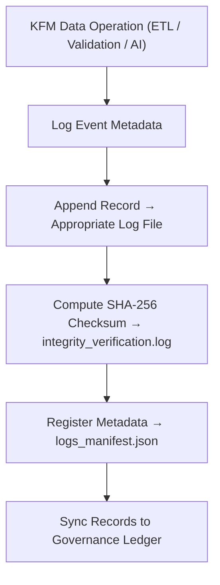

<div align="center">

# 📜 Kansas Frontier Matrix — **System Logs**  
`data/work/staging/tabular/tmp/logs/`

### *“Every transformation, every validation, every byte — logged, verified, and remembered.”*

**Purpose:**  
The **System Logs Layer** captures all **ETL, validation, normalization, and AI governance events** occurring within the Kansas Frontier Matrix (KFM) staging environment.  
It provides a **complete operational trace** ensuring that all automated and human actions are **auditable, reversible, and ethically documented** under FAIR+CARE principles.

[](../../../../../../../../../docs/architecture/repo-focus.md)  
[](../../../../../../../../../LICENSE)  
[]()  
[]()  
[]()

</div>

---

## 🧭 Overview

The **System Logs Layer** ensures that every component in the KFM data pipeline — from raw ingestion to AI validation — leaves an immutable, timestamped trail.  
It unifies logs from:
- ETL pipelines and extraction events  
- AI and FAIR+CARE validation processes  
- Schema normalization and conflict resolution operations  
- Audit sandbox simulations  
- Governance synchronization and checksum verification  

All log entries are **signed, versioned, and checksum-validated** to maintain operational integrity and reproducibility.

---

## 🗂️ Directory Layout

```text
data/work/staging/tabular/tmp/logs/
├── etl_pipeline.log                     # End-to-end ETL activity trace
├── validation_engine.log                # Schema and FAIR+CARE validator run history
├── normalization_engine.log             # Harmonization and data alignment event log
├── ai_processing.log                    # AI model execution and explainability traces
├── audit_pipeline.log                   # Audit sandbox and compliance simulation log
├── governance_sync.log                  # Ledger and provenance synchronization events
├── integrity_verification.log           # Checksum, hash, and cryptographic validation outputs
├── logs_manifest.json                   # Index of all system log metadata and hashes
└── README.md                            # This document
```

---

## 🔁 Log Generation Workflow



---

## 🧩 Logs Manifest Schema

| Field | Description | Example |
|-------|--------------|----------|
| `log_id` | Unique log entry ID | `log_2025_10_26_0057` |
| `process` | System process name | `ETL / Validation / AI / Audit / Governance` |
| `file_path` | Location of log file | `validation_engine.log` |
| `record_count` | Number of entries logged | `1289` |
| `checksum` | SHA-256 integrity hash | `f9a7c18b4e98efb...` |
| `curator_reviewed` | Whether curator has audited log | `true` |
| `timestamp` | Time of last update | `2025-10-26T17:24:09Z` |
| `governance_link` | Ledger reference | `governance/system_logs_ledger.jsonld#log_2025_10_26_0057` |

---

## ⚙️ Core Components

| Component | Function | Output |
|------------|-----------|---------|
| **ETL Pipeline Logger** | Captures data extraction and transformation events | `etl_pipeline.log` |
| **Validation Engine Logger** | Records schema, FAIR+CARE, and checksum tests | `validation_engine.log` |
| **Normalization Trace Recorder** | Logs harmonization and semantic realignments | `normalization_engine.log` |
| **AI Process Logger** | Tracks inference runs, confidence scores, and drift alerts | `ai_processing.log` |
| **Audit Sandbox Logger** | Documents governance simulation events | `audit_pipeline.log` |
| **Governance Sync Tracker** | Logs synchronization and ledger updates | `governance_sync.log` |
| **Integrity Verifier** | Validates all logs with cryptographic checksums | `integrity_verification.log` |

> 🧠 *If transparency is the soul of science, logs are its memory — immutable, structured, and ethical.*

---

## ⚙️ Curator & Operations Workflow

1. Review recent ETL and validation logs:
   ```bash
   tail -n 50 etl_pipeline.log
   tail -n 50 validation_engine.log
   ```
2. Generate integrity verification report:
   ```bash
   make logs-verify
   ```
3. Archive completed logs and refresh manifest:
   ```bash
   make logs-archive
   ```
4. Sync log metadata to governance ledger:
   ```bash
   make governance-update
   ```

---

## 📈 Monitoring & Governance Metrics

| Metric | Description | Target |
|---------|-------------|---------|
| **Logging Completeness** | % of operational actions logged | 100% |
| **Checksum Validation Rate** | Logs successfully verified for integrity | 100% |
| **FAIR+CARE Traceability** | Logs containing ethical and provenance context | 100% |
| **Curator Review Coverage** | Logs manually reviewed and approved | ≥ 90% |
| **Governance Sync Frequency** | Update cadence to governance ledger | Daily |

---

## 🧾 Compliance Matrix

| Standard | Scope | Validator |
|-----------|--------|-----------|
| **FAIR+CARE** | Ethical and provenance-aligned logging | `fair-audit` |
| **MCP-DL v6.3** | Documentation-first lifecycle recordkeeping | `docs-validate` |
| **ISO/IEC 23053:2022** | AI and operational event tracking | `ai-validate` |
| **CIDOC CRM / PROV-O** | Provenance and lineage structure compliance | `graph-lint` |
| **STAC / DCAT 3.0** | Metadata discoverability of system events | `stac-validate` |

---

## 🪶 Version History

| Version | Date | Author | Notes |
|----------|------|---------|-------|
| v9.0.0 | 2025-10-26 | `@kfm-architecture` | Initial creation of System Logs documentation under Diamond⁹ Ω / Crown∞Ω certification. |

---

<div align="center">

### 🜂 Kansas Frontier Matrix — *Transparency · Continuity · Accountability*  
**“Logs are the DNA of governance — immutable strands linking ethics to execution.”**

[]()
[]()
[]()
[]()
[]()

<br><br>
<a href="#-kansas-frontier-matrix--system-logs-operational-trace--validation-record-layer--diamond⁹-Ω--crown∞Ω-certified">⬆ Back to Top</a>

</div>
