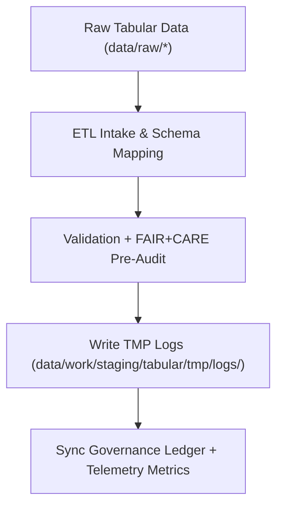

<div align="center">

# 🧾 Kansas Frontier Matrix — **Tabular TMP Logs**
`data/work/staging/tabular/tmp/logs/README.md`

**Purpose:** Centralized log directory for all tabular ingestion, normalization, and FAIR+CARE pre-validation events within the Kansas Frontier Matrix (KFM) ETL pipeline.  
Ensures traceability, transparency, and reproducibility across all temporary tabular processing activities under MCP-DL v6.3 and FAIR+CARE governance.

[](../../../../../../docs/standards/faircare-validation.md)
[](../../../../../../LICENSE)
[](../../../../../../docs/architecture/repo-focus.md)

</div>

---

## 📚 Overview

The `data/work/staging/tabular/tmp/logs/` directory captures **runtime activity logs, validation outputs, and governance synchronization traces** generated during tabular TMP operations.  
It provides a full record of schema normalization, FAIR+CARE audits, and checksum verification for all temporary tabular transformations.

### Core Functions
- Record ETL runtime events for traceability and validation.  
- Capture schema validation, data contract checks, and FAIR+CARE audit traces.  
- Maintain governance synchronization logs linking ETL outcomes to provenance ledgers.  
- Emit **telemetry** data for system performance and governance analytics dashboards.  

All logs follow FAIR+CARE governance standards and are retained per data lifecycle policy for reproducibility.

---

## 🗂️ Directory Layout

```plaintext
data/work/staging/tabular/tmp/logs/
├── README.md
│
├── etl_tmp_run.log                     # Execution trace for TMP ingestion and normalization
├── data_contract_check.log             # Schema contract conformance and field mapping report
├── faircare_pre_audit.log              # FAIR+CARE pre-validation and ethics trace
├── governance_sync.log                 # Provenance ledger synchronization record
└── metadata.json                       # Log-level checksum, telemetry, and runtime metadata
```

---

## ⚙️ TMP Logging Workflow



### Workflow Summary
1. **ETL Intake:** Logs capture all ingestion and schema normalization operations.  
2. **Validation:** Field-level QA, encoding checks, and schema enforcement recorded.  
3. **FAIR+CARE Audit:** Pre-validation ethics checks logged for audit traceability.  
4. **Governance:** Checksum hashes synced with provenance ledger.  
5. **Telemetry:** Execution statistics emitted for focus dashboards and observability.

---

## 🧩 Example Log Metadata Record

```json
{
  "id": "tabular_tmp_log_climate_indices_v9.4.0",
  "component": "etl_tmp_pipeline",
  "created": "2025-11-02T15:50:00Z",
  "records_processed": 56321,
  "schema_errors": 0,
  "validation_warnings": 2,
  "faircare_status": "compliant",
  "checksum": "sha256:9c10c2fa09cb8bb4d9e0432f1faef733fb93ad12...",
  "telemetry_link": "releases/v9.4.0/focus-telemetry.json",
  "governance_ledger_ref": "data/reports/audit/data_provenance_ledger.json"
}
```

---

## 🧠 FAIR+CARE Compliance in TMP Logging

| Principle | Implementation |
|------------|----------------|
| **Findable** | Logs indexed by dataset ID, ETL pipeline, and checksum. |
| **Accessible** | Stored in open text/JSON formats accessible for audit. |
| **Interoperable** | Logging schemas conform to FAIR+CARE and MCP-DL v6.3 standards. |
| **Reusable** | Includes provenance, telemetry, and checksum for reproducibility. |
| **Collective Benefit** | Promotes transparent data processing and ethical auditability. |
| **Authority to Control** | FAIR+CARE Council reviews pre-validation log summaries. |
| **Responsibility** | Validators document all TMP pipeline and schema operations. |
| **Ethics** | Sensitive or identifying data redacted before archival. |

Compliance results synchronized to:  
`data/reports/fair/data_care_assessment.json` • `data/reports/audit/data_provenance_ledger.json`

---

## ⚙️ Log Categories

| Log File | Description | Format |
|-----------|--------------|--------|
| `etl_tmp_run.log` | End-to-end trace of ETL ingestion and TMP normalization. | Text |
| `data_contract_check.log` | Reports schema contract alignment and discrepancies. | Text |
| `faircare_pre_audit.log` | Records FAIR+CARE audit events and outcomes. | Text |
| `governance_sync.log` | Tracks synchronization with the governance ledger. | Text |
| `metadata.json` | Stores context, checksums, telemetry references, and runtime info. | JSON |

---

## ⚖️ Governance & Provenance Integration

| Record | Description |
|---------|-------------|
| `metadata.json` | Contains TMP run metadata, validator ID, and telemetry pointer. |
| `data/reports/audit/data_provenance_ledger.json` | Logs lineage, FAIR+CARE audit results, and governance trace. |
| `data/reports/validation/schema_validation_summary.json` | Tracks schema QA outcomes linked to TMP logs. |
| `releases/v9.4.0/manifest.zip` | Archives log checksums for reproducibility validation. |

Governance and telemetry sync automated by **`tabular_tmp_log_sync.yml`**.

---

## 🧾 Retention Policy

| Log Type | Retention Duration | Policy |
|-----------|--------------------|--------|
| ETL TMP Logs | 30 days | Purged post dataset normalization approval. |
| Schema Validation Logs | 14 days | Retained until FAIR+CARE review complete. |
| FAIR+CARE Pre-Audit Logs | 90 days | Archived for ethics verification. |
| Governance Sync Logs | 365 days | Maintained permanently for provenance continuity. |

Cleanup managed by **`tabular_tmp_cleanup.yml`**.

---

## 🧾 Internal Use Citation

```text
Kansas Frontier Matrix (2025). Tabular TMP Logs (v9.4.0).
Centralized log repository for tabular ETL, schema validation, and FAIR+CARE pre-validation operations.
Restricted to internal reproducibility, governance, and ethical audit processes.
```

---

## 🧾 Version Notes

| Version | Date | Notes |
|----------|------|--------|
| v9.4.0 | 2025-11-02 | Added telemetry integration, expanded schema diagnostics, and improved governance trace. |
| v9.3.2 | 2025-10-28 | Introduced FAIR+CARE pre-audit log capture and checksum synchronization. |
| v9.2.0 | 2024-07-15 | Added schema contract validation and QA reporting. |
| v9.0.0 | 2023-01-10 | Established TMP log workspace for tabular ETL pipelines. |

---

<div align="center">

**Kansas Frontier Matrix** · *Data Provenance × FAIR+CARE Accountability × Reproducible Tabular Governance × Telemetry Traceability*  
[🔗 Repository](https://github.com/bartytime4life/Kansas-Frontier-Matrix) • [🧭 Docs Portal](../../../../../../docs/) • [⚖️ Governance Ledger](../../../../../../docs/standards/governance/)

</div>
