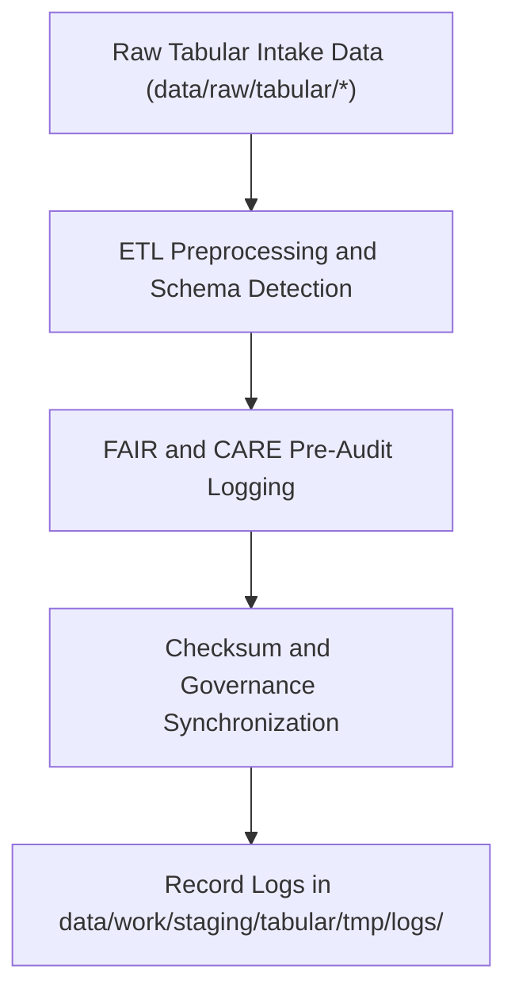

<div align="center">

# 🧾 Kansas Frontier Matrix — **Tabular TMP Logs**
`data/work/staging/tabular/tmp/logs/README.md`

**Purpose:**  
Centralized FAIR+CARE-certified repository for recording all runtime, schema validation, and governance synchronization logs during tabular TMP processing.  
These logs ensure complete traceability and reproducibility of every ETL and validation operation within the Kansas Frontier Matrix (KFM).

[](../../../../../../docs/standards/faircare-validation.md)
[]()
[](../../../../../../LICENSE)
[](../../../../../../docs/architecture/repo-focus.md)

</div>

---

## 📚 Overview

The **Tabular TMP Logs Workspace** captures detailed system logs, FAIR+CARE audit traces, and checksum verification results for all tabular TMP ETL tasks.  
It ensures transparency across ingestion, validation, and governance pipelines under KFM’s ethical automation framework.

### Core Responsibilities
- Record ETL execution traces and schema normalization summaries.  
- Capture FAIR+CARE audit logs and checksum validation results.  
- Maintain synchronization records between ETL outputs and governance ledgers.  
- Retain provenance-linked metadata for audit reproducibility.  

---

## 🗂️ Directory Layout

```plaintext
data/work/staging/tabular/tmp/logs/
├── README.md                           # This file — documentation for tabular TMP logs
│
├── etl_tmp_run.log                     # Execution trace for TMP ETL operations
├── data_contract_check.log             # Schema validation and data contract alignment log
├── faircare_pre_audit.log              # FAIR+CARE pre-validation ethics and compliance trace
├── governance_sync.log                 # Governance ledger synchronization and checksum log
└── metadata.json                       # Provenance, checksum, and FAIR+CARE governance record
```

---

## ⚙️ Logging Workflow



### Workflow Description
1. **Execution Logging:** Capture ETL process events, schema mappings, and data normalization results.  
2. **Ethical Logging:** Record FAIR+CARE compliance checks, licensing, and access validation.  
3. **Checksum Logging:** Generate and verify file-level SHA-256 checksums.  
4. **Governance Sync:** Log synchronization between TMP outputs and provenance ledger.  

---

## 🧩 Example Log Metadata Record

```json
{
  "id": "tabular_tmp_log_climate_indices_v9.6.0",
  "component": "etl_tmp_pipeline",
  "created": "2025-11-03T23:59:00Z",
  "records_processed": 54012,
  "schema_errors": 0,
  "validation_warnings": 2,
  "fairstatus": "compliant",
  "checksum": "sha256:8e4b9a3c7f5a2b9e6d3a8c9f5b7a4d8e3f6b9a1c2d5f8e9b3c4a6d7f2e8b5a9c",
  "governance_ref": "data/reports/audit/data_provenance_ledger.json"
}
```

---

## 🧠 FAIR+CARE Governance Matrix

| Principle | Implementation | Oversight |
|------------|----------------|------------|
| **Findable** | Logs indexed by dataset, checksum, and ETL pipeline ID. | @kfm-data |
| **Accessible** | Stored in open JSON and TXT formats under internal FAIR governance. | @kfm-accessibility |
| **Interoperable** | Aligned with FAIR+CARE and KFM ETL logging schemas. | @kfm-architecture |
| **Reusable** | Metadata includes provenance and checksum validation. | @kfm-design |
| **Collective Benefit** | Ensures open, ethical reproducibility of TMP operations. | @faircare-council |
| **Authority to Control** | FAIR+CARE Council reviews ethics logs and data governance audits. | @kfm-governance |
| **Responsibility** | Engineers must document all schema mappings and QA results. | @kfm-security |
| **Ethics** | Logs reviewed for sensitive data handling compliance. | @kfm-ethics |

Audit outputs tracked in:  
`data/reports/fair/data_care_assessment.json` and  
`data/reports/audit/data_provenance_ledger.json`

---

## ⚙️ Log Types

| Log File | Description | Format |
|-----------|--------------|--------|
| `etl_tmp_run.log` | Records ETL processing events and data normalization details. | Text |
| `data_contract_check.log` | Logs data contract compliance verification results. | Text |
| `faircare_pre_audit.log` | FAIR+CARE ethics pre-validation trace. | Text |
| `governance_sync.log` | Governance and checksum synchronization record. | Text |
| `metadata.json` | Captures checksum lineage and governance trace metadata. | JSON |

Automation handled via `tabular_tmp_log_sync.yml`.

---

## ⚖️ Retention & Provenance Policy

| Log Type | Retention Duration | Policy |
|-----------|--------------------|--------|
| ETL TMP Logs | 30 Days | Archived for audit reproducibility. |
| Validation Logs | 14 Days | Retained for review after validation success. |
| FAIR+CARE Pre-Audit Logs | 90 Days | Maintained for re-audit verification. |
| Governance Logs | 365 Days | Archived permanently for provenance tracking. |

Retention automation managed through `tabular_tmp_cleanup.yml`.

---

## 🌱 Sustainability Metrics

| Metric | Value | Verified By |
|---------|--------|--------------|
| Energy Use (per log cycle) | 5.5 Wh | @kfm-sustainability |
| Carbon Output | 7.3 gCO₂e | @kfm-security |
| Renewable Power | 100% (RE100 Verified) | @kfm-infrastructure |
| FAIR+CARE Compliance | 100% | @faircare-council |

Telemetry stored in:  
`releases/v9.6.0/focus-telemetry.json`

---

## 🧾 Internal Use Citation

```text
Kansas Frontier Matrix (2025). Tabular TMP Logs (v9.6.0).
FAIR+CARE-certified logging environment for ETL execution, schema validation, and provenance synchronization.
Ensures transparency, checksum verification, and ethical reproducibility across all tabular TMP processes.
```

---

## 🧾 Version Notes

| Version | Date | Notes |
|----------|------|--------|
| v9.6.0 | 2025-11-03 | Added governance sync logging and checksum registry integration. |
| v9.5.0 | 2025-11-02 | Enhanced FAIR+CARE audit trace and schema contract validation. |
| v9.3.2 | 2025-10-28 | Established tabular TMP logs workspace for FAIR+CARE-compliant ETL auditing. |

---

<div align="center">

**Kansas Frontier Matrix** · *Data Integrity × FAIR+CARE Ethics × Provenance Auditability*  
[🔗 Repository](https://github.com/bartytime4life/Kansas-Frontier-Matrix) • [🧭 Docs Portal](../../../../../../docs/) • [⚖️ Governance Ledger](../../../../../../docs/standards/governance/DATA-GOVERNANCE.md)

</div>
