<div align="center">

# 🧾 Kansas Frontier Matrix — **Tabular TMP Logs**
`data/work/staging/tabular/tmp/logs/README.md`

**Purpose:**  
Central FAIR+CARE-certified repository for **runtime, schema validation, and governance synchronization logs** during tabular TMP processing.  
Ensures complete traceability and reproducibility of ETL and validation operations within KFM.

[](../../../../../../docs/architecture/README.md)
[](../../../../../../docs/standards/faircare-validation.md)
[]()
[](../../../../../../LICENSE)

</div>

---

## 📘 Overview

The **Tabular TMP Logs Workspace** records detailed **system logs, FAIR+CARE traces, and checksum events** for all TMP ETL tasks.  
It provides transparency across ingestion, validation, and governance pipelines under KFM’s ethical automation framework.

### Core Responsibilities
- Record ETL execution traces and schema normalization checks.  
- Capture FAIR+CARE pre-audit logs and checksum validation.  
- Maintain sync records between TMP outputs and governance ledgers.  
- Preserve provenance-linked metadata for audit reproducibility.  

---

## 🗂️ Directory Layout

```plaintext
data/work/staging/tabular/tmp/logs/
├── README.md
├── etl_tmp_run.log
├── data_contract_check.log
├── faircare_pre_audit.log
├── governance_sync.log
└── metadata.json
```

---

## ⚙️ Logging Workflow

```mermaid
flowchart TD
    A["Raw Tabular Intake (data/raw/tabular/*)"] --> B["ETL Preprocessing + Schema Detection"]
    B --> C["FAIR + CARE Pre-Audit Logging"]
    C --> D["Checksum + Governance Synchronization"]
    D --> E["Persist Logs → staging/tabular/tmp/logs/"]
```



### Steps
1. **Execution Logging** — Capture ETL events, schema maps, and normalization.  
2. **Ethical Logging** — Record FAIR+CARE checks, licensing, and access.  
3. **Checksum Logging** — Generate and verify SHA-256 hashes.  
4. **Governance Sync** — Log TMP output linkage to provenance ledger.

---

## 🧩 Example Log Metadata Record

```json
{
  "id": "tabular_tmp_log_climate_indices_v9.7.0",
  "component": "etl_tmp_pipeline",
  "created": "2025-11-06T23:59:00Z",
  "records_processed": 54012,
  "schema_errors": 0,
  "validation_warnings": 2,
  "fairstatus": "compliant",
  "checksum_sha256": "sha256:8e4b9a3c7f5a2b9e6d3a8c9f5b7a4d8e3f6b9a1c2d5f8e9b3c4a6d7f2e8b5a9c",
  "governance_ref": "data/reports/audit/data_provenance_ledger.json"
}
```

---

## 🧠 FAIR+CARE Governance Matrix

| Principle | Implementation | Oversight |
|-----------|----------------|-----------|
| **Findable** | Logs indexed by dataset, checksum, pipeline ID. | `@kfm-data` |
| **Accessible** | Open text + JSON formats for internal audit. | `@kfm-accessibility` |
| **Interoperable** | Aligns with FAIR+CARE + KFM ETL logging schemas. | `@kfm-architecture` |
| **Reusable** | Provenance + checksum validation retained. | `@kfm-design` |
| **Collective Benefit** | Supports ethical reproducibility of TMP operations. | `@faircare-council` |
| **Authority to Control** | Council reviews ethics + governance logs. | `@kfm-governance` |
| **Responsibility** | Engineers document mappings + QA outcomes. | `@kfm-security` |
| **Ethics** | Logs screened for sensitive attributes. | `@kfm-ethics` |

**Audit refs:**  
`data/reports/fair/data_care_assessment.json` · `data/reports/audit/data_provenance_ledger.json`

---

## ⚙️ Log Types

| Log File | Description | Format |
|----------|-------------|--------|
| `etl_tmp_run.log` | ETL processing events + normalization details | Text |
| `data_contract_check.log` | Contract compliance verification | Text |
| `faircare_pre_audit.log` | Pre-validation ethics & accessibility trace | Text |
| `governance_sync.log` | Ledger sync + checksum events | Text |
| `metadata.json` | Checksum lineage + provenance metadata | JSON |

**Automation:** `tabular_tmp_log_sync.yml`

---

## ♻️ Retention & Sustainability

| Log Type | Retention | Policy |
|----------|----------:|--------|
| ETL TMP Logs | 30 Days | Archived for audit reproducibility. |
| Validation Logs | 14 Days | Retained post-validation.          |
| FAIR+CARE Logs | 90 Days | Kept for re-audit verification.     |
| Governance Logs | 365 Days | Archived for provenance history.    |

**Telemetry:** `../../../../../../releases/v9.7.0/focus-telemetry.json`

---

## 🌱 Sustainability Metrics

| Metric | Value | Verified By |
|--------|------:|-------------|
| Energy Use (per log cycle) | 5.5 Wh | `@kfm-sustainability` |
| Carbon Output | 7.3 gCO₂e | `@kfm-security` |
| Renewable Power | 100% (RE100) | `@kfm-infrastructure` |
| FAIR+CARE Compliance | 100% | `@faircare-council` |

---

## 🧾 Internal Citation

```text
Kansas Frontier Matrix (2025). Tabular TMP Logs (v9.7.0).
FAIR+CARE-certified logging environment for TMP ETL execution, schema validation, and provenance synchronization—ensuring transparent, checksum-verified, and ethically reproducible tabular workflows.
```

---

<div align="center">

**Kansas Frontier Matrix**  
*Data Integrity × FAIR+CARE Ethics × Provenance Auditability*  
© 2025 Kansas Frontier Matrix — Internal · FAIR+CARE Certified · Diamond⁹ Ω / Crown∞Ω Ultimate Certified  

[Back to Tabular TMP](../README.md) · [Governance Charter](../../../../../../docs/standards/governance/DATA-GOVERNANCE.md)

</div>