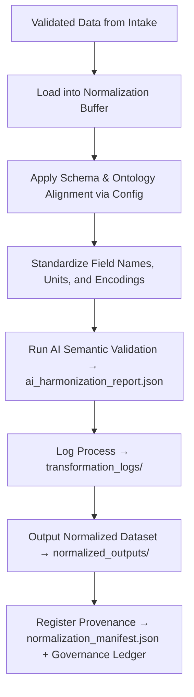

<div align="center">

# 🧮 Kansas Frontier Matrix — **Normalization Buffer**  
`data/work/staging/tabular/tmp/normalization_buffer/`

### *“Consistency is not coincidence — it’s the architecture of understanding.”*

**Purpose:**  
The **Normalization Buffer Layer** serves as the **intermediate harmonization zone** for tabular data in the Kansas Frontier Matrix (KFM).  
It ensures that incoming data, after initial validation and AI analysis, is standardized into uniform schemas and formats before integration into the structured **staging and processed layers**.

[](../../../../../../../../../docs/architecture/repo-focus.md)  
[](../../../../../../../../../LICENSE)  
[]()  
[]()  
[]()

</div>

---

## 🧭 Overview

The **Normalization Buffer** acts as a controlled staging zone between **raw/staging intake** and **validated tabular datasets**.  
It allows for:
- Harmonization of data structures into CIDOC CRM, DCAT, or STAC-compatible schemas  
- Standardization of column names, encodings, and value domains  
- FAIR+CARE metadata enrichment  
- AI-assisted semantic validation and drift correction  
- Logging of all transformation and reformatting processes for reproducibility  

This layer ensures every dataset is fully compliant with KFM’s schema and metadata standards before archival or graph integration.

---

## 🗂️ Directory Layout

```text
data/work/staging/tabular/tmp/normalization_buffer/
├── incoming_raw_snapshots/              # Temporary raw extracts awaiting normalization
│   ├── treaty_data_snapshot_2025_10_26.csv
│   ├── hydrology_metadata_raw.csv
│   └── census_population_input.json
├── normalized_outputs/                  # Harmonized files ready for staging ingestion
│   ├── treaty_data_normalized.csv
│   ├── hydrology_metadata_standardized.json
│   └── census_population_clean.csv
├── transformation_logs/                 # Step-by-step transformation logs
│   ├── normalization_trace.log
│   ├── encoding_conversion_report.json
│   └── ai_semantic_alignment_summary.json
├── normalization_manifest.json          # Registry of datasets processed through the buffer
├── ai_harmonization_report.json         # AI-assisted normalization and drift metrics
├── schema_alignment_config.yaml         # YAML configuration defining normalization mappings
└── README.md                            # This document
```

---

## 🔁 Normalization Workflow



---

## 🧩 Manifest Schema

| Field | Description | Example |
|-------|--------------|----------|
| `dataset_id` | Unique identifier for normalized dataset | `ks_treaty_1851` |
| `source_file` | Original raw file path | `incoming_raw_snapshots/treaty_data_snapshot_2025_10_26.csv` |
| `normalized_file` | Output after harmonization | `normalized_outputs/treaty_data_normalized.csv` |
| `schema_applied` | Schema or ontology mapping used | `CIDOC_CRM_v6.2` |
| `ai_alignment_score` | Confidence of AI-driven schema matching | `0.948` |
| `checksum` | SHA-256 integrity hash of normalized output | `c2b4de891aef003e...` |
| `processed_by` | Curator or automated agent | `AI Harmonizer v4.1` |
| `timestamp` | UTC time of normalization completion | `2025-10-26T16:53:25Z` |

---

## ⚙️ Core Components

| Component | Function | Output |
|------------|-----------|---------|
| **Schema Alignment Engine** | Converts datasets to CIDOC/DCAT-compliant structure | `normalized_outputs/` |
| **AI Harmonizer** | Suggests ontology matches and detects drift | `ai_harmonization_report.json` |
| **Encoding Converter** | Ensures UTF-8 uniform encoding and field normalization | `encoding_conversion_report.json` |
| **Transformation Logger** | Tracks every step of field, type, and structure modification | `transformation_logs/` |
| **Governance Integrator** | Registers normalization events and provenance | `normalization_manifest.json` |

> 🧠 *Normalization Buffer ensures that no data enters the main repository without semantic consistency and ethical transparency.*

---

## ⚙️ Curator & Governance Workflow

1. Import raw or AI-validated data into `incoming_raw_snapshots/`.  
2. Run normalization pipeline:
   ```bash
   make normalize-data
   ```
3. Verify schema alignment and AI harmonization results:
   ```bash
   make validate-normalization
   ```
4. Review logs and FAIR+CARE compliance in `transformation_logs/`.  
5. Promote normalized outputs to staging ingestion:
   ```bash
   make promote-normalized
   ```
6. Update governance ledger and normalization manifest:
   ```bash
   make governance-update
   ```

---

## 📈 Monitoring Metrics

| Metric | Description | Target |
|---------|-------------|---------|
| **Normalization Success Rate** | % of files successfully harmonized | ≥ 98% |
| **AI Alignment Accuracy** | Confidence in semantic alignment | ≥ 0.94 |
| **Schema Compliance Rate** | % of outputs conforming to CIDOC/DCAT standards | 100% |
| **FAIR+CARE Metadata Completeness** | Ethical metadata coverage | 100% |
| **Governance Synchronization** | Provenance log update frequency | Daily |

---

## 🧾 Compliance Matrix

| Standard | Scope | Validator |
|-----------|--------|-----------|
| **FAIR+CARE** | Ethical and transparent data harmonization | `fair-audit` |
| **MCP-DL v6.3** | Documentation-first ETL pipeline compliance | `docs-validate` |
| **CIDOC CRM / DCAT 3.0** | Semantic ontology and metadata structure alignment | `graph-lint` |
| **ISO 19115 / 19157** | Metadata quality and transformation traceability | `geojson-lint` |
| **STAC 1.0** | Harmonized tabular data interoperability | `stac-validate` |

---

## 🪶 Version History

| Version | Date | Author | Notes |
|----------|------|---------|-------|
| v9.0.0 | 2025-10-26 | `@kfm-architecture` | Initial creation of Normalization Buffer documentation under Diamond⁹ Ω / Crown∞Ω certification. |

---

<div align="center">

### 🜂 Kansas Frontier Matrix — *Harmonization · Consistency · Provenance*  
**“Normalization is the foundation of truth — where structure becomes understanding.”**

[]()
[]()
[]()
[]()
[]()

<br><br>
<a href="#-kansas-frontier-matrix--normalization-buffer-data-harmonization--pre-integration-layer--diamond⁹-Ω--crown∞Ω-certified">⬆ Back to Top</a>

</div>
