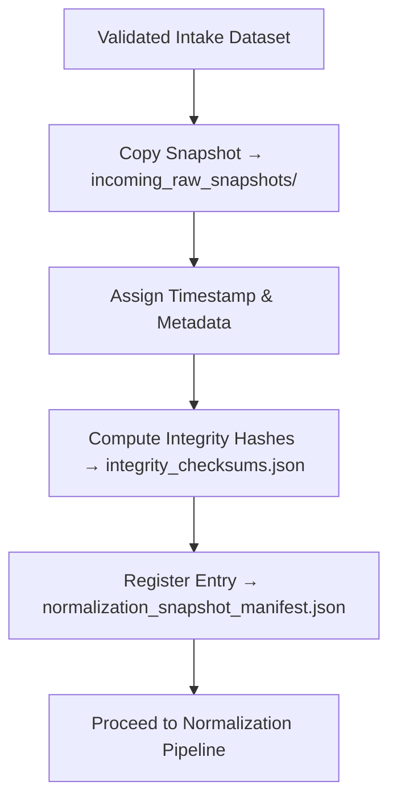

<div align="center">

# 📥 Kansas Frontier Matrix — **Incoming Raw Snapshots**  
`data/work/staging/tabular/tmp/normalization_buffer/incoming_raw_snapshots/`

### *“Every transformation begins with a snapshot of truth.”*

**Purpose:**  
This directory houses **raw, pre-normalized datasets** that have successfully passed AI validation and schema checks but are awaiting harmonization in the Normalization Buffer.  
Each file stored here represents a **time-stamped snapshot** of an incoming dataset before format or ontology transformation — ensuring traceability, reproducibility, and integrity of the normalization process.

[](../../../../../../../../../../../../../docs/architecture/repo-focus.md)  
[](../../../../../../../../../../../../../LICENSE)  
[]()  
[]()  
[]()

</div>

---

## 🧭 Overview

The **Incoming Raw Snapshots Sub-Layer** serves as the **intake-to-normalization bridge** for tabular data within the Kansas Frontier Matrix (KFM).  
Each dataset here:
- Captures its **original post-validation form** prior to reformatting.  
- Retains its **native schema and metadata** for audit and comparison.  
- Is checksum-verified and logged for provenance reproducibility.  
- Provides **input for semantic, structural, and FAIR+CARE normalization pipelines**.  

Snapshots ensure that KFM can always reproduce transformations from a fixed, validated reference point.

---

## 🗂️ Directory Layout

```text
data/work/staging/tabular/tmp/normalization_buffer/incoming_raw_snapshots/
├── treaty_data_snapshot_2025_10_26.csv        # Treaty metadata extract awaiting normalization
├── hydrology_metadata_raw.csv                 # Raw hydrological dataset pre-transformation
├── census_population_input.json               # JSON-formatted demographic input file
├── normalization_snapshot_manifest.json       # Registry of incoming snapshot metadata
├── integrity_checksums.json                   # SHA-256 verification for all snapshot files
└── README.md                                  # This document
```

---

## 🔁 Snapshot Workflow



---

## 🧩 Snapshot Manifest Schema

| Field | Description | Example |
|-------|--------------|----------|
| `snapshot_id` | Unique identifier for snapshot | `snapshot_2025_10_26_001` |
| `dataset_name` | Source dataset name | `ks_treaty_1851` |
| `source_path` | Original location of dataset | `data/work/staging/tabular/tmp/intake/validation/` |
| `file_type` | Dataset format | `CSV` |
| `checksum` | SHA-256 integrity value | `5b8e1c9a77f031a3ef...` |
| `file_size_bytes` | Size of snapshot file | `1928471` |
| `validation_status` | Post-intake validation state | `Passed` |
| `timestamp` | UTC time snapshot was created | `2025-10-26T16:55:31Z` |
| `provenance_reference` | Governance ledger entry link | `governance/normalization_incoming_ledger.jsonld#snapshot_2025_10_26_001` |

---

## ⚙️ Key Components

| Component | Function | Output |
|------------|-----------|---------|
| **Snapshot Creator** | Captures post-validation datasets for normalization | `*_snapshot_YYYY_MM_DD.*` |
| **Integrity Verifier** | Computes and logs SHA-256 checksums | `integrity_checksums.json` |
| **Metadata Tracker** | Records provenance and lineage for each snapshot | `normalization_snapshot_manifest.json` |
| **Governance Mapper** | Syncs snapshot entries with FAIR+CARE provenance graph | `normalization_incoming_ledger.jsonld` |

> 🧠 *Snapshots freeze the exact state of validated data before normalization — ensuring that history and integrity remain intact.*

---

## ⚙️ Curator Workflow

Curators and data engineers should:
1. Import or verify intake-validated datasets.  
2. Generate a timestamped snapshot using:
   ```bash
   make snapshot-create
   ```
3. Compute and verify checksums:
   ```bash
   make snapshot-verify
   ```
4. Register snapshot metadata in the manifest:
   ```bash
   make governance-update
   ```
5. Proceed to normalization using the harmonization pipeline.

---

## 📈 Snapshot Monitoring Metrics

| Metric | Description | Target |
|---------|-------------|---------|
| **Snapshot Creation Rate** | Frequency of new incoming datasets captured | Continuous |
| **Integrity Verification Success** | % of snapshot hashes verified successfully | 100% |
| **Normalization Readiness** | % of snapshots queued for harmonization | ≥ 95% |
| **Governance Traceability** | % of snapshots linked to ledger entries | 100% |

---

## 🧾 Compliance Matrix

| Standard | Scope | Validator |
|-----------|--------|-----------|
| **FAIR+CARE** | Ethical and transparent provenance tracking | `fair-audit` |
| **MCP-DL v6.3** | Documentation-first snapshot governance | `docs-validate` |
| **CIDOC CRM / DCAT 3.0** | Provenance and schema traceability | `graph-lint` |
| **ISO 19115 / 19157** | Metadata and data lineage documentation | `geojson-lint` |
| **STAC 1.0** | Data interoperability and discoverability | `stac-validate` |

---

## 🪶 Version History

| Version | Date | Author | Notes |
|----------|------|---------|-------|
| v9.0.0 | 2025-10-26 | `@kfm-architecture` | Initial creation of Incoming Raw Snapshots documentation under Diamond⁹ Ω / Crown∞Ω certification. |

---

<div align="center">

### 🜂 Kansas Frontier Matrix — *Traceability · Preservation · Consistency*  
**“Snapshots don’t just preserve data — they preserve accountability.”**

[]()
[]()
[]()
[]()
[]()

<br><br>
<a href="#-kansas-frontier-matrix--incoming-raw-snapshots-pre-normalization-data-layer--diamond⁹-Ω--crown∞Ω-certified">⬆ Back to Top</a>

</div>
