<div align="center">

# 📊 Kansas Frontier Matrix — **Normalized Outputs**  
`data/work/staging/tabular/tmp/normalization_buffer/normalized_outputs/`

### *“Normalization transforms data from variation to verification.”*

**Purpose:**  
This directory stores **harmonized, schema-aligned datasets** produced by the KFM Normalization Buffer pipeline.  
Each file here represents a **fully standardized and validated output** ready for ingestion into the next staging phase or integration into the graph, map, or FAIR+CARE catalog systems.

[](../../../../../../../../../../../../../docs/architecture/repo-focus.md)  
[](../../../../../../../../../../../../../LICENSE)  
[]()  
[]()  
[]()

</div>

---

## 🧭 Overview

The **Normalized Outputs Layer** is the **final stage of data harmonization** within the KFM tabular intake pipeline.  
Every file here:
- Has passed AI-assisted semantic validation and checksum verification.  
- Conforms to **CIDOC CRM, DCAT, and STAC-compliant schemas**.  
- Includes **FAIR+CARE-enriched metadata** for ethical stewardship.  
- Is provenance-linked to its corresponding **incoming snapshot and normalization logs**.  

These outputs form the canonical, structured representation of each dataset, ensuring consistent integration across KFM’s analytical, geospatial, and archival systems.

---

## 🗂️ Directory Layout

```text
data/work/staging/tabular/tmp/normalization_buffer/normalized_outputs/
├── treaty_data_normalized.csv              # Harmonized treaty dataset (CSV, schema-aligned)
├── hydrology_metadata_standardized.json    # Cleaned and CIDOC/DCAT-compliant metadata
├── census_population_clean.csv             # Normalized population table, UTF-8 verified
├── normalized_outputs_manifest.json        # Registry of harmonized dataset metadata
├── normalization_quality_report.json       # AI verification and FAIR+CARE scoring summary
├── export_checksums.json                   # SHA-256 integrity validation for all outputs
└── README.md                               # This document
```

---

## 🔁 Normalization Output Workflow

```mermaid
flowchart TD
    A["Normalized Data Produced by Buffer"] --> B["Run Schema Validator (CIDOC/DCAT)"]
    B --> C["Perform FAIR+CARE Metadata Check"]
    C --> D["Verify Checksums & Integrity → export_checksums.json"]
    D --> E["Generate Quality Report → normalization_quality_report.json"]
    E --> F["Register Dataset in Manifest & Governance Ledger"]
    F --> G["Promote to Staging / Processed Layer"]
```



---

## 🧩 Normalized Outputs Manifest Schema

| Field | Description | Example |
|-------|--------------|----------|
| `dataset_id` | Dataset identifier | `ks_treaty_1851` |
| `normalized_file` | Path to normalized output file | `normalized_outputs/treaty_data_normalized.csv` |
| `schema_applied` | Schema mapping used | `CIDOC_CRM_v6.2` |
| `ai_validation_score` | AI harmonization confidence (0–1) | `0.973` |
| `fair_score` | FAIR compliance metric | `0.95` |
| `care_score` | CARE compliance metric | `0.93` |
| `checksum` | SHA-256 integrity verification | `b84a8d95e1130a6fc3d...` |
| `timestamp` | Time of export | `2025-10-26T16:57:08Z` |
| `provenance_ref` | Governance ledger linkage | `governance/normalized_outputs_ledger.jsonld#ks_treaty_1851` |

---

## ⚙️ Quality Control Modules

| Module | Function | Output |
|---------|-----------|---------|
| **Schema Validator** | Ensures structural alignment with CIDOC/DCAT | `normalized_outputs_manifest.json` |
| **AI Harmonization Engine** | Confirms semantic equivalence and ontology mapping | `normalization_quality_report.json` |
| **Checksum Verifier** | Validates cryptographic integrity of normalized data | `export_checksums.json` |
| **FAIR+CARE Evaluator** | Scores datasets for accessibility, reuse, and ethics | `normalization_quality_report.json` |
| **Governance Logger** | Links harmonized outputs to ledger provenance | `normalized_outputs_manifest.json` |

> 🧠 *Normalization is complete only when both structure and ethics align.*

---

## ⚙️ Curator Workflow

Curators and data engineers should:
1. Review all normalized files in `normalized_outputs/` for schema and encoding consistency.  
2. Verify checksums via:
   ```bash
   make checksums-verify
   ```
3. Review AI harmonization results in `normalization_quality_report.json`.  
4. Confirm FAIR+CARE compliance scores.  
5. Publish normalized datasets to the staging repository:
   ```bash
   make promote-normalized
   ```
6. Sync ledger metadata to governance:
   ```bash
   make governance-update
   ```

---

## 📈 Quality & Performance Metrics

| Metric | Description | Target |
|---------|-------------|---------|
| **Normalization Accuracy** | Structural and semantic alignment rate | ≥ 0.98 |
| **Checksum Verification Rate** | Successful integrity checks | 100% |
| **FAIR+CARE Compliance** | Combined ethical and metadata completeness score | ≥ 0.95 |
| **Export Readiness** | % of datasets ready for staging promotion | ≥ 90% |
| **Governance Trace Completeness** | % of normalized files with provenance linkage | 100% |

---

## 🧾 Compliance Matrix

| Standard | Scope | Validator |
|-----------|--------|-----------|
| **FAIR+CARE** | Ethical and transparent data normalization | `fair-audit` |
| **MCP-DL v6.3** | Documentation-driven normalization compliance | `docs-validate` |
| **CIDOC CRM / DCAT 3.0** | Ontology and metadata schema validation | `graph-lint` |
| **ISO 19115 / 19157** | Metadata lineage and data quality assurance | `geojson-lint` |
| **STAC / STAC-JSON** | Harmonized tabular dataset structure verification | `stac-validate` |

---

## 🪶 Version History

| Version | Date | Author | Notes |
|----------|------|---------|-------|
| v9.0.0 | 2025-10-26 | `@kfm-architecture` | Initial creation of Normalized Outputs documentation under Diamond⁹ Ω / Crown∞Ω certification. |

---

<div align="center">

### 🜂 Kansas Frontier Matrix — *Harmonization · Verification · Governance*  
**“Normalization is the bridge between raw data and reproducible science.”**

[]()
[]()
[]()
[]()
[]()

<br><br>
<a href="#-kansas-frontier-matrix--normalized-outputs-post-harmonization-data-layer--diamond⁹-Ω--crown∞Ω-certified">⬆ Back to Top</a>

</div>
