<div align="center">

# 🧾 Kansas Frontier Matrix — **Transformation Logs**  
`data/work/staging/tabular/tmp/normalization_buffer/transformation_logs/`

### *“If it wasn’t logged, it wasn’t normalized.”*

**Purpose:**  
This directory captures the **complete audit trail of normalization operations** applied to tabular datasets within the Kansas Frontier Matrix (KFM).  
Each log records **structural, semantic, and ethical transformations** performed during harmonization — ensuring full transparency, reproducibility, and governance traceability.

[](../../../../../../../../../../../../../docs/architecture/repo-focus.md)  
[](../../../../../../../../../../../../../LICENSE)  
[]()  
[]()  
[]()

</div>

---

## 🧭 Overview

The **Transformation Logs Layer** is the **chronological record of normalization operations** executed on raw intake datasets before integration.  
It preserves the **methodology, parameters, and provenance context** for each harmonization step — ensuring that every alteration is reversible and verifiable.

Transformation logs document:
- Schema and field mapping alignments  
- Encoding and format conversions  
- AI semantic harmonization actions  
- FAIR+CARE metadata enrichments  
- Data quality corrections and provenance adjustments  

Every entry is cross-referenced with **normalization manifests**, **checksum verifications**, and the **governance ledger**.

---

## 🗂️ Directory Layout

```text
data/work/staging/tabular/tmp/normalization_buffer/transformation_logs/
├── normalization_trace.log              # Sequential record of normalization steps applied
├── encoding_conversion_report.json      # UTF-8 and format standardization report
├── ai_semantic_alignment_summary.json   # AI-assisted field mapping and ontology alignment log
├── faircare_enrichment_audit.json       # FAIR+CARE metadata augmentation details
├── validation_results.json              # Schema and integrity validation after normalization
├── transformation_diff_summary.json     # JSON diff comparing pre- and post-normalized datasets
└── README.md                            # This document
```

---

## 🔁 Transformation Logging Workflow

```mermaid
flowchart TD
    A["Incoming Snapshot Loaded"] --> B["Apply Schema & Ontology Mapping"]
    B --> C["Normalize Encoding & Data Formats"]
    C --> D["Run AI Semantic Alignment → ai_semantic_alignment_summary.json"]
    D --> E["Enrich Metadata via FAIR+CARE Engine"]
    E --> F["Validate Schema → validation_results.json"]
    F --> G["Record All Operations → normalization_trace.log"]
    G --> H["Compare Input vs Output → transformation_diff_summary.json"]
    H --> I["Register Provenance → transformation_logs_ledger.jsonld"]
```



---

## 🧩 Transformation Log Schema (normalization_trace.log)

| Field | Description | Example |
|-------|--------------|----------|
| `log_id` | Unique operation ID | `transform_2025_10_26_003` |
| `dataset_id` | Dataset being normalized | `ks_treaty_1851` |
| `operation` | Type of transformation | `Schema Alignment / Encoding Conversion` |
| `operator` | Curator or automated agent | `AI Harmonizer v4.1` |
| `details` | Operation parameters or changes | `"Mapped field 'TreatyDate' → 'date_signed' per CIDOC_CRM_v6.2"` |
| `status` | Operation outcome | `Success` |
| `checksum` | SHA-256 verification of output state | `98b7e1f9d21b4a9c31d...` |
| `timestamp` | Time of operation | `2025-10-26T16:58:52Z` |

---

## ⚙️ Core Logging Components

| Component | Function | Output |
|------------|-----------|---------|
| **Normalization Trace Logger** | Sequential record of transformations | `normalization_trace.log` |
| **AI Alignment Recorder** | Logs semantic mapping and AI inferences | `ai_semantic_alignment_summary.json` |
| **Encoding Converter** | Tracks all character set and delimiter conversions | `encoding_conversion_report.json` |
| **FAIR+CARE Auditor** | Records metadata enrichments and ethical validations | `faircare_enrichment_audit.json` |
| **Transformation Diff Engine** | Produces before/after data diffs | `transformation_diff_summary.json` |

> 🧠 *Every normalization event is logged with reproducible parameters — no hidden transformations, no undocumented changes.*

---

## ⚙️ Curator & Governance Workflow

1. Run normalization and transformation scripts.  
2. Review normalization logs:
   ```bash
   tail -n 20 normalization_trace.log
   ```
3. Examine AI-assisted mappings in `ai_semantic_alignment_summary.json`.  
4. Verify metadata enrichments in `faircare_enrichment_audit.json`.  
5. Compare structural diffs between snapshots and outputs:
   ```bash
   diff -u ../incoming_raw_snapshots/file.csv ../normalized_outputs/file.csv
   ```
6. Sync logs to governance ledger:
   ```bash
   make governance-update
   ```

---

## 📈 Monitoring & Audit Metrics

| Metric | Description | Target |
|---------|-------------|---------|
| **Transformation Transparency Rate** | % of operations fully logged and verifiable | 100% |
| **Checksum Integrity** | % of logs linked to output hashes | 100% |
| **FAIR+CARE Enrichment Success** | % of metadata enrichments validated | ≥ 0.95 |
| **AI Semantic Accuracy** | Confidence in ontology mapping correctness | ≥ 0.93 |
| **Governance Ledger Sync** | Frequency of log uploads to ledger | Daily |

---

## 🧾 Compliance Matrix

| Standard | Scope | Validator |
|-----------|--------|-----------|
| **FAIR+CARE** | Ethical metadata enrichment and trace logging | `fair-audit` |
| **MCP-DL v6.3** | Documentation-first ETL transparency | `docs-validate` |
| **CIDOC CRM / DCAT 3.0** | Ontology and schema transformation tracking | `graph-lint` |
| **ISO 19115 / 19157** | Metadata lineage and operation quality standards | `geojson-lint` |
| **STAC 1.0** | Interoperable audit and provenance metadata | `stac-validate` |

---

## 🪶 Version History

| Version | Date | Author | Notes |
|----------|------|---------|-------|
| v9.0.0 | 2025-10-26 | `@kfm-architecture` | Initial creation of Transformation Logs documentation under Diamond⁹ Ω / Crown∞Ω certification. |

---

<div align="center">

### 🜂 Kansas Frontier Matrix — *Transparency · Provenance · Integrity*  
**“Transformation without documentation is mutation — normalization makes it accountable.”**

[]()
[]()
[]()
[]()
[]()

<br><br>
<a href="#-kansas-frontier-matrix--transformation-logs-normalization-provenance--audit-layer--diamond⁹-Ω--crown∞Ω-certified">⬆ Back to Top</a>

</div>
