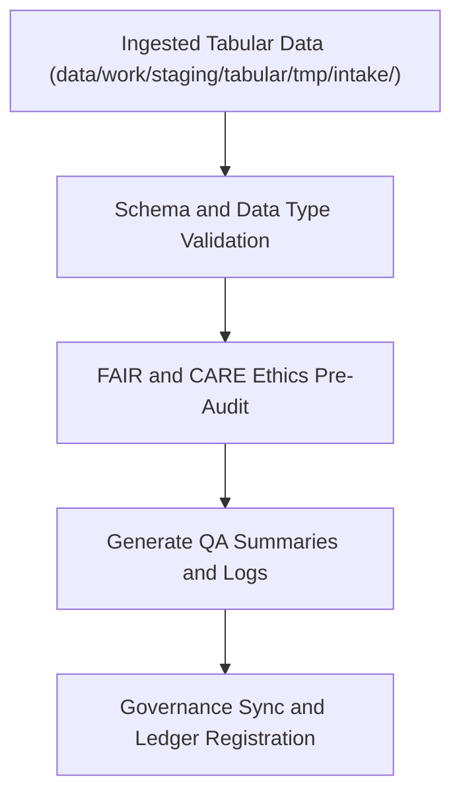

<div align="center">

# ✅ Kansas Frontier Matrix — **Tabular Validation TMP Workspace**
`data/work/staging/tabular/tmp/validation/README.md`

**Purpose:** Temporary validation workspace for schema testing, quality checks, and FAIR+CARE pre-audits of tabular datasets during the ETL staging process.  
Ensures CSV, JSON, and Parquet tables conform to schema definitions, ethical governance principles, and FAIR+CARE data standards before promotion to validated staging layers.

[](../../../../../../docs/standards/faircare-validation.md)
[](../../../../../../LICENSE)
[](../../../../../../docs/architecture/repo-focus.md)

</div>

---

## 📚 Overview

The `data/work/staging/tabular/tmp/validation/` directory contains **transient validation artifacts** used during the ETL staging process for tabular datasets.  
These validation steps ensure that all tabular data adheres to defined data contracts, JSON Schemas, and FAIR+CARE ethical principles before migration into normalized staging.

### Functions:
- Validate schema structure against `data_contract_ref`.  
- Perform column-level and datatype integrity checks.  
- Run FAIR+CARE ethical pre-audits for accessibility and attribution.  
- Log QA metrics, errors, and governance synchronization results.  

All validation artifacts in this directory are **temporary** and purged after successful staging or audit confirmation.

---

## 🗂️ Directory Layout

```plaintext
data/work/staging/tabular/tmp/validation/
├── README.md                               # This file — documentation for tabular validation TMP workspace
│
├── schema_preview.json                     # Preview of field-level schema validation
├── field_normalization_summary.json         # Normalization report for tabular field names and data types
├── faircare_pre_audit.json                 # FAIR+CARE compliance pre-validation results
├── schema_error_log.txt                    # Log of any schema mismatches or missing fields
└── metadata.json                           # Validation context and governance metadata
```

---

## ⚙️ Tabular Validation Workflow



### Workflow Description:
1. **Schema Validation:** Check field presence, naming conventions, and data types.  
2. **Ethics Audit:** Run FAIR+CARE tests on accessibility, documentation, and provenance.  
3. **QA Summary:** Generate structured logs and error reports for review.  
4. **Governance:** Register results with provenance ledger and manifest.  
5. **Promotion:** Clean datasets advanced to `data/work/staging/tabular/normalized/`.

---

## 🧩 Example Validation Metadata Record

```json
{
  "id": "tabular_validation_climate_indices_v9.3.2",
  "dataset_source": "data/work/staging/tabular/tmp/intake/climate_indices_intake.parquet",
  "validator": "@kfm-data-lab",
  "created": "2025-10-28T15:10:00Z",
  "fields_checked": 35,
  "errors_found": 0,
  "schema_status": "passed",
  "faircare_score": 98.5,
  "checksum": "sha256:2b4e91de71a4839c9a2181a5d94f7266a8b9af33...",
  "governance_ref": "data/reports/audit/data_provenance_ledger.json"
}
```

---

## 🧠 FAIR+CARE Pre-Audit Compliance

| Principle | Implementation in TMP Validation |
|------------|---------------------------------|
| **Findable** | All temporary validation records include schema ID and checksum. |
| **Accessible** | Validation reports available internally to FAIR+CARE Council. |
| **Interoperable** | Validation outputs follow open JSON and CSV QA standards. |
| **Reusable** | Metadata and audit logs preserve validation lineage. |
| **Collective Benefit** | Ensures ethical stewardship before public release. |
| **Authority to Control** | Governance Council verifies schema and ethics results. |
| **Responsibility** | Validators record schema and ethical outcomes in audit ledger. |
| **Ethics** | Reviews dataset structure for restricted or inappropriate content. |

Audit reports appended to:  
`data/reports/fair/data_care_assessment.json`  
and `data/reports/audit/data_provenance_ledger.json`.

---

## ⚙️ Validation Artifacts

| File | Description | Format |
|------|--------------|--------|
| `schema_preview.json` | Preview of schema mapping, fields, and datatypes. | JSON |
| `field_normalization_summary.json` | Field renaming and normalization report. | JSON |
| `faircare_pre_audit.json` | FAIR+CARE ethics compliance pre-audit results. | JSON |
| `schema_error_log.txt` | Detailed error trace from schema conformance check. | Text |
| `metadata.json` | Runtime context, checksum, and provenance linkage. | JSON |

---

## ⚖️ Governance & Provenance Integration

| Record | Description |
|---------|-------------|
| `metadata.json` | Captures validation runtime, validator identity, and checksum reference. |
| `data/reports/audit/data_provenance_ledger.json` | Logs validation lineage and FAIR+CARE pre-audit results. |
| `data/reports/validation/schema_validation_summary.json` | Stores cross-schema validation outcomes. |
| `releases/v9.3.2/manifest.zip` | Global checksum record of validated TMP files. |

Governance synchronization automated via `tabular_validation_sync.yml`.

---

## 🧾 Retention Policy

| File Type | Retention Duration | Policy |
|------------|--------------------|--------|
| Schema Reports | 14 days | Deleted after staging validation success. |
| FAIR+CARE Audits | 30 days | Retained for governance review. |
| Error Logs | 7 days | Purged post-resolution and ledger entry. |
| Metadata | 365 days | Archived for provenance and certification continuity. |

Cleanup governed by `tabular_tmp_cleanup.yml`.

---

## 🧾 Internal Use Citation

```text
Kansas Frontier Matrix (2025). Tabular Validation TMP Workspace (v9.3.2).
Temporary environment for validating tabular schema, data types, and FAIR+CARE ethical readiness prior to normalization and certification.
Restricted to internal ETL, QA, and governance workflows.
```

---

## 🧾 Version Notes

| Version | Date | Notes |
|----------|------|--------|
| v9.3.2 | 2025-10-28 | Added FAIR+CARE pre-audit and schema normalization summary tracking. |
| v9.2.0 | 2024-07-15 | Introduced automated error log integration with governance ledger. |
| v9.0.0 | 2023-01-10 | Established tabular validation TMP directory under FAIR+CARE compliance. |

---

<div align="center">

**Kansas Frontier Matrix** · *Data Quality × FAIR+CARE Ethics × Provenance Assurance*  
[🔗 Repository](https://github.com/bartytime4life/Kansas-Frontier-Matrix) • [🧭 Docs Portal](../../../../../../docs/) • [⚖️ Governance Ledger](../../../../../../docs/standards/governance/)

</div>

