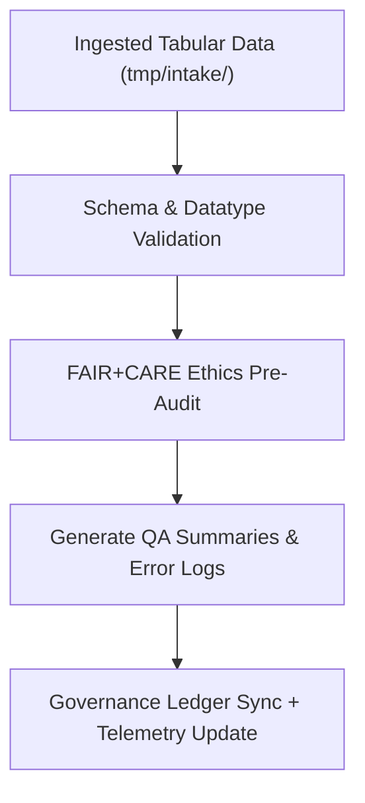

<div align="center">

# ✅ Kansas Frontier Matrix — **Tabular Validation TMP Workspace**
`data/work/staging/tabular/tmp/validation/README.md`

**Purpose:** Temporary validation workspace for schema testing, quality checks, and FAIR+CARE pre-audits of tabular datasets during ETL staging.  
Ensures CSV, JSON, and Parquet tables conform to schema definitions, ethical governance, and FAIR+CARE data standards before promotion to validated staging layers.

[](../../../../../../docs/standards/faircare-validation.md)
[](../../../../../../LICENSE)
[](../../../../../../docs/architecture/repo-focus.md)

</div>

---

## 📚 Overview

The `data/work/staging/tabular/tmp/validation/` directory stores **transient validation artifacts** generated during tabular ETL staging.  
Validation steps here ensure that all tabular data adheres to data contracts, JSON Schemas, and FAIR+CARE ethical principles before migration into normalized staging.

### Functions
- Validate structure against **`data_contract_ref`** and JSON Schemas.  
- Perform column-level and datatype integrity checks.  
- Run FAIR+CARE pre-audits for accessibility, attribution, and ethics.  
- Log QA metrics, warnings/errors, and governance synchronization results.  
- Emit telemetry for validation duration, error counts, and rule coverage.

All artifacts in this directory are **temporary** and removed after successful staging or audit confirmation.

---

## 🗂️ Directory Layout

```plaintext
data/work/staging/tabular/tmp/validation/
├── README.md
│
├── schema_preview.json                     # Field-level schema validation preview
├── field_normalization_summary.json        # Report on field names, types, and encodings
├── faircare_pre_audit.json                 # FAIR+CARE accessibility & ethics pre-validation
├── schema_error_log.txt                    # Detailed list of schema mismatches or missing fields
└── metadata.json                           # Validation context, checksum, and telemetry reference
```

---

## ⚙️ Tabular Validation Workflow



### Workflow Description
1. **Schema Validation:** Confirm field presence, naming conventions, and data types.  
2. **Ethics Audit:** Pre-validate FAIR+CARE criteria (license, provenance, accessibility).  
3. **QA Summary:** Produce structured logs and human-readable reports for reviewers.  
4. **Governance:** Register outcomes with the provenance ledger and release manifest; update telemetry metrics.  
5. **Promotion:** Advance compliant datasets to `data/work/staging/tabular/normalized/`.

---

## 🧩 Example Validation Metadata Record

```json
{
  "id": "tabular_validation_climate_indices_v9.4.0",
  "dataset_source": "data/work/staging/tabular/tmp/intake/climate_indices_intake.parquet",
  "validator": "@kfm-data-lab",
  "created": "2025-11-02T16:00:00Z",
  "fields_checked": 37,
  "errors_found": 0,
  "schema_status": "passed",
  "faircare_score": 98.9,
  "checksum": "sha256:2b4e91de71a4839c9a2181a5d94f7266a8b9af33...",
  "telemetry_link": "releases/v9.4.0/focus-telemetry.json",
  "governance_ledger_ref": "data/reports/audit/data_provenance_ledger.json"
}
```

---

## 🧠 FAIR+CARE Pre-Audit Compliance

| Principle | Implementation in TMP Validation |
|------------|---------------------------------|
| **Findable** | Validation records include schema ID, checksum, and telemetry pointer. |
| **Accessible** | Pre-audit reports available to FAIR+CARE Council via governance dashboards. |
| **Interoperable** | Outputs in open JSON/CSV formats following KFM QA standards. |
| **Reusable** | Metadata and logs preserve lineage for reproducibility. |
| **Collective Benefit** | Ensures ethical stewardship before public release. |
| **Authority to Control** | Governance Council reviews schema and ethics outcomes. |
| **Responsibility** | Validators document schema and ethics results in the ledger. |
| **Ethics** | Reviews dataset structure for restricted or inappropriate content. |

Audit reports appended to:  
`data/reports/fair/data_care_assessment.json` • `data/reports/audit/data_provenance_ledger.json`

---

## ⚙️ Validation Artifacts

| File | Description | Format |
|------|--------------|--------|
| `schema_preview.json` | Preview of schema mappings, fields, and datatypes. | JSON |
| `field_normalization_summary.json` | Field renaming, encodings, and datatype normalizations. | JSON |
| `faircare_pre_audit.json` | FAIR+CARE ethics pre-validation results. | JSON |
| `schema_error_log.txt` | Detailed schema conformance trace. | Text |
| `metadata.json` | Runtime context, checksum, and telemetry reference. | JSON |

---

## ⚖️ Governance & Provenance Integration

| Record | Description |
|---------|-------------|
| `metadata.json` | Captures validation runtime, validator ID, checksum, and telemetry. |
| `data/reports/audit/data_provenance_ledger.json` | Logs validation lineage and pre-audit results. |
| `data/reports/validation/schema_validation_summary.json` | Aggregates pre-validation outcomes. |
| `releases/v9.4.0/manifest.zip` | Registry of TMP validation artifacts and hashes. |

Synchronization automated via **`tabular_validation_sync.yml`**.

---

## 🧾 Retention Policy

| File Type | Retention Duration | Policy |
|------------|--------------------|--------|
| Schema Reports | 14 days | Deleted after staging validation success. |
| FAIR+CARE Audits | 30 days | Retained for ethics review and sign-off. |
| Error Logs | 7 days | Purged post-resolution and ledger entry. |
| Metadata | 365 days | Archived for provenance and certification continuity. |

Cleanup managed by **`tabular_tmp_cleanup.yml`**.

---

## 🧾 Internal Use Citation

```text
Kansas Frontier Matrix (2025). Tabular Validation TMP Workspace (v9.4.0).
Temporary environment for validating tabular schema, datatypes, and FAIR+CARE ethical readiness prior to normalization and certification.
Restricted to internal ETL, QA, and governance workflows.
```

---

## 🧾 Version Notes

| Version | Date | Notes |
|----------|------|--------|
| v9.4.0 | 2025-11-02 | Added telemetry integration, expanded validation diagnostics, and automated governance sync. |
| v9.3.2 | 2025-10-28 | Added FAIR+CARE pre-audit and schema normalization summary tracking. |
| v9.2.0 | 2024-07-15 | Automated error log integration with governance ledger. |
| v9.0.0 | 2023-01-10 | Established tabular validation TMP directory under FAIR+CARE compliance. |

---

<div align="center">

**Kansas Frontier Matrix** · *Data Quality × FAIR+CARE Ethics × Provenance Assurance × Telemetry Traceability*  
[🔗 Repository](https://github.com/bartytime4life/Kansas-Frontier-Matrix) • [🧭 Docs Portal](../../../../../../docs/) • [⚖️ Governance Ledger](../../../../../../docs/standards/governance/)

</div>
