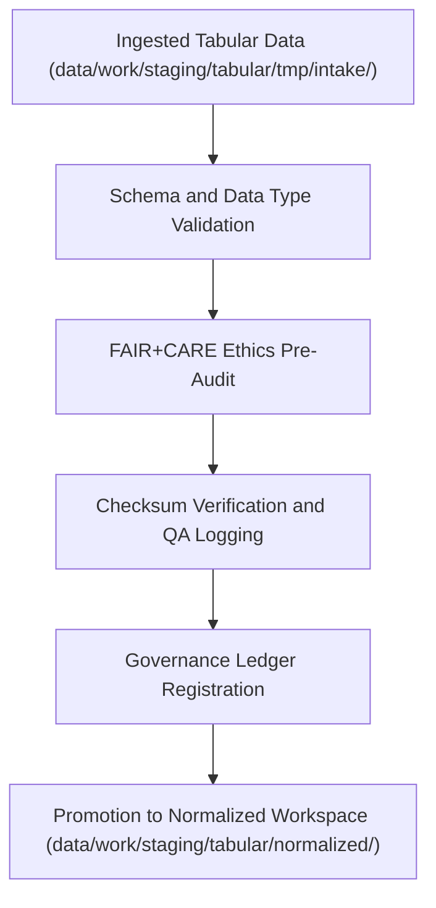

<div align="center">

# ✅ Kansas Frontier Matrix — **Tabular Validation TMP Workspace**
`data/work/staging/tabular/tmp/validation/README.md`

**Purpose:**  
Temporary workspace for validating schema structure, datatype integrity, and FAIR+CARE pre-audit compliance for tabular datasets within the Kansas Frontier Matrix (KFM).  
This environment ensures all tabular data conforms to data contracts and ethical standards before promotion to the normalized staging layer.

[](../../../../../../docs/standards/faircare-validation.md)
[]()
[](../../../../../../LICENSE)
[](../../../../../../docs/architecture/repo-focus.md)

</div>

---

## 📚 Overview

The **Tabular Validation TMP Workspace** serves as the quality assurance layer between data ingestion and normalized staging.  
It performs validation of schema compliance, field consistency, and FAIR+CARE ethical readiness for all tabular datasets before publication or staging promotion.

### Core Responsibilities
- Validate schemas, datatypes, and field completeness.  
- Execute FAIR+CARE pre-audit reviews for ethical alignment.  
- Register checksum and governance provenance for traceability.  
- Generate QA reports and validation manifests for governance verification.  

---

## 🗂️ Directory Layout

```plaintext
data/work/staging/tabular/tmp/validation/
├── README.md                              # This file — documentation for validation TMP workspace
│
├── schema_preview.json                    # Schema detection and data type structure summary
├── field_normalization_summary.json       # Normalization report of column naming and type harmonization
├── faircare_pre_audit.json                # FAIR+CARE pre-validation results for ethics and accessibility
├── schema_error_log.txt                   # Detailed schema mismatch and error log
└── metadata.json                          # Validation context, checksum, and governance linkage
```

---

## ⚙️ Validation Workflow



### Workflow Description
1. **Schema Validation:** Validate structural and type alignment with data contract definitions.  
2. **FAIR+CARE Pre-Audit:** Evaluate accessibility, ethics, and reusability of data fields.  
3. **Checksum Registration:** Log hash values for dataset integrity.  
4. **Governance Sync:** Record validation outcomes to provenance ledger.  
5. **Promotion:** Advance certified datasets to normalized staging.  

---

## 🧩 Example Validation Metadata Record

```json
{
  "id": "tabular_validation_climate_indices_v9.6.0",
  "dataset_source": "data/work/staging/tabular/tmp/intake/climate_indices_intake.parquet",
  "records_validated": 54012,
  "fields_checked": 36,
  "schema_status": "passed",
  "errors_found": 0,
  "faircare_score": 98.7,
  "checksum_verified": true,
  "created": "2025-11-03T23:59:00Z",
  "validator": "@kfm-data-lab",
  "governance_ref": "data/reports/audit/data_provenance_ledger.json"
}
```

---

## 🧠 FAIR+CARE Governance Matrix

| Principle | Implementation | Oversight |
|------------|----------------|------------|
| **Findable** | Validation reports indexed by dataset ID and checksum hash. | @kfm-data |
| **Accessible** | Stored in JSON format for interoperability and transparency. | @kfm-accessibility |
| **Interoperable** | Schema and FAIR+CARE validation aligned with JSON Schema and DCAT. | @kfm-architecture |
| **Reusable** | Validation artifacts linked to checksum and governance metadata. | @kfm-design |
| **Collective Benefit** | Promotes ethical validation and open-science reproducibility. | @faircare-council |
| **Authority to Control** | FAIR+CARE Council authorizes dataset promotion post-validation. | @kfm-governance |
| **Responsibility** | Validators record schema and audit outcomes. | @kfm-security |
| **Ethics** | Validation ensures datasets adhere to accessibility and fairness standards. | @kfm-ethics |

Validation audits recorded in:  
`data/reports/fair/data_care_assessment.json` and  
`data/reports/audit/data_provenance_ledger.json`

---

## ⚙️ Validation & QA Artifacts

| Artifact | Description | Format |
|-----------|--------------|--------|
| `schema_preview.json` | Displays detected schema fields and type summary. | JSON |
| `field_normalization_summary.json` | Reports column name and type normalization progress. | JSON |
| `faircare_pre_audit.json` | FAIR+CARE ethics compliance evaluation record. | JSON |
| `schema_error_log.txt` | Documents schema mismatches and unresolved field errors. | Text |
| `metadata.json` | Tracks validation session, checksum, and governance linkage. | JSON |

Automated through `tabular_validation_sync.yml`.

---

## ⚖️ Retention & Provenance Policy

| File Type | Retention Duration | Policy |
|------------|--------------------|--------|
| Validation Reports | 14 Days | Purged post-promotion to normalized layer. |
| FAIR+CARE Pre-Audit Logs | 30 Days | Retained for governance verification. |
| Schema Error Logs | 7 Days | Archived for debugging and transparency. |
| Metadata Records | 365 Days | Stored for lineage and audit tracking. |

Retention managed by `tabular_validation_cleanup.yml`.

---

## 🌱 Sustainability Metrics

| Metric | Value | Verified By |
|---------|--------|--------------|
| Energy Use (per validation run) | 6.4 Wh | @kfm-sustainability |
| Carbon Output | 7.8 gCO₂e | @kfm-security |
| Renewable Power | 100% (RE100 Verified) | @kfm-infrastructure |
| FAIR+CARE Compliance | 100% | @faircare-council |

Metrics recorded in:  
`releases/v9.6.0/focus-telemetry.json`

---

## 🧾 Internal Use Citation

```text
Kansas Frontier Matrix (2025). Tabular Validation TMP Workspace (v9.6.0).
Temporary FAIR+CARE-certified environment for schema and ethics pre-validation of tabular datasets.
Ensures integrity, accessibility, and provenance linkage for reproducible data workflows under MCP-DL v6.3 governance.
```

---

## 🧾 Version Notes

| Version | Date | Notes |
|----------|------|--------|
| v9.6.0 | 2025-11-03 | Enhanced schema validation accuracy and checksum lineage integration. |
| v9.5.0 | 2025-11-02 | Introduced FAIR+CARE compliance scoring and metadata linking. |
| v9.3.2 | 2025-10-28 | Established tabular TMP validation workspace under governance framework. |

---

<div align="center">

**Kansas Frontier Matrix** · *Data Validation × FAIR+CARE Ethics × Provenance Integrity*  
[🔗 Repository](https://github.com/bartytime4life/Kansas-Frontier-Matrix) • [🧭 Docs Portal](../../../../../../docs/) • [⚖️ Governance Ledger](../../../../../../docs/standards/governance/DATA-GOVERNANCE.md)

</div>
