<div align="center">

# ✅ Kansas Frontier Matrix — **Tabular Validation TMP Workspace**
`data/work/staging/tabular/tmp/validation/README.md`

**Purpose:**  
Governed pre-validation environment for **schema structure, datatype integrity, and FAIR+CARE pre-audit compliance** across tabular datasets.  
Ensures each dataset adheres to data contracts and ethics standards before promotion to normalized staging.

[](../../../../../../docs/architecture/README.md)
[](../../../../../../docs/standards/faircare-validation.md)
[]()
[](../../../../../../LICENSE)

</div>

---

## 📘 Overview

The **Tabular Validation TMP Workspace** bridges ingestion and normalized staging, performing **schema validation, datatype checks, and FAIR+CARE ethics readiness** before data certification.

### Core Responsibilities
- Validate schemas, datatypes, and field completeness.  
- Execute FAIR+CARE ethics audits.  
- Register checksum + governance provenance.  
- Generate QA reports for governance review.  

---

## 🗂️ Directory Layout

```plaintext
data/work/staging/tabular/tmp/validation/
├── README.md
├── schema_preview.json
├── field_normalization_summary.json
├── faircare_pre_audit.json
├── schema_error_log.txt
└── metadata.json
```

---

## ⚙️ Validation Workflow

```mermaid
flowchart TD
    A["Intake Data (tmp/intake/)"] --> B["Schema + Datatype Validation"]
    B --> C["FAIR + CARE Ethics Audit"]
    C --> D["Checksum Verification + QA Logging"]
    D --> E["Governance Ledger Sync"]
    E --> F["Promotion → Normalized Staging"]
```



### Steps
1. **Schema Validation** — Ensure contract compliance.  
2. **Ethics Audit** — Evaluate FAIR+CARE principles.  
3. **Checksum Registration** — Record integrity hashes.  
4. **Governance Sync** — Write validation to provenance ledger.  
5. **Promotion** — Advance certified datasets to normalized workspace.

---

## 🧩 Example Validation Metadata Record

```json
{
  "id": "tabular_validation_climate_indices_v9.7.0",
  "dataset_source": "data/work/staging/tabular/tmp/intake/climate_indices_intake.parquet",
  "records_validated": 54012,
  "fields_checked": 36,
  "schema_status": "passed",
  "errors_found": 0,
  "faircare_score": 99.0,
  "checksum_verified": true,
  "created": "2025-11-06T23:59:00Z",
  "validator": "@kfm-data-lab",
  "governance_ref": "data/reports/audit/data_provenance_ledger.json"
}
```

---

## 🧠 FAIR+CARE Governance Matrix

| Principle | Implementation | Oversight |
|-----------|----------------|-----------|
| **Findable** | Validation indexed by dataset ID & checksum hash. | `@kfm-data` |
| **Accessible** | JSON validation reports accessible for review. | `@kfm-accessibility` |
| **Interoperable** | Schema validated with DCAT/JSON Schema mapping. | `@kfm-architecture` |
| **Reusable** | Reports linked to checksum + provenance metadata. | `@kfm-design` |
| **Collective Benefit** | Promotes ethical validation + open data reuse. | `@faircare-council` |
| **Authority to Control** | Council certifies post-validation promotion. | `@kfm-governance` |
| **Responsibility** | Validators document schema + audit outcomes. | `@kfm-security` |
| **Ethics** | Reviews ensure fairness, accessibility, inclusivity. | `@kfm-ethics` |

**Audit refs:**  
`data/reports/fair/data_care_assessment.json` · `data/reports/audit/data_provenance_ledger.json`

---

## ⚙️ Validation & QA Artifacts

| Artifact | Description | Format |
|-----------|--------------|--------|
| `schema_preview.json` | Summary of detected schema + field datatypes. | JSON |
| `field_normalization_summary.json` | Column harmonization + normalization. | JSON |
| `faircare_pre_audit.json` | FAIR+CARE ethics pre-validation record. | JSON |
| `schema_error_log.txt` | Logs schema errors or null value mismatches. | Text |
| `metadata.json` | Session metadata with governance + checksum lineage. | JSON |

**Automation:** `tabular_validation_sync.yml`

---

## ♻️ Retention & Sustainability Policy

| File Type | Retention | Policy |
|-----------|----------:|--------|
| Validation Reports | 14 Days | Purged after promotion. |
| FAIR+CARE Logs | 30 Days | Retained for re-audit verification. |
| Schema Error Logs | 7 Days | Archived for transparency. |
| Metadata | 365 Days | Maintained for governance lineage. |

**Telemetry:** `../../../../../../releases/v9.7.0/focus-telemetry.json`

---

## 🌱 Sustainability Metrics

| Metric | Value | Verified By |
|--------|------:|-------------|
| Energy Use (per run) | 6.4 Wh | `@kfm-sustainability` |
| Carbon Output | 7.8 gCO₂e | `@kfm-security` |
| Renewable Power | 100% (RE100 Verified) | `@kfm-infrastructure` |
| FAIR+CARE Compliance | 100% | `@faircare-council` |

---

## 🧾 Internal Citation

```text
Kansas Frontier Matrix (2025). Tabular Validation TMP Workspace (v9.7.0).
Governed FAIR+CARE environment for validating schema structure, ethics readiness, and data integrity prior to staging certification under MCP-DL v6.3.
```

---

## 🕰️ Version History

| Version | Date | Author | Summary |
|--------:|------|--------|---------|
| v9.7.0 | 2025-11-06 | `@kfm-data` | Upgraded telemetry + schema validation, added FAIR+CARE metrics. |
| v9.6.0 | 2025-11-03 | `@kfm-data` | Enhanced checksum lineage + ethics pre-validation. |

---

<div align="center">

**Kansas Frontier Matrix**  
*Data Validation × FAIR+CARE Ethics × Provenance Integrity*  
© 2025 Kansas Frontier Matrix — Internal · FAIR+CARE Certified · Diamond⁹ Ω / Crown∞Ω Ultimate Certified  

[Back to Tabular TMP](../README.md) · [Governance Charter](../../../../../../docs/standards/governance/DATA-GOVERNANCE.md)

</div>