<div align="center">

# 🧰 Kansas Frontier Matrix — **Workbench**  
`data/work/staging/tabular/tmp/workbench/`

### *“Experimentation is where validation becomes innovation.”*

**Purpose:**  
The **Workbench Layer** serves as the **interactive analyst sandbox** for developing, testing, and prototyping validation logic, AI models, and data transformations within the Kansas Frontier Matrix (KFM).  
It provides an isolated yet governed space for experimentation while maintaining traceability and FAIR+CARE compliance.

[](../../../../../../../../../docs/architecture/repo-focus.md)  
[](../../../../../../../../../LICENSE)  
[]()  
[]()  
[]()

</div>

---

## 🧭 Overview

The **Workbench Layer** provides a **controlled environment** for KFM engineers, analysts, and AI researchers to:
- Prototype ETL logic and schema refinements  
- Test AI model inference and drift corrections  
- Conduct FAIR+CARE validation experiments  
- Evaluate new governance or data provenance workflows  
- Develop transformations without affecting production data layers  

All activities in the workbench are version-controlled, automatically logged, and subject to governance oversight — ensuring **experimentation with accountability**.

---

## 🗂️ Directory Layout

```text
data/work/staging/tabular/tmp/workbench/
├── datasets/                         # Temporary sandbox datasets for experimental use
│   ├── test_population.csv
│   ├── schema_refinement_sample.json
│   └── metadata_experiment.yml
├── notebooks/                        # Jupyter/Colab-style analysis notebooks
│   ├── ai_validation_experiments.ipynb
│   ├── drift_detection_experiments.ipynb
│   └── schema_mapping_test.ipynb
├── scripts/                          # Python and CLI utilities for data experiments
│   ├── validate_experiment.py
│   ├── test_faircare_metrics.py
│   └── prototype_schema_validator.py
├── logs/                             # Execution and governance logs for reproducibility
│   ├── workbench_activity.log
│   ├── ai_run_output.log
│   └── provenance_diff.json
├── reports/                          # Experiment summaries and test results
│   ├── faircare_experiment_report.json
│   ├── schema_validation_trial.json
│   └── ai_benchmark_summary.json
└── README.md                         # This document
```

---

## 🔁 Workbench Workflow

```mermaid
flowchart TD
    A["Dataset or Model Prototype Created"] --> B["Run Validation or AI Experiment"]
    B --> C["Log Activity → workbench_activity.log"]
    C --> D["Analyze Results → reports/"]
    D --> E["Review Output → governance/ or ai/explainability/"]
    E --> F{"Passes FAIR+CARE? or Governance Threshold?"}
    F -- "Yes ✅" --> G["Promote to data/work/staging/tabular/tmp/intake/"]
    F -- "No 🚫" --> H["Iterate & Refine Experiment"]
```



---

## 🧩 Metadata Schema for Experiment Reports

| Field | Description | Example |
|-------|--------------|----------|
| `experiment_id` | Unique workbench experiment ID | `exp_workbench_2025_10_26_001` |
| `experiment_type` | Type of validation or test | `Schema Validation / FAIR+CARE Audit / AI Drift Detection` |
| `dataset_ref` | Associated test dataset or model | `datasets/test_population.csv` |
| `experiment_summary` | Description of purpose and goal | `"Testing schema alignment improvements for CIDOC integration."` |
| `outcome_status` | Result of experiment | `Passed / Needs Refinement / Failed` |
| `fair_score` | FAIR compliance rating | `0.93` |
| `care_score` | CARE compliance rating | `0.90` |
| `curator_notes` | Manual review comments | `"Schema refinement validated successfully, no metadata loss observed."` |
| `timestamp` | Time of experiment completion | `2025-10-26T16:43:17Z` |

---

## ⚙️ Experimental Modules

| Module | Function | Output |
|---------|-----------|---------|
| **Schema Refinement Engine** | Tests updated schema configurations | `schema_validation_trial.json` |
| **AI Drift Detector** | Measures semantic and statistical drift | `ai_benchmark_summary.json` |
| **FAIR+CARE Auditor** | Evaluates metadata completeness during experiments | `faircare_experiment_report.json` |
| **Governance Logger** | Tracks provenance and approval for successful experiments | `provenance_diff.json` |

> 🧠 *The Workbench acts as the “safe-to-fail” zone in the KFM ecosystem — innovation with documentation and ethical oversight.*

---

## ⚙️ Curator & Governance Procedures

Curators and researchers must:
1. Log every experiment with metadata in `workbench_activity.log`.  
2. Ensure datasets used are sandbox copies, not production assets.  
3. Document FAIR+CARE and schema validation scores in `reports/`.  
4. Export validated prototypes to the intake pipeline:
   ```bash
   make workbench-export
   ```
5. Sync all experiment records with the governance ledger:
   ```bash
   make governance-update
   ```

---

## 📈 Key Performance Metrics

| Metric | Description | Target |
|---------|-------------|---------|
| **Experiment Reproducibility** | % of experiments successfully replicated | ≥ 95% |
| **FAIR+CARE Compliance Rate** | Ethical alignment of workbench results | ≥ 0.9 |
| **Promotion Success Rate** | % of experiments promoted to production intake | ≥ 70% |
| **Governance Review Latency** | Time between experiment and review | < 24h |
| **Documentation Coverage** | % of experiments with complete metadata | 100% |

---

## 🧾 Compliance Matrix

| Standard | Scope | Validator |
|-----------|--------|-----------|
| **FAIR+CARE** | Ethical experimentation and reproducibility tracking | `fair-audit` |
| **MCP-DL v6.3** | Documentation-first development lifecycle | `docs-validate` |
| **ISO 9001:2015** | Quality management and improvement consistency | `quality-audit` |
| **CIDOC CRM / PROV-O** | Provenance documentation for experimental data | `graph-lint` |
| **STAC / DCAT 3.0** | Experimental metadata interoperability | `stac-validate` |

---

## 🪶 Version History

| Version | Date | Author | Notes |
|----------|------|---------|-------|
| v9.0.0 | 2025-10-26 | `@kfm-architecture` | Initial creation of Workbench documentation under Diamond⁹ Ω / Crown∞Ω certification. |

---

<div align="center">

### 🜂 Kansas Frontier Matrix — *Experiment · Learn · Evolve*  
**“The Workbench is where validation meets imagination — and both are logged.”**

[]()
[]()
[]()
[]()
[]()

<br><br>
<a href="#-kansas-frontier-matrix--workbench-analyst-sandbox--experimental-layer--diamond⁹-Ω--crown∞Ω-certified">⬆ Back to Top</a>

</div>
