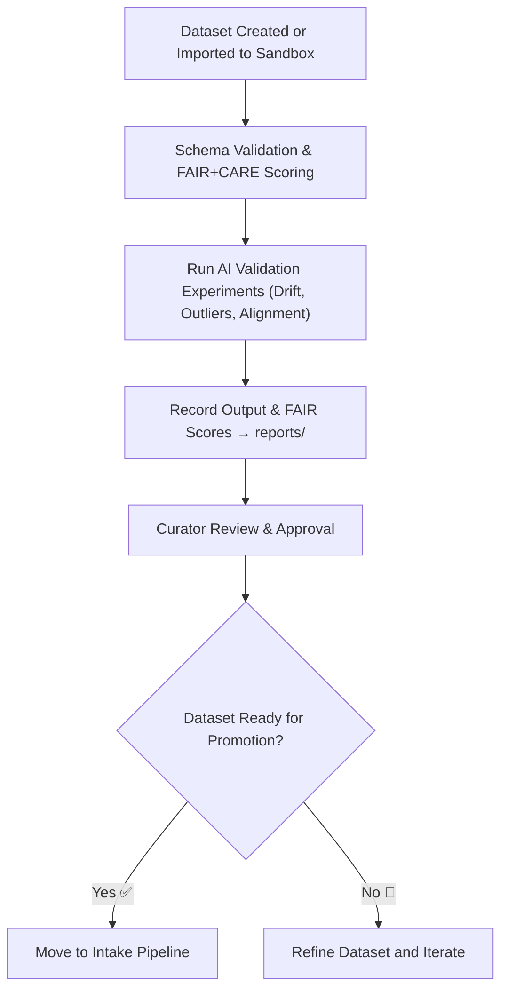

<div align="center">

# 🧾 Kansas Frontier Matrix — **Workbench Datasets**  
`data/work/staging/tabular/tmp/workbench/datasets/`

### *“Every prototype deserves a safe space to fail, learn, and evolve.”*

**Purpose:**  
This directory provides **sandbox datasets** used for experimentation, validation, and AI model testing within the Kansas Frontier Matrix (KFM) Workbench.  
All datasets stored here are temporary, isolated, and designed for **development, reproducibility, and schema experimentation** while maintaining traceable provenance and FAIR+CARE compliance.

[](../../../../../../../../../../../docs/architecture/repo-focus.md)  
[](../../../../../../../../../../../LICENSE)  
[]()  
[]()  
[]()

</div>

---

## 🧭 Overview

The **Workbench Datasets Sub-Layer** serves as a **controlled data sandbox** for KFM analysts, AI engineers, and schema architects.  
These datasets are used for:
- Testing schema refinements and ETL logic  
- Validating FAIR+CARE scoring mechanisms  
- AI model benchmarking and drift experimentation  
- Crosswalking ontological alignments before production implementation  

Each dataset in this directory is **versioned**, **checksum-verified**, and **provenance-tracked** — ensuring reproducibility of all experimental activities.

---

## 🗂️ Directory Layout

```text
data/work/staging/tabular/tmp/workbench/datasets/
├── test_population.csv                 # Example demographic dataset for schema testing
├── schema_refinement_sample.json       # Mock dataset for schema and field validation
├── metadata_experiment.yml             # YAML-based FAIR+CARE metadata configuration test
├── temporal_alignment_case.csv         # Example of time-series semantic testing
├── geo_ontology_test.json              # CIDOC/DCAT geo mapping prototype
└── README.md                           # This document
```

---

## 🔁 Dataset Experimentation Workflow



---

## 🧩 Metadata Template (sandbox schema)

| Field | Description | Example |
|-------|--------------|----------|
| `dataset_id` | Temporary identifier for sandbox dataset | `test_population_2025_10_26` |
| `experiment_type` | Purpose of dataset | `Schema Validation` |
| `source_reference` | Data origin or inspiration | `US Census Extract (sampled)` |
| `license` | Provisional dataset license | `CC-BY 4.0` |
| `fair_score` | FAIR compliance score | `0.88` |
| `care_score` | CARE compliance score | `0.92` |
| `checksum` | SHA-256 verification of dataset | `c84a74b1992ae0...` |
| `curator_notes` | Governance or analyst remarks | `"Dataset conforms to preliminary schema mapping test"` |
| `timestamp` | Creation date | `2025-10-26T16:45:33Z` |

---

## ⚙️ Experimentation Modules

| Module | Function | Output |
|---------|-----------|---------|
| **Schema Validator** | Tests field alignment and data types | `schema_refinement_sample.json` |
| **AI Drift Analyzer** | Evaluates data drift under AI models | `temporal_alignment_case.csv` |
| **FAIR+CARE Evaluator** | Audits ethical completeness and provenance | `metadata_experiment.yml` |
| **Ontology Crosswalk Tester** | Aligns dataset fields with CIDOC/DCAT classes | `geo_ontology_test.json` |

> 🧠 *All sandbox datasets must include provenance headers and mock FAIR+CARE metadata, even for experimental use.*

---

## ⚙️ Curator Workflow

1. Upload or generate sandbox datasets.  
2. Record dataset metadata in `metadata_experiment.yml`.  
3. Run automated schema validation:
   ```bash
   make workbench-validate
   ```
4. Evaluate FAIR+CARE compliance:
   ```bash
   make faircare-evaluate
   ```
5. Submit experiment report for governance ledger inclusion:
   ```bash
   make governance-update
   ```

---

## 📈 Dataset Governance Metrics

| Metric | Description | Target |
|---------|-------------|---------|
| **Schema Validation Success Rate** | % of datasets passing schema tests | ≥ 95% |
| **FAIR+CARE Compliance Rate** | Ethical metadata completeness score | ≥ 0.9 |
| **Data Reproducibility** | Ability to re-run sandbox tests | 100% |
| **Promotion Success Rate** | Datasets successfully approved for intake | ≥ 70% |

---

## 🧾 Compliance Matrix

| Standard | Scope | Validator |
|-----------|--------|-----------|
| **FAIR+CARE** | Ethical and reproducible data stewardship | `fair-audit` |
| **MCP-DL v6.3** | Documentation-first experimentation protocol | `docs-validate` |
| **ISO 9001:2015** | Quality management for data processes | `quality-audit` |
| **CIDOC CRM / DCAT 3.0** | Semantic and metadata consistency | `graph-lint` |
| **STAC 1.0** | Dataset metadata interoperability | `stac-validate` |

---

## 🪶 Version History

| Version | Date | Author | Notes |
|----------|------|---------|-------|
| v9.0.0 | 2025-10-26 | `@kfm-architecture` | Initial creation of Workbench Datasets documentation under Diamond⁹ Ω / Crown∞Ω certification. |

---

<div align="center">

### 🜂 Kansas Frontier Matrix — *Sandbox · Structure · Stewardship*  
**“Even temporary data deserves permanent principles.”**

[]()
[]()
[]()
[]()
[]()

<br><br>
<a href="#-kansas-frontier-matrix--workbench-datasets-sandbox-data-testing-layer--diamond⁹-Ω--crown∞Ω-certified">⬆ Back to Top</a>

</div>
