<div align="center">

# 🧾 Kansas Frontier Matrix — **Workbench Logs**  
`data/work/staging/tabular/tmp/workbench/logs/`

### *“Every experiment leaves a trace — and every trace tells a story.”*

**Purpose:**  
This directory stores all **activity, validation, and provenance logs** generated during experimentation within the Kansas Frontier Matrix (KFM) Workbench environment.  
Logs here ensure that experimental actions are **traceable, reversible, and reproducible**, forming the ethical and technical backbone of sandbox governance.

[](../../../../../../../../../../../docs/architecture/repo-focus.md)  
[](../../../../../../../../../../../LICENSE)  
[]()  
[]()  
[]()

</div>

---

## 🧭 Overview

The **Workbench Logs Layer** serves as a transparent **audit trail** for all experimental activity conducted in the KFM Workbench.  
Each log entry captures:
- User or automated action metadata  
- Script and notebook executions  
- FAIR+CARE evaluation outcomes  
- Provenance diff tracking and schema state changes  
- AI drift alerts and test validation reports  

Logs are timestamped, hashed, and synchronized with the **Governance Ledger**, ensuring full lifecycle accountability.

---

## 🗂️ Directory Layout

```text
data/work/staging/tabular/tmp/workbench/logs/
├── workbench_activity.log               # Chronological record of sandbox actions
├── ai_run_output.log                    # Log of AI-driven experimental outputs
├── provenance_diff.json                 # Metadata diff between experiment versions
├── validation_trace.log                 # Schema validation and FAIR+CARE audit events
├── drift_alerts.log                     # AI drift monitoring for experimental models
└── README.md                            # This document
```

---

## 🔁 Logging Workflow

```mermaid
flowchart TD
    A["Experiment or Script Executed"] --> B["Capture Metadata → workbench_activity.log"]
    B --> C["Record AI & Schema Results → validation_trace.log"]
    C --> D["Generate Provenance Diff → provenance_diff.json"]
    D --> E["Detect Drift or Ethics Flags → drift_alerts.log"]
    E --> F["Sync Results → Governance Ledger & FAIR+CARE Audit"]
```



---

## 🧩 Log Entry Schema (workbench_activity.log)

| Field | Description | Example |
|-------|--------------|----------|
| `log_id` | Unique log entry identifier | `log_2025_10_26_001` |
| `user` | Username or system agent | `@kfm-data` |
| `event_type` | Type of action performed | `Notebook Execution / Schema Validation` |
| `artifact` | File, dataset, or model affected | `notebooks/schema_mapping_test.ipynb` |
| `outcome` | Result or state change | `"Schema check passed with warnings"` |
| `fair_score` | FAIR metric result (0–1) | `0.91` |
| `care_score` | CARE metric result (0–1) | `0.88` |
| `checksum` | SHA-256 of relevant artifact | `8f0a7a4b9d23ce...` |
| `timestamp` | UTC time of event | `2025-10-26T16:49:59Z` |

---

## ⚙️ Logging Categories

| Log File | Purpose | Output Type |
|-----------|----------|--------------|
| **workbench_activity.log** | Records all manual and automated actions within the sandbox | Human-readable log |
| **ai_run_output.log** | Captures AI validation results and output summaries | JSON + Text |
| **provenance_diff.json** | Documents metadata or schema changes between test iterations | JSON diff object |
| **validation_trace.log** | Tracks FAIR+CARE validation steps during experimentation | Text + FAIR/CARE scoring |
| **drift_alerts.log** | Notes any AI drift or ethical deviations | Human-readable + JSON alert |

> 🧠 *Logs provide full traceability of experiments and ensure all sandbox activity remains under ethical and technical governance.*

---

## ⚙️ Governance Integration

1. All log entries are automatically checksum-verified during nightly validation.  
2. Log data is periodically aggregated and published to:
   ```bash
   governance/workbench_logs_ledger.jsonld
   ```
3. Curators can audit experiment provenance using:
   ```bash
   make governance-audit
   ```
4. Logs older than 90 days are archived but remain retrievable under KFM’s transparency policy.

---

## 📈 Logging Metrics

| Metric | Description | Target |
|---------|-------------|---------|
| **Logging Coverage** | % of sandbox actions recorded | 100% |
| **Governance Sync Rate** | Logs successfully published to governance ledger | Daily |
| **Checksum Validation Rate** | % of logs verified with SHA-256 integrity | 100% |
| **FAIR+CARE Trace Completeness** | % of logged actions with ethical context | 100% |
| **Drift Detection Response Time** | Mean response time to drift alerts | < 2 hours |

---

## 🧾 Compliance Matrix

| Standard | Scope | Validator |
|-----------|--------|-----------|
| **FAIR+CARE** | Ethical audit trail and provenance compliance | `fair-audit` |
| **MCP-DL v6.3** | Documentation-first logging and traceability | `docs-validate` |
| **ISO/IEC 23053:2022** | AI lifecycle logging standards | `ai-validate` |
| **CIDOC CRM / PROV-O** | Provenance and metadata lineage structure | `graph-lint` |
| **STAC / DCAT 3.0** | Metadata interoperability and discoverability | `stac-validate` |

---

## 🪶 Version History

| Version | Date | Author | Notes |
|----------|------|---------|-------|
| v9.0.0 | 2025-10-26 | `@kfm-architecture` | Initial creation of Workbench Logs documentation under Diamond⁹ Ω / Crown∞Ω certification. |

---

<div align="center">

### 🜂 Kansas Frontier Matrix — *Traceability · Integrity · Governance*  
**“Without logs, transparency is a story we can’t prove.”**

[]()
[]()
[]()
[]()
[]()

<br><br>
<a href="#-kansas-frontier-matrix--workbench-logs-experimental-provenance--audit-layer--diamond⁹-Ω--crown∞Ω-certified">⬆ Back to Top</a>

</div>
