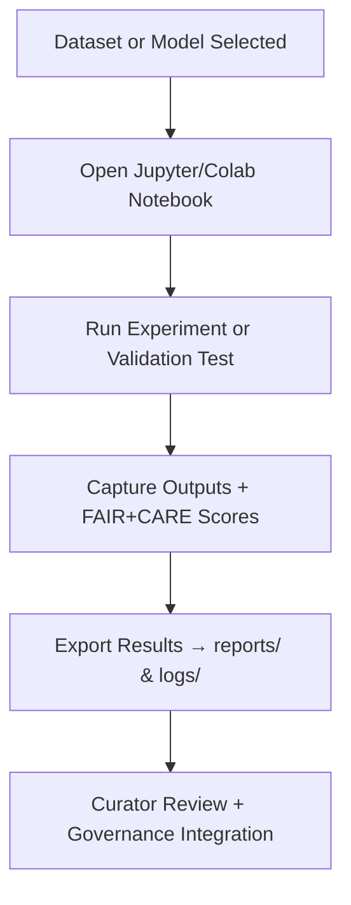

<div align="center">

# 📓 Kansas Frontier Matrix — **Workbench Notebooks**  
`data/work/staging/tabular/tmp/workbench/notebooks/`

### *“Reproducible ideas begin as documented experiments.”*

**Purpose:**  
This directory serves as the **interactive laboratory** for the Kansas Frontier Matrix (KFM), where data analysts, AI engineers, and schema architects perform hands-on research using Jupyter and Colab-style notebooks.  
These notebooks explore **validation methods, FAIR+CARE metrics, schema refinement, AI performance, and governance prototypes** — with all outputs traceable and compliant with MCP-DL documentation standards.

[](../../../../../../../../../../../docs/architecture/repo-focus.md)  
[](../../../../../../../../../../../LICENSE)  
[]()  
[]()  
[]()

</div>

---

## 🧭 Overview

The **Workbench Notebooks Layer** is where **interactive documentation, visualization, and exploratory analysis** occur before full pipeline integration.  
All experiments run here must maintain:
- Versioned notebooks with fixed seeds and reproducible outputs  
- FAIR+CARE metadata embedded within notebook headers  
- Clear cell-level provenance and validation tracking  
- Structured exports for governance review  

The notebooks here serve as **living documentation** for KFM’s data science, validation, and AI integration processes.

---

## 🗂️ Directory Layout

```text
data/work/staging/tabular/tmp/workbench/notebooks/
├── ai_validation_experiments.ipynb      # Experimental anomaly and ethics validation tests
├── drift_detection_experiments.ipynb    # Drift and model monitoring case studies
├── schema_mapping_test.ipynb            # CIDOC/DCAT schema alignment notebook
├── ontology_crosswalk_builder.ipynb     # Semantic linkage prototype notebook
├── faircare_audit_visualizer.ipynb      # FAIR+CARE compliance dashboard
└── README.md                            # This document
```

---

## 🔁 Notebook Workflow



---

## 🧩 Notebook Metadata Schema (YAML Front Matter Example)

```yaml
---
title: "FAIR+CARE Compliance Audit (v3)"
author: "@kfm-data"
environment: "JupyterLab v4.1"
dataset: "test_population.csv"
experiment_type: "Ethical Metadata Evaluation"
tags: ["FAIR", "CARE", "Schema", "Audit"]
fair_score: 0.91
care_score: 0.88
governance_review: "Pending"
created: 2025-10-26T16:47:02Z
---
```

> 🧠 *Every notebook includes YAML front matter for metadata governance compatibility.*

---

## ⚙️ Common Notebook Types

| Notebook | Description | Output |
|-----------|--------------|---------|
| **AI Validation Experiments** | Tests anomaly, semantic, and ethical models | `reports/ai_benchmark_summary.json` |
| **Drift Detection Experiments** | Measures model consistency over time | `reports/drift_analysis.json` |
| **Schema Mapping Tests** | Validates CIDOC CRM / DCAT alignment | `reports/schema_validation_trial.json` |
| **Ontology Crosswalk Builder** | Generates field mappings and semantic joins | `reports/ontology_map_output.json` |
| **FAIR+CARE Audit Visualizer** | Produces ethical dashboards and trend reports | `reports/faircare_experiment_report.json` |

---

## 🧠 FAIR+CARE Embedded Principles

Each notebook should:
- Include **FAIR+CARE metadata** and **provenance headers**.  
- Log all experimental changes to `workbench_activity.log`.  
- Provide ethical context for experimental data and models.  
- Align outputs with governance records (`governance/workbench_notebooks_ledger.jsonld`).  

---

## ⚙️ Notebook Execution Standards

1. Activate the controlled environment:
   ```bash
   make workbench-launch
   ```
2. Record each execution result in the metadata cell or YAML front matter.  
3. Save experiment outputs in `../reports/` with version and timestamp naming.  
4. Ensure notebooks are reproducible with fixed random seeds.  
5. Submit completed notebooks for governance review:
   ```bash
   make governance-update
   ```

---

## 📈 Performance & Governance Metrics

| Metric | Description | Target |
|---------|-------------|---------|
| **Reproducibility** | % of notebooks producing consistent results | ≥ 95% |
| **FAIR+CARE Metadata Completeness** | Ethical and provenance metadata coverage | 100% |
| **Governance Sync Rate** | % of notebooks registered in governance ledger | 100% |
| **Validation Accuracy** | Consistency between notebook results and production validation | ≥ 90% |
| **Execution Stability** | Average notebook runtime consistency | ±10% variance |

---

## 🧾 Compliance Matrix

| Standard | Scope | Validator |
|-----------|--------|-----------|
| **FAIR+CARE** | Documentation and ethical compliance for experiments | `fair-audit` |
| **MCP-DL v6.3** | Structured notebook governance and reproducibility | `docs-validate` |
| **ISO 9001:2015** | Quality and lifecycle management of experiments | `quality-audit` |
| **CIDOC CRM / DCAT 3.0** | Semantic metadata standardization | `graph-lint` |
| **STAC / DCAT 3.0** | Interoperability and discovery metadata | `stac-validate` |

---

## 🪶 Version History

| Version | Date | Author | Notes |
|----------|------|---------|-------|
| v9.0.0 | 2025-10-26 | `@kfm-architecture` | Initial creation of Workbench Notebooks documentation under Diamond⁹ Ω / Crown∞Ω certification. |

---

<div align="center">

### 🜂 Kansas Frontier Matrix — *Documentation · Experimentation · Ethics*  
**“Notebooks are the lab journals of open science — governed, ethical, and reproducible.”**

[]()
[]()
[]()
[]()
[]()

<br><br>
<a href="#-kansas-frontier-matrix--workbench-notebooks-experimental-analysis--validation-layer--diamond⁹-Ω--crown∞Ω-certified">⬆ Back to Top</a>

</div>
