<div align="center">

# 📊 Kansas Frontier Matrix — **Workbench Reports**  
`data/work/staging/tabular/tmp/workbench/reports/`

### *“Experiments end in data — validation begins with documentation.”*

**Purpose:**  
The **Workbench Reports Layer** archives all **experimental results, FAIR+CARE audits, AI validation summaries, and schema tests** conducted within the Kansas Frontier Matrix (KFM) sandbox environment.  
It functions as a living ledger of innovation, accountability, and reproducible outcomes for all workbench activities.

[](../../../../../../../../../../../docs/architecture/repo-focus.md)  
[](../../../../../../../../../../../LICENSE)  
[]()  
[]()  
[]()

</div>

---

## 🧭 Overview

The **Workbench Reports Sub-Layer** is where **experimental analysis transforms into validated insight**.  
All reports generated in the workbench — whether by AI models, scripts, or notebooks — are versioned, validated, and cross-referenced with governance metadata.  

Reports here provide:
- Summary statistics and validation outcomes  
- FAIR+CARE ethical assessments and compliance breakdowns  
- Schema and ontology test results  
- AI performance and drift detection metrics  
- Human-curated commentary for governance and future model improvements  

Every report includes provenance links and metadata hashes for audit reproducibility.

---

## 🗂️ Directory Layout

```text
data/work/staging/tabular/tmp/workbench/reports/
├── faircare_experiment_report.json       # FAIR+CARE scoring results for sandbox datasets
├── schema_validation_trial.json          # Results from schema refinement and mapping tests
├── ai_benchmark_summary.json             # AI validation performance and drift data
├── ontology_crosswalk_report.json        # CIDOC/DCAT semantic mapping results
├── validation_dashboard_summary.json     # Combined dashboard metrics for all experiments
├── human_feedback_notes.json             # Analyst interpretations and governance observations
└── README.md                             # This document
```

---

## 🔁 Report Generation Workflow

```mermaid
flowchart TD
    A["Run Workbench Experiment (Script/Notebook)"] --> B["Generate Validation Results"]
    B --> C["Create FAIR+CARE Scoring Outputs"]
    C --> D["Aggregate Schema / AI / Ontology Findings"]
    D --> E["Compile into JSON Reports"]
    E --> F["Sync Provenance → Governance Ledger"]
```



---

## 🧩 Report Schema Example (FAIR+CARE Experiment Report)

| Field | Description | Example |
|-------|--------------|----------|
| `report_id` | Unique report identifier | `report_workbench_2025_10_26_001` |
| `experiment_ref` | Related experiment or notebook | `notebooks/faircare_audit_visualizer.ipynb` |
| `dataset_used` | Test dataset name | `test_population.csv` |
| `fair_score` | FAIR metric score | `0.94` |
| `care_score` | CARE metric score | `0.91` |
| `schema_result` | Summary of schema validation | `"Passed with minor warnings"` |
| `ai_drift_detected` | Whether AI model drift occurred | `false` |
| `curator_comment` | Human notes on findings | `"FAIR+CARE metrics validated, schema alignment confirmed."` |
| `timestamp` | Report creation time | `2025-10-26T16:51:18Z` |

---

## ⚙️ Core Report Types

| Report | Description | Generated By |
|---------|--------------|---------------|
| **faircare_experiment_report.json** | Evaluates FAIR+CARE alignment of sandbox datasets | `test_faircare_metrics.py` |
| **schema_validation_trial.json** | Logs schema test results and CIDOC/DCAT conformity | `prototype_schema_validator.py` |
| **ai_benchmark_summary.json** | AI anomaly detection and drift benchmarking summary | `generate_drift_report.py` |
| **ontology_crosswalk_report.json** | Semantic mapping between schema and ontology entities | `ontology_crosswalk_tool.py` |
| **validation_dashboard_summary.json** | Aggregates validation metrics across experiments | Workbench telemetry engine |
| **human_feedback_notes.json** | Curator and governance commentary on experimental quality | Manual entries |

> 🧠 *Reports serve both scientific and governance roles — technical validation for developers, ethical transparency for curators.*

---

## ⚙️ Curator & Governance Workflow

Curators and reviewers must:
1. Review FAIR+CARE reports and verify completeness.  
2. Cross-check schema trial results with ontology maps.  
3. Add human commentary to `human_feedback_notes.json`.  
4. Export verified reports to the intake documentation index:
   ```bash
   make workbench-export
   ```
5. Sync results with governance ledger for transparency:
   ```bash
   make governance-update
   ```

---

## 📈 Workbench Reporting Metrics

| Metric | Description | Target |
|---------|-------------|---------|
| **Report Validation Rate** | % of reports passing schema validation | 100% |
| **FAIR+CARE Audit Completion** | % of experiments with ethical evaluations | 100% |
| **Governance Sync Accuracy** | % of reports successfully linked to ledger | 100% |
| **Human Feedback Coverage** | Reports containing curator commentary | ≥ 90% |
| **Data Drift Detection Accuracy** | Correctness of AI drift classification | ≥ 0.9 precision |

---

## 🧾 Compliance Matrix

| Standard | Scope | Validator |
|-----------|--------|-----------|
| **FAIR+CARE** | Ethical documentation of experimental results | `fair-audit` |
| **MCP-DL v6.3** | Documentation-first experiment result governance | `docs-validate` |
| **ISO 9001:2015** | Quality assurance and result consistency | `quality-audit` |
| **CIDOC CRM / PROV-O** | Provenance traceability and experiment linkage | `graph-lint` |
| **STAC / DCAT 3.0** | Metadata interoperability for report publishing | `stac-validate` |

---

## 🪶 Version History

| Version | Date | Author | Notes |
|----------|------|---------|-------|
| v9.0.0 | 2025-10-26 | `@kfm-architecture` | Initial creation of Workbench Reports documentation under Diamond⁹ Ω / Crown∞Ω certification. |

---

<div align="center">

### 🜂 Kansas Frontier Matrix — *Documentation · Validation · Transparency*  
**“Every report is a record of accountability — proof that science and ethics align.”**

[]()
[]()
[]()
[]()
[]()

<br><br>
<a href="#-kansas-frontier-matrix--workbench-reports-experimental-results--governance-feedback-layer--diamond⁹-Ω--crown∞Ω-certified">⬆ Back to Top</a>

</div>
