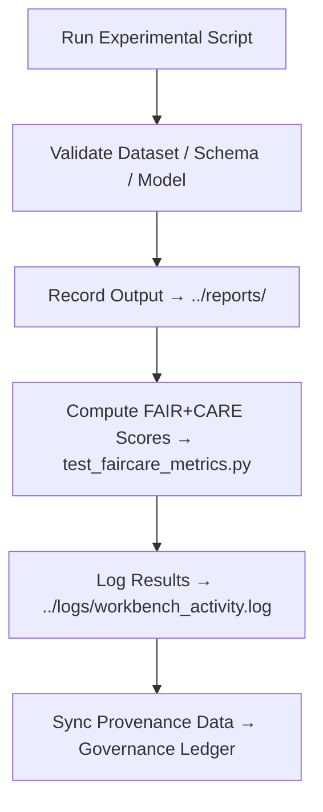

<div align="center">

# ⚙️ Kansas Frontier Matrix — **Workbench Scripts**  
`data/work/staging/tabular/tmp/workbench/scripts/`

### *“Every line of code in the workbench is an act of reproducible discovery.”*

**Purpose:**  
This directory houses the **Python, CLI, and validation utilities** used within the Kansas Frontier Matrix (KFM) Workbench environment.  
These scripts automate experimental workflows — from schema refinement to FAIR+CARE scoring — while maintaining complete reproducibility and governance traceability under the MCP-DL v6.3 standard.

[](../../../../../../../../../../../docs/architecture/repo-focus.md)  
[](../../../../../../../../../../../LICENSE)  
[]()  
[]()  
[]()

</div>

---

## 🧭 Overview

The **Workbench Scripts Layer** contains reproducible automation tools for KFM analysts, AI engineers, and data curators.  
Scripts here are designed to:
- Automate schema and metadata validation tests  
- Calculate FAIR+CARE compliance scores  
- Execute prototype AI validation models  
- Log provenance and experiment outcomes  
- Facilitate reproducible research and sandbox innovation  

All scripts include **YAML front matter**, **version headers**, and **execution metadata** for governance review.

---

## 🗂️ Directory Layout

```text
data/work/staging/tabular/tmp/workbench/scripts/
├── validate_experiment.py             # Runs validation pipeline on sandbox datasets
├── test_faircare_metrics.py           # Computes FAIR+CARE scores and ethics summary
├── prototype_schema_validator.py      # Checks schema structure and JSON conformance
├── generate_drift_report.py           # Creates drift analysis report from AI model runs
├── ontology_crosswalk_tool.py         # Aligns field mappings between CIDOC/DCAT schemas
├── script_manifest.json               # Metadata registry of all active scripts
└── README.md                          # This document
```

---

## 🔁 Script Execution Workflow



---

## 🧩 Script Manifest Schema

| Field | Description | Example |
|-------|--------------|----------|
| `script_name` | Script identifier | `validate_experiment.py` |
| `purpose` | Function of the script | `"Validate experimental datasets for schema compliance"` |
| `language` | Implementation language | `Python 3.12` |
| `version` | Script version | `v2.1.0` |
| `author` | Maintainer or developer | `@kfm-data` |
| `last_modified` | UTC timestamp | `2025-10-26T16:48:44Z` |
| `dependencies` | Required packages or libraries | `[ "pandas", "jsonschema", "requests" ]` |
| `checksum` | SHA-256 hash for script integrity | `b8e13f4a5d71e54e3a9...` |
| `governance_ref` | Link to governance ledger record | `workbench_scripts_ledger.jsonld#validate_experiment` |

---

## ⚙️ Core Script Functions

| Script | Function | Output |
|---------|-----------|---------|
| **validate_experiment.py** | Executes schema, checksum, and AI validation on sandbox data | `reports/schema_validation_trial.json` |
| **test_faircare_metrics.py** | Calculates FAIR+CARE scores and generates compliance summary | `reports/faircare_experiment_report.json` |
| **prototype_schema_validator.py** | Tests updated schemas for STAC/DCAT/CIDOC conformity | `reports/schema_mapping_results.json` |
| **generate_drift_report.py** | Analyzes AI model drift across experiments | `reports/ai_drift_summary.json` |
| **ontology_crosswalk_tool.py** | Builds field crosswalks between ontology standards | `reports/ontology_crosswalk_output.json` |

> 🧠 *Scripts are sandbox tools, but still require metadata headers, validation checks, and ethical governance registration.*

---

## ⚙️ Example Execution

```bash
# Run FAIR+CARE scoring test
python3 test_faircare_metrics.py --input ../datasets/test_population.csv --output ../reports/faircare_experiment_report.json

# Validate new schema prototype
python3 prototype_schema_validator.py --schema ../datasets/schema_refinement_sample.json --report ../reports/schema_mapping_results.json

# Generate drift report for AI model runs
python3 generate_drift_report.py --input ../logs/ai_run_output.log --output ../reports/ai_drift_summary.json
```

---

## 📈 Development & Compliance Metrics

| Metric | Description | Target |
|---------|-------------|---------|
| **Script Validation Pass Rate** | % of scripts verified under governance | 100% |
| **Reproducibility Coverage** | % of experiments reproducible using scripts | ≥ 95% |
| **Execution Logging Rate** | % of script runs recorded to logs | 100% |
| **FAIR+CARE Compliance Rate** | Scripts adhering to metadata and ethical standards | ≥ 0.9 |
| **Governance Registration Rate** | Scripts linked to provenance ledger | 100% |

---

## 🧾 Compliance Matrix

| Standard | Scope | Validator |
|-----------|--------|-----------|
| **FAIR+CARE** | Ethical and open-science automation compliance | `fair-audit` |
| **MCP-DL v6.3** | Documentation-first experiment automation | `docs-validate` |
| **ISO 9001:2015** | Quality and process improvement framework | `quality-audit` |
| **CIDOC CRM / DCAT 3.0** | Semantic traceability of scripts and reports | `graph-lint` |
| **STAC 1.0** | Metadata and output validation | `stac-validate` |

---

## 🪶 Version History

| Version | Date | Author | Notes |
|----------|------|---------|-------|
| v9.0.0 | 2025-10-26 | `@kfm-architecture` | Initial creation of Workbench Scripts documentation under Diamond⁹ Ω / Crown∞Ω certification. |

---

<div align="center">

### 🜂 Kansas Frontier Matrix — *Automation · Experimentation · Ethics*  
**“Automation isn’t about removing people — it’s about documenting how we improve together.”**

[]()
[]()
[]()
[]()
[]()

<br><br>
<a href="#-kansas-frontier-matrix--workbench-scripts-experimental-automation--validation-tools--diamond⁹-Ω--crown∞Ω-certified">⬆ Back to Top</a>

</div>
