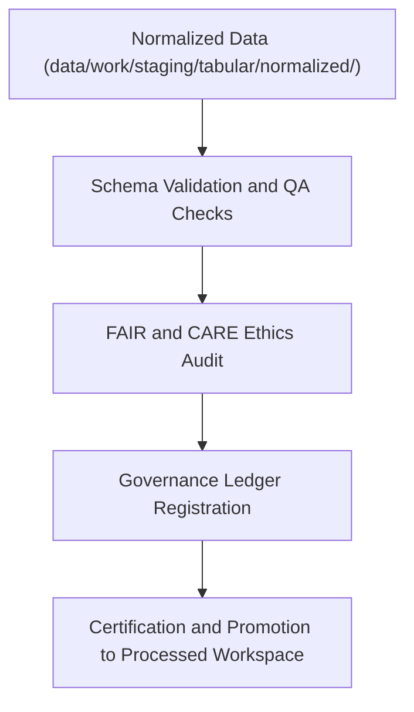

<div align="center">

# ✅ Kansas Frontier Matrix — **Tabular Validation Workspace**
`data/work/staging/tabular/validation/README.md`

**Purpose:** Dedicated workspace for quality assurance, schema compliance, and FAIR+CARE ethics validation of tabular datasets in the Kansas Frontier Matrix (KFM).  
Ensures all tables meet technical, ethical, and interoperability standards before promotion to normalized or processed layers.

[](../../../../../docs/standards/faircare-validation.md)
[](../../../../../LICENSE)
[](../../../../../docs/architecture/repo-focus.md)

</div>

---

## 📚 Overview

The `data/work/staging/tabular/validation/` directory serves as the **final validation checkpoint** for all tabular datasets prior to certification.  
This layer verifies schema accuracy, FAIR+CARE compliance, and governance linkage for reproducible tabular data workflows.

### Key Responsibilities:
- Validate tabular data structure against JSON schema and data contracts.  
- Verify field-level data types, value ranges, and categorical consistency.  
- Conduct FAIR+CARE ethics audits for accessibility, attribution, and open-data quality.  
- Cross-check dataset provenance, versioning, and checksum integrity.  

All validation logs and reports are integrated into the KFM provenance ledger for full transparency.

---

## 🗂️ Directory Layout

```plaintext
data/work/staging/tabular/validation/
├── README.md                               # This file — tabular validation documentation
│
├── schema_validation_summary.json          # Field-by-field schema compliance report
├── faircare_tabular_audit.json             # FAIR+CARE ethical and accessibility audit report
├── qa_summary.md                           # Human-readable validation summary for maintainers
├── stac_dcat_mapping.log                   # Crosswalk validation between STAC and DCAT metadata
└── metadata.json                           # Validation metadata and governance reference
```

---

## ⚙️ Tabular Validation Workflow



### Workflow Steps:
1. **Schema Validation:** Ensure alignment with the latest `data_contract_ref`.  
2. **Quality Assurance:** Evaluate null values, consistency, and type conformity.  
3. **Ethical Review:** Run FAIR+CARE audits on accessibility, openness, and reuse compliance.  
4. **Governance Registration:** Write validation outcomes to provenance ledger.  
5. **Certification:** Flag datasets as “FAIR+CARE Certified” before publication.

---

## 🧩 Example Validation Metadata Record

```json
{
  "id": "tabular_validation_climate_indices_v9.3.2",
  "dataset_source": "data/work/staging/tabular/normalized/climate_indices_normalized.parquet",
  "schema_version": "v3.0.1",
  "fields_validated": 34,
  "errors_detected": 0,
  "fairstatus": "certified",
  "faircare_score": 98.4,
  "checksum": "sha256:91a3b8de56e8a9b9df42b29113ed3dcb514bd891...",
  "created": "2025-10-28T15:55:00Z",
  "validator": "@kfm-data-lab",
  "governance_ledger_ref": "data/reports/audit/data_provenance_ledger.json"
}
```

---

## 🧠 FAIR+CARE Compliance Review

| Principle | Implementation |
|------------|----------------|
| **Findable** | Indexed in provenance ledger and linked to STAC/DCAT catalog entries. |
| **Accessible** | Stored in open, machine-readable CSV and Parquet formats. |
| **Interoperable** | Schema fields validated against JSON Schema and DCAT specs. |
| **Reusable** | Metadata ensures citation, licensing, and checksum traceability. |
| **Collective Benefit** | Ensures ethical, equitable use of environmental and archival data. |
| **Authority to Control** | FAIR+CARE Council certifies tabular governance compliance. |
| **Responsibility** | Validation reports archived for reproducibility. |
| **Ethics** | All attributes verified for neutrality, privacy, and sensitivity. |

FAIR+CARE results stored in:  
`data/reports/fair/data_care_assessment.json`  
and `data/reports/audit/data_provenance_ledger.json`.

---

## ⚙️ Validation & QA Tools

| Tool | Function | Output |
|------|-----------|--------|
| **Great Expectations** | Field-level schema and value-range testing. | JSON |
| **Pandas / PyArrow** | Statistical QA and type harmonization. | CSV / Parquet |
| **FAIR+CARE Validator** | Ethical and accessibility scoring. | JSON |
| **stac-validator** | Cross-schema verification with STAC/DCAT. | Text log |
| **Checksum Auditor** | SHA-256 verification against manifest. | JSON |

---

## ⚖️ Governance & Provenance Integration

| Record | Description |
|---------|-------------|
| `metadata.json` | Captures runtime context, validation results, and checksum. |
| `data/reports/audit/data_provenance_ledger.json` | Logs validation lineage and FAIR+CARE certification. |
| `data/reports/validation/schema_validation_summary.json` | Field-level schema and QA report archive. |
| `releases/v9.3.2/manifest.zip` | Stores global checksum registry for validated datasets. |

All validation runs automated via `tabular_validation_sync.yml` workflow.

---

## 🧾 Retention Policy

| File Type | Retention Duration | Policy |
|------------|--------------------|--------|
| Validation Reports | 180 days | Archived for FAIR+CARE re-certification. |
| FAIR+CARE Audit Files | 365 days | Retained permanently for governance oversight. |
| QA Summaries | 90 days | Reviewed then transferred to system logs. |
| Metadata | Permanent | Maintained for provenance and traceability. |

Archival and cleanup managed via `tabular_validation_cleanup.yml`.

---

## 🧾 Internal Use Citation

```text
Kansas Frontier Matrix (2025). Tabular Validation Workspace (v9.3.2).
Quality assurance and FAIR+CARE validation environment for tabular datasets ensuring schema compliance, reproducibility, and ethical governance.
Restricted to internal certification and provenance workflows.
```

---

## 🧾 Version Notes

| Version | Date | Notes |
|----------|------|--------|
| v9.3.2 | 2025-10-28 | Integrated FAIR+CARE governance reporting and checksum verification. |
| v9.2.0 | 2024-07-15 | Added Great Expectations and DCAT-STAC mapping validation. |
| v9.0.0 | 2023-01-10 | Established tabular validation workspace under FAIR+CARE framework. |

---

<div align="center">

**Kansas Frontier Matrix** · *Data Quality × FAIR+CARE Ethics × Provenance Integrity*  
[🔗 Repository](https://github.com/bartytime4life/Kansas-Frontier-Matrix) • [🧭 Docs Portal](../../../../../docs/) • [⚖️ Governance Ledger](../../../../../docs/standards/governance/)

</div>
