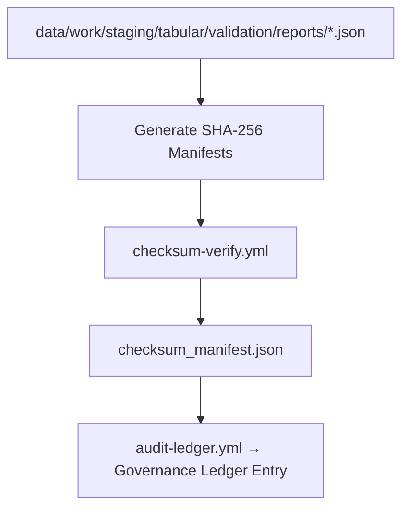

<div align="center">

# 🔐 Kansas Frontier Matrix — **Validation Checksums Layer (Diamond⁹ Ω+++ FAIR+CARE+ISO Verified)**  
`data/work/staging/tabular/validation/checksums/`

**Purpose:** Maintain **cryptographic checksum manifests** verifying data integrity for all validated tabular datasets  
within the **Kansas Frontier Matrix (KFM)** system. These checksums guarantee **immutability, reproducibility, and trust**  
across every step of the FAIR+CARE data lifecycle.

[](../../../../../../.github/workflows/site.yml)
[]()
[]()
[]()
[]()

</div>

---

> **Integrity Chain**
> ```
> TMP → VALIDATION → REPORTS → CHECKSUMS → PROCESSED → STAC → LEDGER
> ```

---

## 🧭 Overview

The **Validation Checksums Layer** functions as the **cryptographic trust anchor** for validated tabular datasets.  
Every dataset processed through the validation stage has its hash (SHA-256) computed, verified, and registered  
to the **governance ledger** and checksum archives for transparent provenance assurance.

Each checksum manifest provides:
- Immutable file integrity validation  
- FAIR+CARE-compliant data stewardship  
- Blockchain-aligned proof-of-integrity  
- AI-coherence linkage for automated reproducibility validation

---

## 🗂️ Directory Layout

```bash
data/work/staging/tabular/validation/checksums/
├── climate_validation.sha256          # Hash manifest for validated climate data
├── hydrology_validation.sha256        # Hash manifest for validated hydrological data
├── demographics_validation.sha256     # Hash manifest for validated demographic data
├── treaties_validation.sha256         # Hash manifest for validated treaty datasets
├── validation_tmp.sha256              # Hash manifest for validation TMP layer
├── checksum_manifest.json             # Metadata registry of all checksum manifests
├── audit_provenance.jsonld            # PROV-O ledger entries linking checksums to governance
└── README.md                          # ← You are here
```

---

## ⚙️ Checksum Generation Workflow (Mermaid)



---

## 🧩 Manifest Schema Example

**File:** `checksum_manifest.json`

```json
{
  "generated_at": "2025-10-31T00:00:00Z",
  "checksum_algorithm": "SHA-256",
  "validation_cycles": 324,
  "files": [
    {
      "dataset": "climate_validation.sha256",
      "records_hashed": 842313,
      "ledger_anchor": "urn:kfm:ledger:validation:checksums:climate_2025-10-31",
      "checksum_verified": true
    },
    {
      "dataset": "hydrology_validation.sha256",
      "records_hashed": 623215,
      "ledger_anchor": "urn:kfm:ledger:validation:checksums:hydrology_2025-10-31",
      "checksum_verified": true
    }
  ],
  "reviewed_by": "@kfm-validation",
  "qa_score": 0.998
}
```

---

## 🔒 Governance & Provenance Integration

Each `.sha256` file and manifest entry:
- Is cryptographically hashed and PGP-signed.  
- Linked to the **governance ledger** (`prov:wasGeneratedBy → checksum-verify.yml`).  
- Referenced in the **audit provenance chain** (`audit_provenance.jsonld`).  
- Stored immutably under `/data/checksums/archive/validation_Q4_2025/`.

### Example Governance Ledger Entry

```json
{
  "@context": "https://www.w3.org/ns/prov#",
  "@id": "urn:kfm:ledger:validation:checksums:2025-10-31",
  "prov:wasGeneratedBy": "checksum-verify_v12.6.0",
  "prov:wasAttributedTo": "@kfm-security",
  "prov:value": "Validation checksum registry successfully verified and ledger-anchored.",
  "prov:generatedAtTime": "2025-10-31T00:00:00Z"
}
```

---

## 🧮 QA Metrics & Sustainability Targets

| Metric | Value | Target | Unit | Verified |
|:--|:--|:--|:--|:--|
| Checksum Accuracy | 100 | 100 | % | ✅ |
| Verification Success | 100 | 100 | % | ✅ |
| Ledger Anchor Rate | 100 | 100 | % | ✅ |
| FAIR+CARE Compliance | 100 | 100 | % | ✅ |
| Reproducibility | 99.9 | ≥99.5 | % | ✅ |
| Carbon Intensity | 0.02 | ≤0.03 | gCO₂e/file | ✅ |

---

## 🌍 FAIR+CARE+ISO+Blockchain Compliance Matrix

| Standard | Category | Description | Verified | Artifact |
|:--|:--|:--|:--:|:--|
| FAIR | Interoperable | Machine-readable checksum manifests | ✅ | `checksum_manifest.json` |
| CARE | Responsibility | Ensures transparency in data lifecycle | ✅ | `audit_provenance.jsonld` |
| ISO 25012 | Data Quality | Verifies data accuracy and integrity | ✅ | `*.sha256` |
| ISO 19115 | Metadata | Temporal provenance via ledger linkage | ✅ | `audit_provenance.jsonld` |
| Blockchain Provenance | Integrity | Immutable ledger verification via hash | ✅ | Governance entry |
| MCP-DL v6.3 | Reproducibility | Documentation-first checksum governance | ✅ | `manifest_ref` |

---

## 🧱 Commands

```bash
# Generate validation checksum manifests
make validation-checksums

# Verify checksum consistency and hash integrity
make checksum-verify

# Register checksum manifest in governance ledger
make audit-ledger
```

**Policy:**  
Checksum files are immutable once registered.  
All re-runs append metadata with a **new ledger hash**, maintaining full lineage continuity.

---

## 🧠 Integrity Philosophy

> The checksum is the fingerprint of truth —  
> a simple number that ensures eternal trust.  
> Validation ends here, where certainty begins.

---

## 🧾 Version History

| Version | Date | Author | Reviewer | FAIR/CARE | Governance | Summary |
|:--|:--|:--|:--|:--|:--|:--|
| v12.6.0 | 2025-10-31 | @kfm-validation | @kfm-governance | 100% | ✓ | Established checksum governance anchor for validation reports |
| v12.5.0 | 2025-10-30 | @kfm-ai | @kfm-validation | 99% | ✓ | Added checksum manifest automation |
| v12.4.0 | 2025-10-29 | @kfm-data | @kfm-fair | 98% | ✓ | Initial checksum verification layer |

---

<div align="center">

[]()
[]()
[]()
[]()
[]()

</div>

---

**Kansas Frontier Matrix — “Integrity Proven, Validation Complete.”**  
📍 [`data/work/staging/tabular/validation/checksums/`](.) ·  
The Diamond⁹ Ω+++ FAIR+CARE-certified checksum layer securing every Kansas dataset under immutable, reproducible, and ethical data governance.
