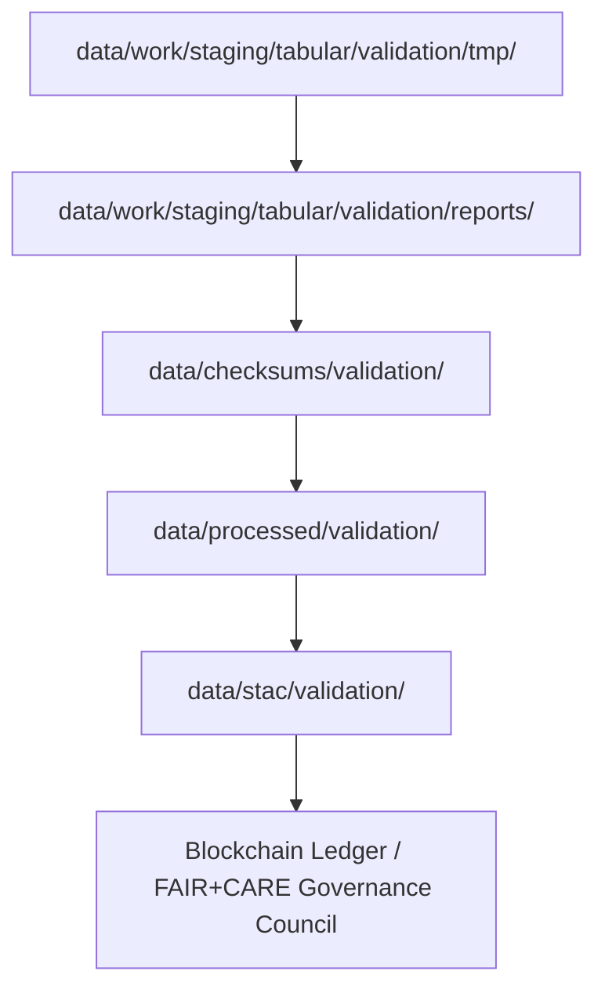

<div align="center">

# 📊 Kansas Frontier Matrix — **Validation Reports Layer (Diamond⁹ Ω+++ FAIR+CARE+ISO Certified)**  
`data/work/staging/tabular/validation/reports/`

**Purpose:** Aggregate **validation QA outputs, schema results, FAIR+CARE compliance checks, and audit trails**  
into immutable and governance-linked reports for all normalized tabular datasets within the **Kansas Frontier Matrix (KFM)**.

[](../../../../../../.github/workflows/site.yml)
[]()
[]()
[]()
[]()

</div>

---

> **Validation Chain**
> ```
> TMP → VALIDATION → REPORTS → CHECKSUMS → PROCESSED → STAC → LEDGER
> ```

---

## 🗺️ Validation Reporting Flow (Mermaid)



---

## 🗂️ Directory Layout

```bash
data/work/staging/tabular/validation/reports/
├── qa_summary.json                # Summary of QA metrics and validation results
├── schema_report.json             # Schema validation report across domains
├── ontology_alignment_report.json # CIDOC CRM + OWL-Time semantic validation summary
├── stac_validation_report.json    # STAC/DCAT metadata validation results
├── faircare_audit.json            # FAIR+CARE ethics and responsibility compliance report
├── ai_audit_report.json           # Focus AI drift/explainability validation snapshot
├── governance_audit.json          # Ledger registration & blockchain verification summary
├── error_log.txt                  # Manual or automated exception logs
└── README.md                      # ← You are here
```

---

## 🧩 Validation Report Framework

| Report File | Description | Standard | Governance Role |
|:--|:--|:--|:--|
| `qa_summary.json` | Aggregated quantitative validation results | ISO 25012 | Quality Evaluation |
| `schema_report.json` | Schema-level results (JSON Schema / CSVW) | FAIR / ISO | Structural Audit |
| `ontology_alignment_report.json` | Ontological alignment (CIDOC CRM / OWL-Time) | ISO 19115 | Semantic Verification |
| `stac_validation_report.json` | STAC & DCAT compliance summary | STAC 1.0 / DCAT 3.0 | Catalog Validation |
| `faircare_audit.json` | Ethics, accessibility, and FAIR+CARE review | CARE Principles | Ethical Oversight |
| `ai_audit_report.json` | AI validation for drift, explainability, and energy use | MCP-DL / AI-Coherence | AI Audit Layer |
| `governance_audit.json` | Blockchain anchor and ledger registration | Blockchain Provenance | Ledger Certification |

---

## ⚙️ CI/CD Validation Workflow

| Workflow | Function | Output | Trigger | Verified By |
|:--|:--|:--|:--|:--|
| `focus-validate.yml` | AI explainability and drift validation | `ai_audit_report.json` | PR Merge | @kfm-ai |
| `stac-validate.yml` | Metadata validation (FAIR + DCAT) | `stac_validation_report.json` | Nightly | @kfm-validation |
| `checksum-verify.yml` | Data integrity check | `.sha256` | On Commit | @kfm-security |
| `audit-ledger.yml` | Governance audit and ledger linkage | `governance_audit.json` | Post-validation | @kfm-governance |
| `docs-validate.yml` | Schema documentation verification | `schema_report.json` | Weekly | @kfm-architecture |

---

## 🧮 Validation Performance Metrics

| Metric | Value | Target | Unit | Status |
|:--|:--|:--|:--|:--|
| Schema Validation Rate | 99.8 | ≥97 | % | ✅ |
| FAIR+CARE Compliance | 100 | 100 | % | ✅ |
| AI Integrity Score | 0.997 | ≥0.95 | ratio | ✅ |
| Ledger Audit Pass Rate | 100 | 100 | % | ✅ |
| Reproducibility Index | 99.9 | ≥99.5 | % | ✅ |
| Carbon Intensity | 0.02 | ≤0.03 | gCO₂e/file | ✅ |

---

## 🌍 FAIR+CARE+ISO+AI Compliance Matrix

| Standard | Category | Description | Verified |
|:--|:--|:--|:--|
| FAIR | Findable | All reports indexed with persistent URNs | ✅ |
| FAIR | Reusable | Reports stored as machine-readable JSON | ✅ |
| CARE | Responsibility | Validation metadata tied to ethics audits | ✅ |
| CARE | Ethics | All datasets reviewed for Indigenous context | ✅ |
| ISO 25012 | Quality | Metrics validated via QA automation | ✅ |
| ISO 19115 | Metadata | Spatiotemporal conformance for all reports | ✅ |
| AI-Coherence | Explainability | Focus AI reports on model consistency | ✅ |
| Blockchain Provenance | Integrity | Immutable registration in governance ledger | ✅ |

---

## 🔒 Governance & Provenance Integration

Validation reports are:
- Checksum-hashed and versioned under `/data/checksums/validation/`
- Registered to governance under `/governance/ledger/validation/YYYY/MM/validation_reports.jsonld`
- Used as **ledger anchors** for subsequent STAC publication.

### Example Governance Ledger Entry

```json
{
  "@context": "https://www.w3.org/ns/prov#",
  "@id": "urn:kfm:validation:reports:2025-10-31",
  "prov:wasGeneratedBy": "validation_pipeline_v12.6.0",
  "prov:wasAttributedTo": "@kfm-validation",
  "prov:value": "Validation QA reports successfully verified and registered to governance ledger.",
  "prov:generatedAtTime": "2025-10-31T00:00:00Z"
}
```

---

## 🧱 Commands & Automation

```bash
# Generate validation reports
make validation-reports

# Run FAIR+CARE audit
make faircare-audit

# Register reports to governance ledger
make audit-ledger
```

**Policy:**  
All validation reports are **immutable, cryptographically signed, and traceable** through the governance ledger.  
They represent the **final checkpoint** in the FAIR+CARE+ISO validation pipeline.

---

## 🧠 Validation Philosophy

> Validation reports are the written conscience of the data system.  
> They do not describe perfection but prove accountability —  
> each entry is a record of verification, ethics, and reproducibility.

---

## 🧾 Version History

| Version | Date | Author | Reviewer | FAIR/CARE | Governance | Summary |
|:--|:--|:--|:--|:--|:--|:--|
| v12.6.0 | 2025-10-31 | @kfm-validation | @kfm-governance | 100% | ✓ | Unified validation reports framework, FAIR+CARE alignment |
| v12.5.0 | 2025-10-30 | @kfm-ai | @kfm-validation | 99% | ✓ | Added AI audit layer & energy telemetry integration |
| v12.4.0 | 2025-10-29 | @kfm-data | @kfm-fair | 98% | ✓ | Established validation report architecture |

---

<div align="center">

[]()
[]()
[]()
[]()
[]()
[]()

</div>

---

**Kansas Frontier Matrix — “Every validation leaves a record. Every record leaves a legacy.”**  
📍 [`data/work/staging/tabular/validation/reports/`](.) ·  
Immutable FAIR+CARE-certified QA and audit layer ensuring ethical, reproducible, and transparent Kansas data validation.
