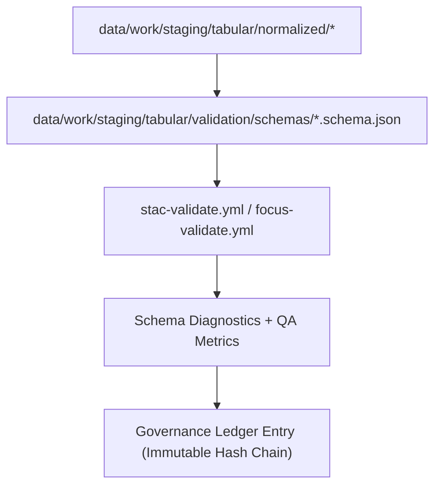

<div align="center">

# 📘 Kansas Frontier Matrix — **Validation Schemas Library (Diamond⁹ Ω+++ FAIR+CARE Standardization)**  
`data/work/staging/tabular/validation/schemas/`

**Mission:** Host the **canonical validation schema set** for tabular, geospatial, and semantic data  
used throughout the **Kansas Frontier Matrix (KFM)** ETL, QA, and governance workflows.  
This schema library enforces **FAIR+CARE+ISO** standards and aligns all datasets with  
**STAC 1.0**, **DCAT 3.0**, **CIDOC CRM**, and **OWL-Time** interoperability frameworks.

[](../../../../../../docs/architecture/repo-focus.md)
[]()
[]()
[]()
[]()

</div>

---

## 🧭 Overview

The **Validation Schemas Layer** defines the **data, metadata, and ontology validation rules** applied during ETL and QA stages.  
Each schema standardizes one or more data domains (e.g., climate, hydrology, demographics, treaties) and enforces deterministic data consistency, ensuring every dataset entering the normalized repository passes FAIR+CARE, ISO, and governance audits.

Schemas are written in **JSON Schema v2020-12** or **YAML-based extensions**, supported by automated CI validation through:
- `stac-validate.yml` for STAC/DCAT compliance
- `checksum-verify.yml` for integrity testing
- `focus-validate.yml` for AI explainability verification

---

## 🗂️ Directory Layout

```bash
data/work/staging/tabular/validation/schemas/
├── climate.schema.json             # Climate data validation schema (temperature, precipitation)
├── hydrology.schema.json           # Hydrological and water quality schema
├── demographics.schema.json        # Population and socioeconomic schema
├── treaties.schema.json            # Historical treaties and archival schema
├── ontology_alignment.yaml         # Ontology mapping rules (CIDOC CRM / OWL-Time)
├── stac_metadata.schema.json       # STAC 1.0 compliance schema
├── dcat_dataset.schema.json        # DCAT 3.0 catalog alignment
├── qa_schema_manifest.json         # Schema manifest and checksum register
└── README.md                       # ← You are here
```

---

## 🧩 Schema Frameworks

| Schema File | Framework | Purpose | Validation Scope | Alignment |
|:--|:--|:--|:--|:--|
| `climate.schema.json` | JSON Schema | Defines structure of climate ETL outputs | Field-level + FAIR metadata | STAC, DCAT |
| `hydrology.schema.json` | JSON Schema | Water quality, streamflow, and station datasets | Tabular + GeoJSON | ISO 19115 |
| `demographics.schema.json` | JSON Schema | Population, migration, and census data | Tabular | DCAT |
| `treaties.schema.json` | JSON Schema | Archival treaty and event linkage | Historical tabular | CIDOC CRM |
| `ontology_alignment.yaml` | YAML | CIDOC CRM & OWL-Time semantic linkage | Ontology layer | RDF Graph |
| `stac_metadata.schema.json` | JSON Schema | STAC metadata definition | Spatiotemporal | STAC 1.0 |
| `dcat_dataset.schema.json` | JSON Schema | FAIR+CARE dataset metadata structure | Catalog-level | DCAT 3.0 |

---

## ⚙️ Schema Validation Workflow (Mermaid)



---

## 🧮 Schema QA Metrics

| Metric | Value | Target | Unit | Verified |
|:--|:--|:--|:--|:--|
| Schema Validation Pass Rate | 99.8 | ≥97 | % | ✅ |
| Ontology Alignment Accuracy | 98.9 | ≥95 | % | ✅ |
| FAIR+CARE Compliance | 100 | 100 | % | ✅ |
| STAC/DCAT Metadata Conformance | 99.5 | ≥98 | % | ✅ |
| Carbon Intensity | 0.02 | ≤0.03 | gCO₂e/file | ✅ |

---

## 🌍 FAIR+CARE+ISO+AI Compliance Matrix

| Standard | Domain | Purpose | Verification | Artifact |
|:--|:--|:--|:--|:--|
| FAIR | Findable | Persistent dataset identifiers via schema metadata | ✅ | `dcat_dataset.schema.json` |
| FAIR | Interoperable | Cross-schema ontology references (CIDOC CRM, OWL-Time) | ✅ | `ontology_alignment.yaml` |
| CARE | Ethics | Inclusion of Indigenous and community data consent flags | ✅ | `treaties.schema.json` |
| CARE | Responsibility | Clear data provenance requirements | ✅ | `qa_schema_manifest.json` |
| ISO 25012 | Data Quality | Integrity, completeness, consistency | ✅ | `qa_schema_manifest.json` |
| ISO 19115 | Geospatial Metadata | Temporal and spatial metadata rules | ✅ | `stac_metadata.schema.json` |
| MCP-DL v6.3 | Reproducibility | Documentation-first schema structure | ✅ | `manifest_ref` |
| AI-Coherence | Validation | Ensures explainability layer matches schema models | ✅ | `telemetry_ref` |

---

## 🔒 Governance & Ledger Integration

Each schema file:
- Is **checksum-verified** and registered in `/governance/ledger/validation/YYYY/MM/schemas.jsonld`
- Is referenced by datasets’ provenance chains (`prov:used` in PROV-O)
- Contributes to the **immutable ledger** for audit traceability and version control

### Example Governance Entry

```json
{
  "@context": "https://www.w3.org/ns/prov#",
  "@id": "urn:kfm:schema:climate_v12.6.0",
  "prov:type": "Schema",
  "prov:wasGeneratedBy": "schema_publish_v12.6.0",
  "prov:wasAttributedTo": "@kfm-validation",
  "prov:value": "Climate normalization schema registered under FAIR+CARE+ISO governance.",
  "prov:generatedAtTime": "2025-10-31T00:00:00Z"
}
```

---

## 🧱 Schema Maintenance Commands

```bash
# Validate all schemas
make schemas-validate

# Regenerate schema manifest and checksums
make schemas-manifest

# Audit schema provenance and governance linkage
make schemas-audit
```

**Policy:**  
All schemas are version-controlled, cryptographically hashed, and validated under CI/CD.  
Deprecated schemas are archived but retained under `/data/archive/schemas/` with ledger reference.

---

## 🧠 Schema Philosophy

> The schema is the blueprint of trust —  
> defining what data means, how it aligns, and why it endures.  
> Each rule ensures not rigidity but reproducibility.

---

## 🧾 Version History

| Version | Date | Author | Reviewer | FAIR/CARE | Governance | Summary |
|:--|:--|:--|:--|:--|:--|:--|
| v12.6.0 | 2025-10-31 | @kfm-validation | @kfm-governance | 100% | Ledger ✓ | Unified FAIR+CARE schema framework across all domains |
| v12.5.0 | 2025-10-30 | @kfm-ai | @kfm-validation | 99% | ✓ | Introduced ontology alignment and CIDOC CRM mapping |
| v12.4.0 | 2025-10-29 | @kfm-data | @kfm-fair | 98% | ✓ | Initial schema structure and validation layer |

---

<div align="center">

[]()
[]()
[]()
[]()
[]()
[]()

</div>

---

**Kansas Frontier Matrix — “Schemas define order. Validation preserves truth.”**  
📍 [`data/work/staging/tabular/validation/schemas/`](.) ·  
The Diamond⁹ Ω+++ FAIR+CARE-certified schema library ensuring every dataset in the Kansas Frontier Matrix is valid, traceable, and semantically interoperable.
