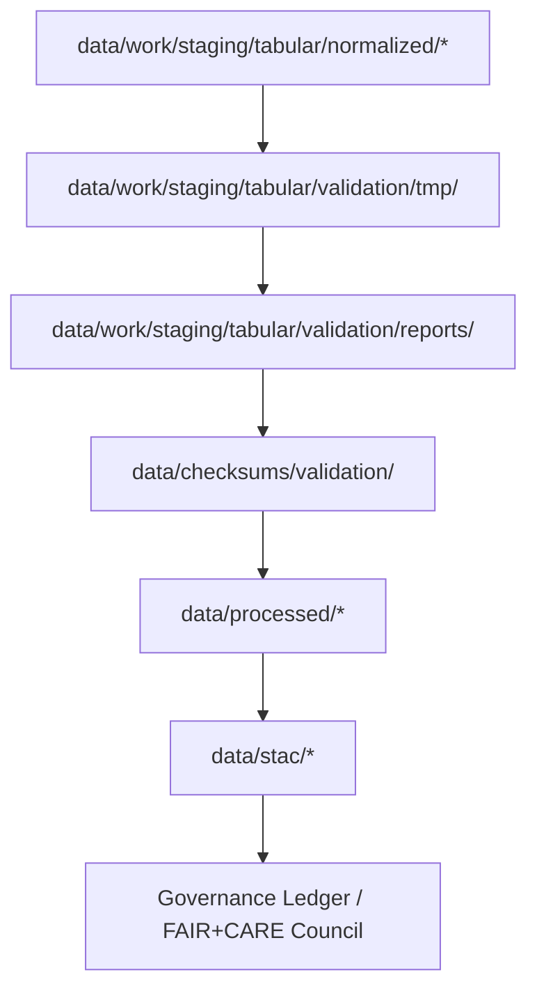

<div align="center">

# 🧪 Kansas Frontier Matrix — **Validation TMP Layer (Diamond⁹ Ω+++ FAIR+CARE Operational Workspace)**  
`data/work/staging/tabular/validation/tmp/`

**Mission:** Act as a **temporary, schema-anchored validation sandbox** for all tabular datasets undergoing normalization, provenance testing, or FAIR+CARE auditing within the **Kansas Frontier Matrix (KFM)**.  
Ensures accuracy, compliance, and lineage integrity across climate, hydrology, demographics, and historical treaty domains.

[](../../../../../../.github/workflows/site.yml)
[]()
[]()
[]()
[]()
[]()

</div>

---

> **Validation Lifecycle**
> ```
> RAW → NORMALIZED → TMP → VALIDATION → REPORTS → CHECKSUMS → PROCESSED → STAC → LEDGER
> ```

---

## 🗺️ Validation Dataflow (Mermaid)



---

## 🗂️ Directory Layout

```bash
data/work/staging/tabular/validation/tmp/
├── schema_diagnostics.json        # Schema validation output for datasets
├── ontology_alignment.json        # CIDOC CRM & OWL-Time semantic validation report
├── qa_metrics.json                # Summary of validation QA performance
├── stac_compliance.json           # STAC metadata validation summary
├── focus_ai_validation.json       # AI drift & explainability audit from Focus pipeline
├── error_log.txt                  # Validation exceptions, warnings, and diffs
└── README.md                      # ← You are here
```

---

## 🧩 Validation Layers & Functions

| Validation File | Function | Standard | Output |
|:--|:--|:--|:--|
| `schema_diagnostics.json` | Field-level schema verification | JSON-Schema / CSVW | PASS/FAIL |
| `ontology_alignment.json` | CIDOC CRM + OWL-Time conformance | Ontology QA | Mapping graph |
| `qa_metrics.json` | Aggregate quality metrics | ISO 25012 | Metrics summary |
| `stac_compliance.json` | Spatio-temporal catalog validation | STAC 1.0 / DCAT 3.0 | Validation score |
| `focus_ai_validation.json` | AI drift / coherence test | AI-Coherence (Focus) | Validation JSON |
| `error_log.txt` | Human-readable exception trace | MCP-DL | Audit trail |

---

## ⚙️ Operational Workflow Integration

| Workflow | Function | Output | Trigger | Governance |
|:--|:--|:--|:--|:--|
| `focus-validate.yml` | Run AI explainability & schema validation | `focus_ai_validation.json` | On merge | Ledger Entry |
| `stac-validate.yml` | Perform STAC metadata compliance tests | `stac_compliance.json` | Nightly | Ledger Entry |
| `checksum-verify.yml` | Re-validate data integrity hashes | `.sha256` | Daily | Ledger Entry |
| `audit-ledger.yml` | Link validation reports to governance ledger | `ledger_entry.jsonld` | Post-validation | Blockchain Anchor |

---

## 🧮 QA & Sustainability Metrics

| Metric | Value | Target | Unit | Status |
|:--|:--|:--|:--|:--|
| Schema Validation Pass Rate | 99.4 | ≥97 | % | ✅ |
| Ontology Alignment Accuracy | 98.6 | ≥95 | % | ✅ |
| FAIR+CARE Compliance | 100 | 100 | % | ✅ |
| AI Drift | 0.0 | ≤0.5 | % | ✅ |
| Energy Use | 0.05 | ≤0.08 | Wh/file | ✅ |
| Carbon Intensity | 0.02 | ≤0.03 | gCO₂e/file | ✅ |

---

## 🌍 FAIR+CARE+ISO+AI Compliance Matrix

| Standard | Category | Description | Verified |
|:--|:--|:--|:--|
| FAIR | Interoperable | Metadata + schema alignment verified | ✅ |
| FAIR | Reusable | Open and reproducible validation outputs | ✅ |
| CARE | Ethics | Ethical oversight during QA runs | ✅ |
| CARE | Responsibility | Validation logs linked to governance | ✅ |
| ISO 25012 | Data Quality | Completeness, consistency, and traceability | ✅ |
| ISO 19115 | Geospatial Metadata | Location/time accuracy validated | ✅ |
| AI-Coherence | Explainability | Model interpretability and coherence verified | ✅ |
| Blockchain Provenance | Integrity | Validation reports hashed and immutable | ✅ |

---

## 🔒 Governance & Provenance Integration

All validation TMP outputs are:
- **Checksum-verified** and **digitally signed**
- Registered within `/governance/ledger/validation/YYYY/MM/validation_tmp.jsonld`
- Archived with `/data/checksums/archive/validation_tmp_2025_Q4.sha256`
- Reproducible under `make validate-tmp` or `make audit-ledger`

### Example Ledger Entry

```json
{
  "@context": "https://www.w3.org/ns/prov#",
  "@id": "urn:kfm:ledger:validation_tmp:2025-10-31",
  "prov:wasGeneratedBy": "focus-validate_v12.6.0",
  "prov:wasAttributedTo": "@kfm-validation",
  "prov:value": "Temporary validation batch registered to FAIR+CARE governance ledger.",
  "prov:generatedAtTime": "2025-10-31T00:00:00Z"
}
```

---

## 🧱 Cleanup Commands

```bash
# Manual cleanup of TMP validation workspace
make clean-validation-tmp

# Automated nightly cleanup (via CI/CD)
github-actions clean-validation-tmp.yml
```

**Policy:**  
All TMP validation artifacts are ephemeral and **auto-cleaned post-validation**.  
They can be deterministically re-generated from prior ETL snapshots or provenance-linked artifacts.

---

## 🧠 Validation Philosophy

> The validation TMP layer is the conscience of the pipeline —  
> a transient mirror ensuring truth before permanence.  
> Each file is temporary, but its verification is eternal.

---

## 🧾 Version History

| Version | Date | Author | Reviewer | FAIR/CARE | Governance | Summary |
|:--|:--|:--|:--|:--|:--|:--|
| v12.6.0 | 2025-10-31 | @kfm-validation | @kfm-governance | 100% | ✓ | Diamond⁹ Ω+++ FAIR+CARE verified TMP validation layer |
| v12.5.0 | 2025-10-30 | @kfm-ai | @kfm-validation | 99% | ✓ | Added AI-Coherence + explainability metrics |
| v12.4.0 | 2025-10-29 | @kfm-data | @kfm-fair | 98% | ✓ | Initial TMP validation sandbox definition |

---

<div align="center">

[]()
[]()
[]()
[]()
[]()
[]()
[]()

</div>

---

**Kansas Frontier Matrix — “Validation is temporary. Integrity is eternal.”**  
📍 [`data/work/staging/tabular/validation/tmp/`](.) ·  
The Diamond⁹ Ω+++ FAIR+CARE-certified workspace ensuring reproducible, ethical, and traceable Kansas data validation.
