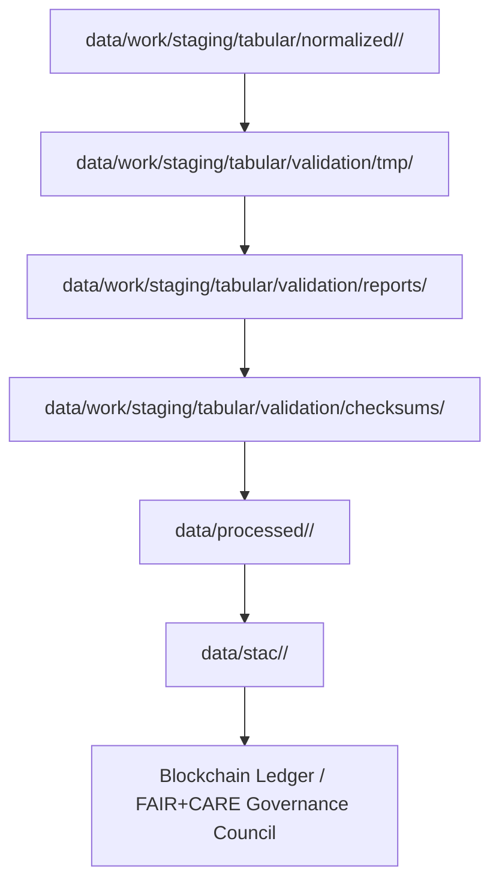

<div align="center">

# 🧩 Kansas Frontier Matrix — **Validation TMP Layer (Diamond⁹ Ω+++ FAIR+CARE Operational Parity)**  
`data/work/staging/tabular/validation/tmp/`

**Purpose:** Provide an **ephemeral QA workspace** for schema verification, FAIR+CARE audit testing,  
and provenance compliance checks during tabular dataset validation across all KFM domains (climate, hydrology, demographics, treaties).  

[](../../../../../../.github/workflows/site.yml)
[]()
[]()
[]()
[]()
[]()

</div>

---

> **Lifecycle Path**
> ```
> RAW → NORMALIZED → TMP → VALIDATION/TMP → REPORTS → CHECKSUMS → PROCESSED → STAC → LEDGER
> ```

---

## 🗺️ Workflow Context (Mermaid)



---

## 🗂️ Directory Layout

```bash
data/work/staging/tabular/validation/tmp/
├── schema_tests/                  # Temporary schema and ontology test outputs
├── provenance_checks/             # PROV-O lineage and integrity validation
├── ai_validation/                 # Focus AI explainability and drift tests
├── audit_flags/                   # FAIR+CARE and ethics flag results
├── tmp_validation_manifest.json   # Index of temporary validation artifacts
├── qa_metrics.json                # Telemetry on validation runtime and results
└── README.md
```

---

## ⚙️ Function & Purpose

The Validation TMP Layer is the **operational sandbox for data assurance**,  
performing automated and manual QA on all normalized datasets before permanent ledger registration.  
It ensures:
- **Schema conformance** (STAC/DCAT/CIDOC CRM/OWL-Time).  
- **Provenance traceability** (PROV-O / blockchain anchors).  
- **AI validation** (Focus AI drift & explainability tests).  
- **Ethical compliance** (CARE + governance audits).  
- **Energy & sustainability audits** under ISO 14064/50001.  

Temporary files here are **auto-cleaned nightly** via `clean-validation-tmp.yml`.

---

## 🧩 Validation Components Overview

| Component | Purpose | Output | Frequency | Retention |
|:--|:--|:--|:--|:--|
| `schema_tests/` | JSON-Schema & STAC checks | `schema_report.json` | Per ETL | 24 hrs |
| `provenance_checks/` | Verify PROV-O lineage links | `provenance_validation.jsonld` | Per ETL | 24 hrs |
